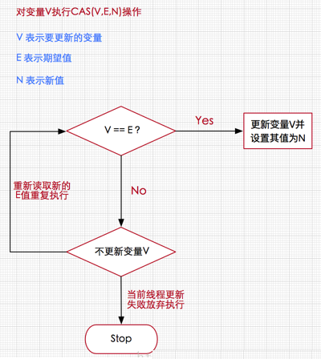
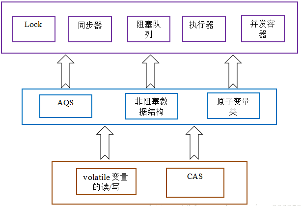
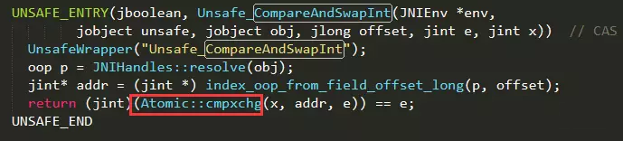
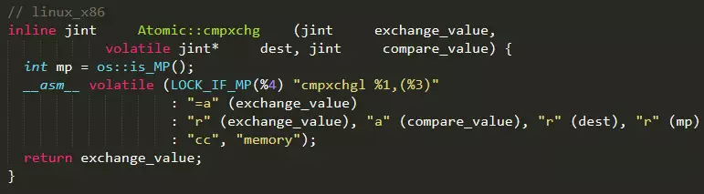
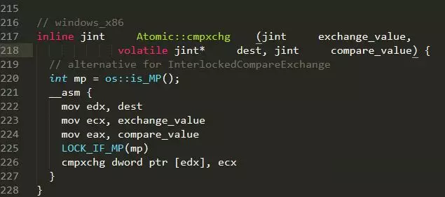
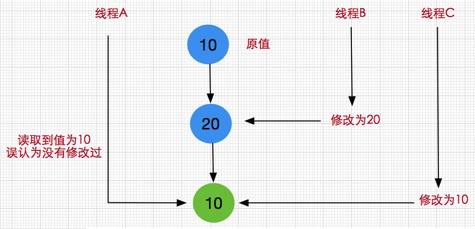

# 深入理解CAS（Compare And Swap）

- CAS（Compare-and-Swap），即比较并替换，是一种实现并发算法时常用到的技术，Java并发包中的很多类都使用了CAS技术。

### 一、CAS的引出

- 1、在JDK1.5之前Java语言是靠synchronized关键字保证同步的，这会导致有锁锁机制存在以下问题：
  - （1）在多线程竞争下，加锁、释放锁会导致比较多的上下文切换和调度延时，引起性能问题。
  - （2）一个线程持有锁会导致其它所有需要此锁的线程挂起。
  - （3）如果一个优先级高的线程等待一个优先级低的线程释放锁会导致优先级倒置，引起性能风险。 
- 2、解决方案：
  - volatile是不错的机制，但是volatile不能保证原子性，因此对于同步最终还是要回到锁机制上来。
  - 独占锁是一种悲观锁，synchronized就是一种独占锁，会导致其它所有需要锁的线程挂起，等待持有锁的线程释放锁。
  - 而另一个更加有效的锁就是乐观锁。所谓**乐观锁**就是，每次不加锁而是假设没有冲突而去完成某项操作，如果因为冲突失败就重试，直到成功为止。**乐观锁用到的机制就是CAS，Compare and Swap（比较与交换）**。

### 二、无锁的概念
- 在谈论无锁概念时，总会关联起乐观派与悲观派，
    - 对于**乐观派**而言，他们认为事情总会往好的方向发展，总是认为坏的情况发生的概率特别小，可以无所顾忌地做事，
    - 但对于**悲观派**而已，他们总会认为发展事态如果不及时控制，以后就无法挽回了，即使无法挽回的局面几乎不可能发生。
    - 这两种派系映射到并发编程中就如同加锁与无锁的策略，即
        - **加锁是一种悲观策略**，
        - **无锁是一种乐观策略**，
- 因为对于**加锁**的并发程序来说，它们总是认为每次访问共享资源时总会发生冲突，因此必须对每一次数据操作实施加锁策略。
- 而无锁则总是假设对共享资源的访问没有冲突，线程可以不停执行，无需加锁，无需等待，
	- 一旦发现冲突，无锁策略则采用一种称为**CAS的技术**来保证线程执行的安全性，**这项CAS技术就是无锁策略实现的关键**，下面我们进一步了解CAS技术的奇妙之处。


### 三、什么是CAS？

- 在计算机科学中，**比较和交换（Conmpare And Swap）是用于实现多线程同步的原子指令**。 **它将内存位置的内容与给定值（预期值）进行比较，只有在相同的情况下，将该内存位置的内容修改为新的给定值**。 这是作为单个原子操作完成的。 原子性保证新值基于最新信息计算; 如果该值在同一时间被另一个线程更新，则写入将失败。 操作结果必须说明是否进行替换; 这可以通过一个简单的布尔响应（这个变体通常称为比较和设置），或通过返回从内存位置读取的值来完成。（摘自维基本科）
- 我们都知道，在java语言之前，并发就已经广泛存在并在服务器领域得到了大量的应用。所以硬件厂商老早就在芯片中加入了大量直至并发操作的原语，从而在硬件层面提升效率。在intel的CPU中，使用**cmpxchg指令**。
- 在Java发展初期，java语言是不能够利用硬件提供的这些便利来提升系统的性能的。而随着java不断的发展，Java本地方法(JNI)的出现，使得java程序越过JVM直接调用本地方法提供了一种便捷的方式，因而java在并发的手段上也多了起来。而在Doug Lea提供的**cucurenct包中，CAS理论是它实现整个java包的基石**。
- **CAS 操作包含三个操作数 —— 内存位置（V）、预期原值（E）和新值（N）**。（`V：Value；E：Expect；N：New`）
    -  如果内存位置的值与预期原值相匹配，那么处理器会自动将该位置值更新为新值 。
    -  否则，处理器不做任何操作。
    -  无论哪种情况，它都会在 CAS 指令之前返回该位置的值。（在 CAS 的一些特殊情况下将仅返回 CAS 是否成功，而不提取当前值）CAS 有效地说明了“我认为位置 V 应该包含值 E；如果包含该值，则将 N 放到这个位置；否则，不要更改该位置，只告诉我这个位置现在的值即可。”
- 通常将 CAS 用于**同步的方式**是**从地址 V 读取值 E，执行多步计算来获得新值 N，然后使用 CAS 将 V 的值从 E 改为 N。如果 V 处的值尚未同时更改，则 CAS 操作成功**。
- 类似于 CAS 的指令允许算法执行**读-修改-写**操作，而无需害怕其他线程同时 修改变量，因为如果其他线程修改变量，那么 CAS 会检测它（并失败），算法 可以对该操作重新计算。

### 四、CAS的目的
- 利用CPU的CAS指令，同时借助JNI来完成Java的**非阻塞算法**。其它原子操作都是利用类似的特性完成的。而整个J.U.C都是建立在CAS之上的，因此对于synchronized阻塞算法，J.U.C在性能上有了很大的提升。（J.U.C:`java.util.concurrent`）

### 五、CAS原理
- CAS的全称是Compare And Swap 即比较交换，其算法核心思想如下(其包含3个参数)
  ```java
  执行函数：CAS(V,E,N)
  ```
	- V：表示要更新的变量
	- E：表示预期值
	- N：表示新值
- CAS算法的核心思想：
    - 如果V值等于E值，则将V的值设为N。
    - 若V值和E值不同，则说明已经有其他线程做了更新，则当前线程什么都不做。
- 通俗的理解就是CAS操作需要我们提供一个期望值，当期望值与当前线程的变量值相同时，说明还没线程修改该值，当前线程可以进行修改，也就是执行CAS操作，但如果期望值与当前线程不符，则说明该值已被其他线程修改，此时不执行更新操作，但可以选择重新读取该变量再尝试再次修改该变量，也可以放弃操作，原理图如下：

    
    
	- 由于CAS操作属于乐观派，它总认为自己可以成功完成操作，当多个线程同时使用CAS操作一个变量时，只有一个会胜出，并成功更新，其余均会失败，但失败的线程并不会被挂起，仅是被告知失败，并且允许再次尝试，当然也允许失败的线程放弃操作，这点从图中也可以看出来。基于这样的原理，CAS操作即使没有锁，同样知道其他线程对共享资源操作影响，并执行相应的处理措施。同时从这点也可以看出，由于无锁操作中没有锁的存在，因此不可能出现死锁的情况，也就是说**无锁操作天生免疫死锁**。

### 六、CPU指令对CAS的支持
- 或许我们可能会有这样的疑问，假设存在多个线程执行CAS操作并且CAS的步骤很多，有没有可能在判断V和E相同后，正要赋值时，切换了线程，更改了值。造成了数据不一致呢？
- 答案是否定的，因为**CAS是一种系统原语**，原语属于操作系统用语范畴，是由若干条指令组成的，用于完成某个功能的一个过程，并且原语的执行必须是连续的，在执行过程中不允许被中断，也就是说**CAS是一条CPU的原子指令，不会造成所谓的数据不一致问题**。

### 七、CAS存在的问题
- 1）**循环时间长开销很大**：

  - 自旋CAS如果长时间不成功，会给CPU带来非常大的执行开销。
  - 如果JVM能支持处理器提供的**pause指令**那么效率会有一定的提升，pause指令有两个作用，
    - 第一它可以延迟流水线执行指令（de-pipeline）,使CPU不会消耗过多的执行资源，延迟的时间取决于具体实现的版本，在一些处理器上延迟时间是零。
    - 第二它可以避免在退出循环的时候因内存顺序冲突（memory order violation）而引起CPU流水线被清空（CPU pipeline flush），从而提高CPU的执行效率。
- 2）**只能保证一个共享变量的原子操作**：

  - 当对一个共享变量执行操作时，我们可以使用循环CAS的方式来保证原子操作，
  - 但是对多个共享变量操作时，循环CAS就无法保证操作的原子性，
    - 这个时候就可以**用锁来保证原子性**，
    - 或者有一个取巧的办法，就是**把多个共享变量合并成一个共享变量来操作**。比如有两个共享变量`i＝2,j=a`，合并一下`ij=2a`，然后用CAS来操作`ij`。
    - 从Java1.5开始JDK提供了AtomicReference类来保证引用对象之间的原子性，你可以把多个变量放在一个对象里来进行CAS操作。

- 3）**ABA问题**:

  - 因为CAS需要在操作值的时候检查下值有没有发生变化，如果没有发生变化则更新，但是如果一个值原来是A，变成了B，又变成了A，那么使用CAS进行检查时会发现它的值没有发生变化，但是实际上却变化了。
  - ABA问题的解决思路就是使用版本号，在变量前面追加上版本号，每次变量更新的时候把版本号加一，那么A->B->A 就会变成1A->2B->3A。
  - 从Java1.5开始JDK的atomic包里提供了一个类AtomicStampedReference来解决ABA问题。这个类的compareAndSet方法作用是首先检查当前引用是否等于预期引用，并且当前标志是否等于预期标志，如果全部相等，则以原子方式将该引用和该标志的值设置为给定的更新值。
  - 举个例子：
    ```sql
    update table set x=x+1, version=version+1 where id=#{id} and version=#{version};  
    ```

### 八、鲜为人知的指针: Unsafe类
- Unsafe类存在于`sun.misc`包中，其内部方法操作可以像C的指针一样直接操作内存，单从名称看来就可以知道该类是非安全的，毕竟Unsafe拥有着类似于C的指针操作，因此总是不应该首先使用Unsafe类，**Java官方也不建议直接使用的Unsafe类**，但我们还是很有必要了解该类，因为**Java中CAS操作的执行依赖于Unsafe类的方法**，注意**Unsafe类中的所有方法都是native修饰的**，也就是说Unsafe类中的方法都直接调用操作系统底层资源执行相应任务，关于Unsafe类的主要功能点如下：
  - Unsafe类的主要功能点1：**内存管理，Unsafe类中存在直接操作内存的方法；**
    ```java
    //分配内存指定大小的内存
    public native long allocateMemory(long bytes);

    //根据给定的内存地址address设置重新分配指定大小的内存
    public native long reallocateMemory(long address, long bytes);

    //用于释放allocateMemory和reallocateMemory申请的内存
    public native void freeMemory(long address);

    //将指定对象的给定offset偏移量内存块中的所有字节设置为固定值
    public native void setMemory(Object o, long offset, long bytes, byte value);

    //设置给定内存地址的值
    public native void putAddress(long address, long x);

    //获取指定内存地址的值
    public native long getAddress(long address);

    //设置给定内存地址的long值
    public native void putLong(long address, long x);

    //获取指定内存地址的long值
    public native long getLong(long address);

    //设置或获取指定内存的byte值
    //其他基本数据类型(long,char,float,double,short等)的操作与putByte及getByte相同
    public native byte getByte(long address);
    public native void putByte(long address, byte x);

    //操作系统的内存页大小
    public native int pageSize();  
    ```
  - Unsafe类的主要功能点2：**提供实例对象新途径**
    ```java
     //传入一个对象的class并创建该实例对象，但不会调用构造方法
    public native Object allocateInstance(Class cls) throws InstantiationException;
    ```
  - Unsafe类的主要功能点3：**类和实例对象以及变量的操作**
    ```java
    //传入Field f，获取字段f在实例对象中的偏移量
    
    //获得给定对象偏移量上的int值，所谓的偏移量可以简单理解为指针指向该变量的内存地址，
    
    //通过偏移量便可得到该对象的变量
    
    //通过偏移量可以设置给定对象上偏移量的int值
    
    //获得给定对象偏移量上的引用类型的值
    
    //通过偏移量可以设置给定对象偏移量上的引用类型的值
    ```
	- 虽然在Unsafe类中存在getUnsafe()方法，但该方法只提供给高级的Bootstrap类加载器使用，普通用户调用将抛出异常，所以我们在Demo中使用了反射技术获取了Unsafe实例对象并进行相关操作。
- Unsafe里的CAS 操作相关：
  - CAS是一些CPU直接支持的指令，也就是我们前面分析的无锁操作，在Java中无锁操作CAS基于以下3个方法实现，在稍后讲解Atomic系列内部方法是基于下述方法的实现的。
      ```java
      //第一个参数o为给定对象，offset为对象内存的偏移量，通过这个偏移量迅速定位字段并设置或获取该字段的值，
      //expected表示期望值，x表示要设置的值，下面3个方法都通过CAS原子指令执行操作。
      public final native boolean compareAndSwapObject(Object o, long offset,Object expected, Object x);

      public final native boolean compareAndSwapInt(Object o, long offset,int expected,int x);

      public final native boolean compareAndSwapLong(Object o, long offset,long expected,long x);
      ```
	- **挂起与恢复**：将一个线程进行挂起是通过park方法实现的，调用 park后，线程将一直阻塞直到超时或者中断等条件出现。unpark可以终止一个挂起的线程，使其恢复正常。Java对线程的挂起操作被封装在 LockSupport类中，LockSupport类中有各种版本pack方法，其底层实现最终还是使用Unsafe.park()方法和Unsafe.unpark()方法。
      ```java
      //线程调用该方法，线程将一直阻塞直到超时，或者是中断条件出现。  
      public native void park(boolean isAbsolute, long time);  

      //终止挂起的线程，恢复正常.java.util.concurrent包中挂起操作都是在LockSupport类实现的，其底层正是使用这两个方法，  
      public native void unpark(Object thread); 
      ```

### 九、java.util.concurrent包解析
#### 1.concurrent包的实现
- 由于java的CAS同时具有volatile读和volatile写的内存语义，因此Java线程之间的通信现在有了下面四种方式： 
  - （1）A线程写volatile变量，随后B线程读这个volatile变量。
  - （2）A线程写volatile变量，随后B线程用CAS更新这个volatile变量。
  - （3）A线程用CAS更新一个volatile变量，随后B线程用CAS更新这个volatile变量。
  - （4）A线程用CAS更新一个volatile变量，随后B线程读这个volatile变量。
- Java的CAS会使用现代处理器上提供的高效机器级别原子指令，这些原子指令以原子方式对内存执行读-改-写操作，这是在多处理器中实现同步的关键（从本质上来说，能够支持原子性读-改-写指令的计算机器，是顺序计算图灵机的异步等价机器，因此任何现代的多处理器都会去支持某种能对内存执行原子性**读-改-写**操作的原子指令）。
- 同时，**volatile变量的读/写和CAS可以实现线程之间的通信**。把这些特性整合在一起，就形成了整个concurrent包得以实现的基石。如果我们仔细分析concurrent包的源代码实现，会发现一个通用化的实现模式：
	- 首先，声明共享变量为volatile；
	- 然后，使用CAS的原子条件更新来实现线程之间的同步；
	- 同时，配合以volatile的读/写和CAS所具有的volatile读和写的内存语义来实现线程之间的通信。
	- **AQS(AbstractQueuedSynchronizer：java.util.concurrent.locks包中的类)** 和 **原子变量类（java.util.concurrent.atomic包中的类）**以及**非阻塞数据结构**，这些concurrent包中的基础类都是使用这种模式来实现的，而concurrent包中的高层类又是依赖于这些基础类来实现的，从整体来看，concurrent包的实现示意图如下：

		


#### 2.并发包中的原子操作类(Atomic系列)
- 通过前面的分析我们已基本理解了无锁CAS的原理并对Java中的指针类Unsafe类有了比较全面的认识，下面进一步分析CAS在Java中的应用，即**并发包中的原子操作类(Atomic系列)**，从JDK 1.5开始提供了`java.util.concurrent.atomic`包，在该包中提供了许多基于CAS实现的原子操作类，用法方便，性能高效，主要分以下4种类型。
  - 1)原子更新基本类型
  - 2)CAS的ABA问题及其解决方案
  - 3)再谈自旋锁
  - 4)


#### 3.原子更新基本类型
- 原子更新基本类型主要包括3个类：
  - AtomicBoolean：原子更新布尔类型
  - AtomicInteger：原子更新整型
  - AtomicLong：原子更新长整型

- 这3个类的实现原理和使用方式几乎是一样的，这里我们**以AtomicInteger为例进行分析**，AtomicInteger主要是针对int类型的数据执行原子操作，它提供了原子自增方法、原子自减方法以及原子赋值方法等。
  ```java
  package java.util.concurrent.atomic;
  import java.util.function.IntUnaryOperator;
  import java.util.function.IntBinaryOperator;
  import sun.misc.Unsafe;
  
  /**
   * @since 1.5
   * @author Doug Lea
  */
  public class AtomicInteger extends Number implements java.io.Serializable {
      private static final long serialVersionUID = 6214790243416807050L;
  
      // setup to use Unsafe.compareAndSwapInt for updates
      //获取指针类Unsafe
      private static final Unsafe unsafe = Unsafe.getUnsafe();
      //下述变量value在AtomicInteger实例对象内的内存偏移量
      private static final long valueOffset;
  
      static {
          try {
              //通过unsafe类的objectFieldOffset()方法，获取value变量在对象内存中的偏移
              //通过该偏移量valueOffset，unsafe类的内部方法可以获取到变量value对其进行取值或赋值操作
              valueOffset = unsafe.objectFieldOffset
                  (AtomicInteger.class.getDeclaredField("value"));
          } catch (Exception ex) { throw new Error(ex); }
      }
      //当前AtomicInteger封装的int变量value
      private volatile int value;
  
      //Creates a new AtomicInteger with the given initial value.
      public AtomicInteger(int initialValue) {
          value = initialValue;
      }
  
      //Creates a new AtomicInteger with initial value {@code 0}.
      public AtomicInteger() {
      }
  
      //获取当前最新值，Gets the current value.
      public final int get() {
          return value;
      }
  
      //设置当前值，具备volatile效果，方法用final修饰是为了更进一步的保证线程安全。
      public final void set(int newValue) {
          value = newValue;
      }
  
      /**
       * @since 1.6
       * 最终会设置成newValue，使用该方法后可能导致其他线程在之后的一小段时间内可以获取到旧值，有点类似于延迟加载
       */
      public final void lazySet(int newValue) {
          unsafe.putOrderedInt(this, valueOffset, newValue);
      }
  
      //设置新值并获取旧值，底层调用的是CAS操作即unsafe.compareAndSwapInt()方法
      public final int getAndSet(int newValue) {
          return unsafe.getAndSetInt(this, valueOffset, newValue);
      }
  
      //如果当前值为expect，则设置为update(当前值指的是value变量)
      public final boolean compareAndSet(int expect, int update) {
          return unsafe.compareAndSwapInt(this, valueOffset, expect, update);
      }
  
      /**
       * Atomically sets the value to the given updated value
       * if the current value {@code ==} the expected value.
       *
       * <p><a href="package-summary.html#weakCompareAndSet">May fail
       * spuriously and does not provide ordering guarantees</a>, so is
       * only rarely an appropriate alternative to {@code compareAndSet}.
       *
       * @param expect the expected value
       * @param update the new value
       * @return {@code true} if successful
       */
      public final boolean weakCompareAndSet(int expect, int update) {
          return unsafe.compareAndSwapInt(this, valueOffset, expect, update);
      }
  
      //当前值加1返回旧值，底层CAS操作
      public final int getAndIncrement() {
          return unsafe.getAndAddInt(this, valueOffset, 1);
      }
  
      //当前值减1，返回旧值，底层CAS操作
      public final int getAndDecrement() {
          return unsafe.getAndAddInt(this, valueOffset, -1);
      }
  
      //当前值增加delta，返回旧值，底层CAS操作
      public final int getAndAdd(int delta) {
          return unsafe.getAndAddInt(this, valueOffset, delta);
      }
  
      //当前值加1，返回新值，底层CAS操作
      public final int incrementAndGet() {
          return unsafe.getAndAddInt(this, valueOffset, 1) + 1;
      }
  
      //当前值减1，返回新值，底层CAS操作
      public final int decrementAndGet() {
          return unsafe.getAndAddInt(this, valueOffset, -1) - 1;
      }
  
      //当前值增加delta，返回新值，底层CAS操作
      public final int addAndGet(int delta) {
          return unsafe.getAndAddInt(this, valueOffset, delta) + delta;
      }
  
      //省略一些不常用的方法....
  }
  ```

    - 通过上述的分析，可以发现AtomicInteger原子类的内部几乎是基于前面分析过Unsafe类中的CAS相关操作的方法实现的，这也同时证明**AtomicInteger是基于无锁实现的**，这里重点分析自增操作实现过程，其他方法自增实现原理一样。

    - 我们发现AtomicInteger类中所有自增或自减的方法都间接调用Unsafe类中的getAndAddInt()方法实现了CAS操作，从而保证了线程安全，关于getAndAddInt其实前面已分析过，它是Unsafe类中1.8新增的方法，源码如下
      ```java
      package sun.misc;

      public final class Unsafe {
          /**Unsafe类中的getAndAddInt方法
           * getAndAddInt方法解析：拿到内存位置的最新值v，使用CAS尝试修将内存位置的值修改为
           * 目标值v+delta，如果修改失败，则获取该内存位置的新值v，然后继续尝试，直至修改成功。
           */
          public final int getAndAddInt(Object o, long offset, int delta) {
              int v;
              do {
                  v = getIntVolatile(o, offset);
              } while (!compareAndSwapInt(o, offset, v, v + delta));
              return v;
          }
      }
      ```
    - 可看出getAndAddInt通过一个while循环不断的重试更新要设置的值，直到成功为止，调用的是Unsafe类中的compareAndSwapInt方法，是一个CAS操作方法。这里需要注意的是，上述源码分析是基于JDK1.8的，如果是1.8之前的方法，AtomicInteger源码实现有所不同，是基于for死循环的，如下
      ```java
      package sun.misc;

      public final class Unsafe {
        //JDK 1.7的源码，由for的死循环实现，并且直接在AtomicInteger实现该方法，
        //JDK1.8后，该方法实现已移动到Unsafe类中，直接调用getAndAddInt方法即可
        public final int incrementAndGet() {
            for (;;) {
                int current = get();
                int next = current + 1;
                if (compareAndSet(current, next))
                    return next;
            }
        }
      }
      ```
- **JNI方法`Atomic::cmpxchg`解析**:

  ```java
  package java.util.concurrent.atomic;
  public class AtomicInteger extends Number implements java.io.Serializable {
    	//当前值加1返回旧值，底层CAS操作
      public final int getAndIncrement() {
          return unsafe.getAndAddInt(this, valueOffset, 1);
      }
  }
  
  package sun.misc;
  public final class Unsafe {
  	  /**
  	   * Unsafe类中的getAndAddInt方法
  	   * getAndAddInt方法解析：拿到内存位置的最新值v，使用CAS尝试修将内存位置的值修改为
  	   * 目标值v+delta，如果修改失败，则获取该内存位置的新值v，然后继续尝试，直至修改成功。
  	   */
  	  public final int getAndAddInt(Object o, long offset, int delta) {
          int v;
          do {
              v = getIntVolatile(o, offset);
          } while (!compareAndSwapInt(o, offset, v, v + delta));
          return v;
      }
  
      public final native boolean compareAndSwapInt(Object var1, long var2, int var4, int var5);
  }
  ```

  

  - 可以看到调用了“`Atomic::cmpxchg`”方法，“`Atomic::cmpxchg`”方法在linux_x86和windows_x86的实现如下。
    - **linux_x86的实现：**
      
      
      
    - **windows_x86的实现：**

      

  - **Atomic::cmpxchg方法解析：**
    - mp是“`os::is_MP()`”的返回结果，“`os::is_MP()`”是一个内联函数，用来判断当前系统是否为多处理器。
    	- 如果当前系统是多处理器，该函数返回1。
    	- 否则，返回0。
    - `LOCK_IF_MP(mp)`会根据 mp 的值来决定是否为 cmpxchg指令 添加lock前缀。
    	- 如果通过mp判断当前系统是多处理器（即mp值为1），则为cmpxchg指令添加lock前缀。
    	- 否则，不加lock前缀。
    - 这是一种优化手段，认为单处理器的环境没有必要添加lock前缀，只有在多核情况下才会添加lock前缀，因为lock会导致性能下降。cmpxchg是汇编指令，作用是**比较并交换**操作数。
- intel手册对lock前缀的说明如下：
  - 1)**确保对内存的读-改-写操作原子执行**。
    - 在Pentium及Pentium之前的处理器中，带有lock前缀的指令在执行期间会锁住总线，使得其他处理器暂时无法通过总线访问内存。很显然，这会带来昂贵的开销。
    - 从Pentium 4，Intel Xeon及P6处理器开始，intel在原有总线锁的基础上做了一个很有意义的优化：如果要访问的内存区域（area of memory）在lock前缀指令执行期间已经在处理器内部的缓存中被锁定（即包含该内存区域的缓存行当前处于独占或以修改状态），并且该内存区域被完全包含在单个缓存行（cache line）中，那么处理器将直接执行该指令。
    - 由于在指令执行期间该缓存行会一直被锁定，其它处理器无法读/写该指令要访问的内存区域，因此能保证指令执行的原子性。
    - 这个操作过程叫做缓存锁定（cache locking），缓存锁定将大大降低lock前缀指令的执行开销，但是当多处理器之间的竞争程度很高或者指令访问的内存地址未对齐时，仍然会锁住总线。
  - 2)**禁止**该指令与之前和之后的读和写**指令重排序**。
  - 3)把写缓冲区中的所有数据刷新到内存中。
	- 上面的第1)点保证了CAS操作是一个原子操作，第2)点和第3)点所具有的内存屏障效果，保证了CAS同时具有volatile读和volatile写的内存语义。

#### 4.CAS的ABA问题及其解决方案
- 假设这样一种场景，当第一个线程执行`CAS(V,E,N)`操作，在获取到当前变量V，准备修改为新值N前，另外两个线程已连续修改了两次变量V的值，使得该值又恢复为旧值，这样的话，我们就无法正确判断这个变量是否已被修改过，如下图

  

- 这就是典型的CAS的ABA问题，一般情况这种情况发现的概率比较小，可能发生了也不会造成什么问题，比如说我们对某个做加减法，不关心数字的过程，那么发生ABA问题也没啥关系。但是在某些情况下还是需要防止的，那么该如何解决呢？在Java中解决ABA问题，我们可以使用以下两个原子类：

  - AtomicStampedReference类
  - AtomicMarkableReference类

- **AtomicStampedReference类**

  - AtomicStampedReference原子类是一个带有时间戳的对象引用，在每次修改后，AtomicStampedReference**不仅会设置新值而且还会记录更改的时间**。当AtomicStampedReference设置对象值时，**对象值**以及**时间戳**都必须满足期望值才能写入成功，这也就解决了反复读写时，无法预知值是否已被修改的窘境。
  - 底层实现为： 通过Pair私有内部类存储数据和时间戳, 并构造volatile修饰的私有实例
  - 接着看AtomicStampedReference类的`compareAndSet()`方法的实现：
    - 同时对当前数据和当前时间进行比较，只有两者都相等是才会执行casPair()方法，
    - 单从该方法的名称就可知是一个CAS方法，最终调用的还是Unsafe类中的compareAndSwapObject方法
  - 到这我们就很清晰AtomicStampedReference的内部实现思想了，
    - **通过一个键值对Pair存储数据和时间戳，在更新时对数据和时间戳进行比较，只有两者都符合预期才会调用Unsafe的compareAndSwapObject方法执行数值和时间戳替换，也就避免了ABA的问题**。

- **AtomicMarkableReference类**

  - AtomicMarkableReference与AtomicStampedReference不同的是，
  - AtomicMarkableReference**维护的是一个boolean值的标识**，也就是说只有true和false两种切换状态，
  - 这种方式并不能完全防止ABA问题的发生，只能减少ABA问题发生的概率。
  - AtomicMarkableReference的实现原理与AtomicStampedReference类似，这里不再介绍。

- 如果要完全杜绝ABA问题的发生，

  - 应该使用AtomicStampedReference原子类更新对象（完全杜绝ABA问题的发生），
  - 而对于AtomicMarkableReference来说**只能减少ABA问题的发生概率，并不能杜绝**。

#### 5.再谈自旋锁
- 自旋锁是一种假设在不久将来，当前的线程可以获得锁，因此虚拟机会让当前想要获取锁的线程做几个空循环(这也是称为自旋的原因)，在经过若干次循环后，如果得到锁，就顺利进入临界区。如果还不能获得锁，那就会将线程在操作系统层面挂起，这种方式确实也是可以提升效率的。但问题是当线程越来越多竞争很激烈时，占用CPU的时间变长会导致性能急剧下降，因此Java虚拟机内部一般对于自旋锁有一定的次数限制，可能是50或者100次循环后就放弃，直接挂起线程，让出CPU资源。
- 如下通过AtomicReference可实现简单的自旋锁。
  ```java
  public class SpinLock {
      private AtomicReference<Thread> sign = new AtomicReference<>();
  
      public void lock(){
          Thread current = Thread.currentThread();
          while(!sign .compareAndSet(null, current)){
  
          }
      }
  
      public void unlock (){
          Thread current = Thread.currentThread();
          sign .compareAndSet(current, null);
      }
  }
  ```
- 使用CAS原子操作作为底层实现，
  - lock()方法将要更新的值设置为当前线程，并将预期值设置为null。
  - unlock()函数将要更新的值设置为null，并预期值设置为当前线程。
  - 然后我们通过lock()和unlock来控制自旋锁的开启与关闭，注意这是一种**非公平锁**。事实上AtomicInteger(或者AtomicLong)原子类内部的CAS操作也是通过不断的自循环(while循环)实现，不过这种循环的结束条件是线程成功更新对于的值，但也是自旋锁的一种。
