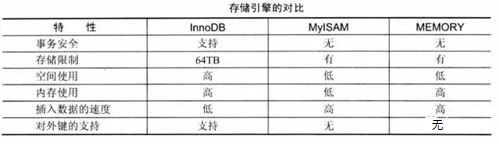

# MySQL存储引擎

## 一、存储引擎
- 关系数据库表是用于存储和组织信息的数据结构，可以将表理解为由行和列组成的表格，类似于Excel的电子表格的形式。
  - 有的表简单有的表复杂，
  - 有的表根本不用存储任何长期的数据，
  - 有的表读取非常快，但是插入数据时却很差；
  - 我们在实际开发过程中，可能需要各种各样的表，不同的表，意味着存储不同类型的数据，数据的处理上也会存在差异。
  - 那么，对MySQL来说，它提供了很多种类型的存储引擎，我们可以根据对数据处理的需求，选择不同存储引擎，从而最大限度利用MySQL强大的功能。
  - 这篇博文将总结和分析各个引擎特点，以及适用场合，并不会纠结更深层次的东西。我的学习方法是先学会用懂得怎么用，再去知道到底是如何能用的。下面就对MySQL支持的存储引擎进行简单介绍。
- MySQL支持的存储引擎有：
	- MyISAM表
	- InnoDB表
	- MEMORY表`[ˈmem(ə)rē]`
	- MERGE表
	- ARCHIVE表`[ˈärˌkīv]`
- 在MySQL数据库中，常用的引擎主要就是2个：Innodb和MyIASM。

## 二、MySQL存储引擎介绍
### 1、MyISAM表
- MyISAM是独立于操作系统的，这说明可以轻松地将其从Windows服务器移植到Linux服务器；每当我们建立一个MyISAM引擎的表时，就会在本地磁盘上建立三个文件，文件名就是表名称。例如，我建立了一个MyISAM引擎的tb_Demo表，那么就会生成以下三个文件：
	- tb_demo.frm存储表定义；
	- tb_demo.MYD存储表数据；
	- tb_demo.MYI存储表索引。
- MyISAM表无法处理事务，这就意味着有事务处理需求的表，不能用MyISAM存储引擎。MyISAM存储引擎特别适合以下几种情况下使用：
	- 选择密集型表。MyISAM存储引擎在筛选大量数据时非常快，是它最突出的优点；
	- 插入密集型表。MyISAM的并发插入特性允许同时选择、插入数据。例如：MyISAM存储引擎非常适合管理邮件或Web服务器日志数据。

### 2、InnoDB表
- InnoDB是一个健壮的事务型存储引擎，这种存储引擎已经被很多互联网公司使用，为用户操作非常大的数据存储提供一个强大的解决方案。我的电脑上安装的MySQL 5.6.13版，InnoDB就是作为默认的存储引擎。InnoDB还引入了行级锁定和外键约束，在以下场合下，使用InnoDB是最理想的选择：
	- 更新密集的表。InnoDB存储引擎特别适合处理多重并发的更新请求；
	- 事务。InnoDB存储引擎是支持事务的标准MySQL存储引擎；
	- 自动灾难恢复。与其它的存储引擎不同，InnoDB表能够自动从灾难中恢复；
	- 外键约束。支持外键的存储引擎只有InnoDB；
	- 支持自动增加列AUTO_INCREMENT属性；
- 一般来说，如果需要事务支持，并且有较高的并发读取频率，InnoDB是很不错的选择。

### 3、MEMORY表
- 使用MySQL Memory存储引擎的出发点是速度。为得到最快的响应时间，采用的逻辑存储介质是系统内存。虽然在内存中存储表数据确实提供很高的性能，但当mysqld守护进程崩溃时，所有的Memory数据都会丢失。获得速度的同时也带来一些缺陷。它要求存储在Memory数据表里的数据用的是长度不变的格式，这意味着不能用BLOB和TEXT这样的长度可变的数据类型，VARCHAR是种长度可变的类型，但因为它在MySQL内部当做长度固定不变的CHAR类型，所以可以使用。
- 一般在以下几种情况下用Memory存储引擎：
	- 目标数据较小，而且被非常频繁地访问。在内存中存放数据，所以会造成内存的使用，可以通过参数max_heap_table_size控制Memory表的大小，设置此参数就可以限制Memory表最大大小；
	- 如果数据是临时的，而且要求必须立即可用，那么就可以存放在内存表中；
	- 存储在Memory表中的数据如突然丢失，不会对应用服务产生实质的负面影响。
- Memory同时支持散列索引和B树索引。B树索引可以使用部分查询、通配查询，也可以使用操作符方便数据挖掘。散列索引进行“相等比较”时非常快，但对“范围比较”速度就慢多了，因此散列索引值适合使用在和操作符，不适合在或操作符，也同样不适合用在order by子句中。

### 4、MERGE表
- MERGE存储引擎是一组MyISAM表组合，这些MyISAM表结构必须完全相同，尽管使用不如其它引擎突出，但是在某些情况下非常有用。说白了Merge表就是几个相同MyISAM表的聚合；Merge表中并没有数据，对Merge类型的表可以进行查询、更新、删除操作，这些操作实际上是对内部的MyISAM表进行操作。
- Merge存储引擎使用场景对于服务器日志这种信息，一般常用的存储策略是将数据分成很多表，每个名称与特定时间端相关。例如：可以用12个相同的表来存储服务器的日志数据，每个表用对应各个月份的名字来命名。当有必要基于所有12个日志表的数据来生成报表时，这意味着需要编写、更新多表查询，以反映这些表中的信息。与其编写这些可能会出现错误的查询，不如将这些表合并起来使用一条查询，之后再删除Merge表而不影响原来的数据，删除Merge表只会删除掉Merge表的定义，对内部表没有任何影响。

### 5、ARCHIVE表
- Archive就是归档的意思，在归档之后很多的高级功能就不再支持了，仅支持最基本的插入和查询两种功能。在MySQL 5.5版前，Archive不支持索引，但是在MySQL 5.5以后的版本中就开始支持索引了。Archive拥有很好的压缩机制，使用zlib压缩库，在记录被请求时会实时压缩，所以它经常被用来当做仓库使用。

## 三、存储引擎相关问题
- 如何查看服务器有哪些存储引擎可以使用？
	- 在mysql客户端中，使用以下命令可以查看MySQL支持的引擎：
	  ```sql
	  show engines;
	  ```
- 如何选合适的存储引擎？
	- 选择标准可以分为：
		- 是否需要支持事务;
		- 是否需要使用热备;
		- 崩溃恢复，能否接受崩溃;
		- 是否需要外键支持。
	- 然后按照标准，选对应的存储引擎即可。

	


