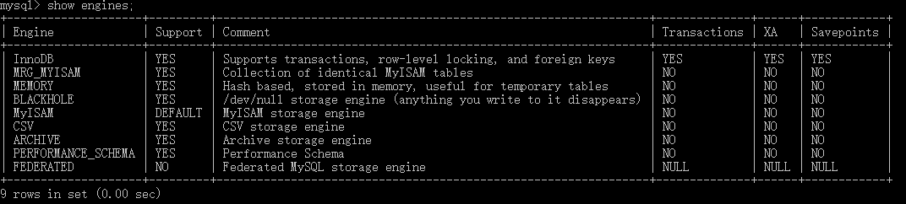
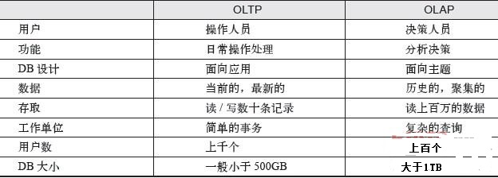

# MySQL存储引擎

- MySQL数据库区别于其他数据库的最重要的一个特点就是其**插件式的表存储引擎**。
- MySQL被设计为一个**单进程多线程架构**的数据库；MySQL数据库实例在系统上的表现就是一个进程。**数据库实例才是真正用于操作数据库文件的**。
- 在MySQL 5.1（《高性能mysql》P17页）版本及之前MyISAM存储引擎是默认的存储引擎（除Windows版本外）；
- 从MySQL数据库5.5.8（《MySQL技术内幕_InnoDB存储引擎》1.3.1InnoDB存储引擎）版本开始，InnoDB存储引擎是默认的存储引擎。

## 一、存储引擎
- 关系数据库表是用于存储和组织信息的数据结构，可以将表理解为由行和列组成的表格，类似于Excel的电子表格的形式。
  - 有的表简单有的表复杂，
  - 有的表根本不用存储任何长期的数据，
  - 有的表读取非常快，但是插入数据时却很差；
  - 我们在实际开发过程中，可能需要各种各样的表，不同的表，意味着存储不同类型的数据，数据的处理上也会存在差异。
  - 那么，对MySQL来说，它提供了很多种类型的存储引擎，我们可以根据对数据处理的需求，选择不同存储引擎，从而最大限度利用MySQL强大的功能。
  - 这篇博文将总结和分析各个引擎特点，以及适用场合，并不会纠结更深层次的东西。我的学习方法是先学会用懂得怎么用，再去知道到底是如何能用的。下面就对MySQL支持的存储引擎进行简单介绍。
- MySQL支持的存储引擎有：
  - MyISAM表
  - InnoDB表
  - MEMORY表`[ˈmem(ə)rē]`
  - MERGE表
  - ARCHIVE表`[ˈärˌkīv]`
  - NDB（集群引擎）NDB的特点是数据全部放在内存中
  - Federated表
  - Maria表（Aria属于社区存储引擎）
  - CSV表
  - Sphinx表
  - Infobright表
- 在MySQL数据库中，常用的引擎主要就是2个：Innodb和MyIASM。

## 二、MySQL存储引擎介绍

  

### 1、MyISAM表（大批量的插入语句、B树）
- 在MySQL 5.0版本之前，MyISAM默认支持的表大小为4GB，如果需要支持大于4GB的MyISAM表时，则需要制定MAX_ROWS和AVG_ROW_LENGTH属性。从MySQL 5.0版本开始，MyISAM默认支持256TB的单表数据，这足够满足一般应用需求。
- MyISAM是独立于操作系统的，这说明可以轻松地将其从Windows服务器移植到Linux服务器；每当我们建立一个MyISAM引擎的表时，就会在本地磁盘上建立三个文件，文件名就是表名称。例如，我建立了一个MyISAM引擎的tb_Demo表，那么就会生成以下三个文件：
  - tb_demo.frm存储表定义；
  - tb_demo.MYD存储表数据；
  - tb_demo.MYI存储表索引。
- MyISAM表无法处理事务，这就意味着有事务处理需求的表，不能用MyISAM存储引擎。MyISAM存储引擎特别适合以下几种情况下使用：
  - 选择密集型表。MyISAM存储引擎在筛选大量数据时非常快，是它最突出的优点；
  - 插入密集型表。MyISAM的并发插入特性允许同时选择、插入数据。例如：MyISAM存储引擎非常适合管理邮件或Web服务器日志数据。
- 大批量的插入语句时（这里是INSERT语句）在MyIASM引擎中执行的比较的快，但是UPDATE语句在Innodb下执行的会比较的快，尤其是在并发量大的时候。
- MyISAM引擎，它是**MySql的默认引擎**，但不提供事务的支持，也不支持行级锁和外键。因此当执行Insert插入和Update更新语句时，即执行写操作的时候需要锁定这个表。所以会导致效率会降低。不过和Innodb不同的是，MyISAM引擎是保存了表的行数，于是当进行`Select count(*) from table`语句时，可以直接的读取已经保存的值而不需要进行扫描全表。所以，如果表的读操作远远多于写操作时，并且不需要事务的支持的。可以将MyISAM作为数据库引擎的首先。
- MyISAM引擎，B+树的数据结构中存储的内容实际上是**实际数据的地址值**。也就是说它的索引和实际数据是分开的，只不过使用索引指向了实际数据。这种索引的模式被称为**非聚集索引**。
- 注意：**对于MyISAM存储引擎表，MySQL数据库只缓存其索引文件**，数据文件的缓存交由操作系统本身来完成，这与其他使用LRU算法缓存数据的大部分数据库大不相同。此外，在MySQL 5.1.23版本之前，无论是在32位还是64位操作系统环境下，缓存索引的缓冲区最大只能设置为4GB。在之后的版本中，64位系统可以支持大于4GB的索引缓冲区。
### 2、InnoDB表（大容量的数据集时、B树）
- 大容量的数据集时趋向于选择Innodb。因为它支持事务处理和故障的恢复。Innodb可以利用数据日志来进行数据的恢复。主键的查询在Innodb也是比较快的。
- InnoDB是一个健壮的事务型存储引擎，这种存储引擎已经被很多互联网公司使用，为用户操作非常大的数据存储提供一个强大的解决方案。我的电脑上安装的MySQL 5.6.13版，**InnoDB就是作为默认的存储引擎**。InnoDB还引入了行级锁定和外键约束，在以下场合下，使用InnoDB是最理想的选择：
  - 更新密集的表。InnoDB存储引擎特别适合处理多重并发的更新请求；
  - 事务。InnoDB存储引擎是支持事务的标准MySQL存储引擎；
  - 自动灾难恢复。与其它的存储引擎不同，InnoDB表能够自动从灾难中恢复；
  - 外键约束。**支持外键的存储引擎只有InnoDB**；
  - 支持自动增加列AUTO_INCREMENT属性；
- **一般来说，如果需要事务支持，并且有较高的并发读取频率，InnoDB是很不错的选择**。
- Innodb引擎，Innodb引擎提供了**对数据库ACID事务的支持**。并且还提供了行级锁和外键的约束。**它的设计的目标就是处理大数据容量的数据库系统**。它本身实际上是基于Mysql后台的完整的系统。Mysql运行的时候，Innodb会在内存中建立缓冲池，用于缓冲数据和索引。但是，该引擎是不支持全文搜索的。同时，启动也比较的慢，它是不会保存表的行数的。当进行`Select count(*) from table`指令的时候，需要进行扫描全表。所以当需要使用数据库的事务时，该引擎就是首选。由于锁的粒度小，写操作是不会锁定全表的。所以在并发度较高的场景下使用会提升效率的。
- Innodb引擎的索引的数据结构也是B+树，只不过数据结构中存储的都是**实际的数据**，这种索引有被称为**聚簇索引**。

### 3、MEMORY表（默认使用哈希索引）
- Memory存储引擎（之前称HEAP存储引擎）将表中的数据存放在内存中，如果数据库重启或发生崩溃，表中的数据都将消失。它非常适合用于存储临时数据的临时表，以及数据仓库中的纬度表。Memory存储引擎默认使用哈希索引，而不是我们熟悉的B+树索引。
- 使用MySQL Memory存储引擎的出发点是速度。为得到最快的响应时间，采用的逻辑存储介质是系统内存。虽然在内存中存储表数据确实提供很高的性能，但当mysqld守护进程崩溃时，所有的Memory数据都会丢失。获得速度的同时也带来一些缺陷。它要求存储在Memory数据表里的数据用的是长度不变的格式，这意味着不能用BLOB和TEXT这样的长度可变的数据类型，VARCHAR是种长度可变的类型，但因为它在MySQL内部当做长度固定不变的CHAR类型，所以可以使用。
- 一般在以下几种情况下用Memory存储引擎：
  - 目标数据较小，而且被非常频繁地访问。在内存中存放数据，所以会造成内存的使用，可以通过参数max_heap_table_size控制Memory表的大小，设置此参数就可以限制Memory表最大大小；
  - 如果数据是临时的，而且要求必须立即可用，那么就可以存放在内存表中；
  - 存储在Memory表中的数据如突然丢失，不会对应用服务产生实质的负面影响。
- **Memory同时支持散列索引和B树索引**。B树索引可以使用部分查询、通配查询，也可以使用操作符方便数据挖掘。散列索引进行“相等比较”时非常快，但对“范围比较”速度就慢多了，因此散列索引值适合使用在和操作符，不适合在或操作符，也同样不适合用在order by子句中。

### 4、MERGE表
- MERGE存储引擎是一组MyISAM表组合，这些MyISAM表结构必须完全相同，尽管使用不如其它引擎突出，但是在某些情况下非常有用。说白了Merge表就是几个相同MyISAM表的聚合；Merge表中并没有数据，对Merge类型的表可以进行查询、更新、删除操作，这些操作实际上是对内部的MyISAM表进行操作。
- Merge存储引擎使用场景对于服务器日志这种信息，一般常用的存储策略是将数据分成很多表，每个名称与特定时间端相关。例如：可以用12个相同的表来存储服务器的日志数据，每个表用对应各个月份的名字来命名。当有必要基于所有12个日志表的数据来生成报表时，这意味着需要编写、更新多表查询，以反映这些表中的信息。与其编写这些可能会出现错误的查询，不如将这些表合并起来使用一条查询，之后再删除Merge表而不影响原来的数据，删除Merge表只会删除掉Merge表的定义，对内部表没有任何影响。

### 5、ARCHIVE表
- Archive就是归档的意思，在归档之后很多的高级功能就不再支持了，仅支持最基本的插入和查询两种功能。在MySQL 5.5版前，Archive不支持索引，但是在MySQL 5.5以后的版本中就开始支持索引了。Archive拥有很好的压缩机制，使用zlib压缩库，在记录被请求时会实时压缩，所以它经常被用来当做仓库使用。
- Archive存储引擎**只支持INSERT和SELECT操作**，从MySQL 5.1开始支持索引。Archive存储引擎使用zlib算法将数据行（row）进行压缩后存储，压缩比一般可达1∶10。正如其名字所示，Archive存储引擎非常适合存储归档数据，如日志信息。Archive存储引擎使用行锁来实现高并发的插入操作，但是其本身并不是事务安全的存储引擎，其设计目标主要是提供高速的插入和压缩功能。

### 6、NDB表

- 2003年，MySQL AB公司从Sony Ericsson公司收购了NDB集群引擎。NDB存储引擎是一个集群存储引擎，类似于Oracle的RAC集群，不过与Oracle RAC share everything架构不同的是，其结构是sharenothing的集群架构，因此能提供更高的可用性。NDB的特点是数据全部放在内存中（从MySQL5.1版本开始，可以将非索引数据放在磁盘上），因此主键查找（primary key lookups）的速度极快，并且通过添加NDB数据存储节点（Data Node）可以线性地提高数据库性能，是高可用、高性能的集群系统。
- 关于NDB存储引擎，有一个问题值得注意，那就是NDB存储引擎的连接操作（JOIN）是在MySQL数据库层完成的，而不是在存储引擎层完成的。这意味着，复杂的连接操作需要巨大的网络开销，因此查询速度很慢。如果解决了这个问题，NDB存储引擎的市场应该是非常巨大的。

### 7、Federated表

- Federated存储引擎表并不存放数据，它只是指向一台远程MySQL数据库服务器上的表。这非常类似于SQL Server的链接服务器和Oracle的透明网关，不同的是，当前Federated存储引擎只支持MySQL数据库表，不支持异构数据库表。

### 8、Maria表

- Maria存储引擎是新开发的引擎，设计目标主要是用来取代原有的MyISAM存储引擎，从而成为MySQL的默认存储引擎。Maria存储引擎的开发者是MySQL的创始人之一的Michael Widenius。因此，它可以看做是MyISAM的后续版本。
- Maria存储引擎的特点是：**支持缓存数据和索引文件，应用了行锁设计，提供了MVCC功能，支持事务和非事务安全的选项，以及更好的BLOB字符类型的处理性能**。


## 三、存储引擎相关问题
- 如何查看服务器有哪些存储引擎可以使用？
  - 在mysql客户端中，使用以下命令可以查看MySQL支持的引擎：
    ```sql
    show engines;
    ```

- 如何选合适的存储引擎？
  - 选择标准可以分为：
  	- 是否需要支持事务;
  	- 是否需要使用热备;
  	- 崩溃恢复，能否接受崩溃;
  	- 是否需要外键支持。
  - 然后按照标准，选对应的存储引擎即可。

  

- 为什么MySQL数据库不支持全文索引？

  - 不！MySQL支持，MyISAM、InnoDB（1.2版本）和Sphinx存储引擎都支持全文索引。
- MySQL数据库速度快是因为不支持事务？
  - 错！虽然MySQL的MyISAM存储引擎不支持事务，但是InnoDB支持。
  - “快”是相对于不同应用来说的，对于ETL这种操作，MyISAM会有其优势，但在OLTP环境中，InnoDB存储引擎的效率更好
    - ETL是数据整合解决方案，说小了，就是倒数据的工具。E、T、L分别代表抽取、转换和装载
    - OLTP主要执行基本的、日常的事务处理，比如在银行存取一笔款，就是一个事务交易。OLTP的特点一般有：
      - 实时性要求高。
      - 查询的数据量不是很大。
      - 交易一般是确定的，所以OLTP是对确定性的数据进行存取。
      - 并发性要求高，并且严格要求事务的完整性、安全性。
- 当表的数据量大于1000万时MySQL的性能会急剧下降吗？
  - 不！MySQL是数据库，不是文件，随着数据行数的增加，性能当然会有所下降，但是这些下降不是线性的，
  - 如果用户选择了正确的存储引擎，以及正确的配置，再多的数据量MySQL也能承受。
  - 如官方手册上提及的，Mytrix和Inc.在InnoDB上存储超过1 TB的数据，还有一些其他网站使用InnoDB存储引擎，处理插入/更新的操作平均800次/秒。
- **OLTP与OLAP的比较**
  - On-Line Transaction Processing联机事务处理过程(OLTP)
  - OLTP主要执行基本的、日常的事务处理，比如在银行存取一笔款，就是一个事务交易。OLTP的特点一般有：
    - 实时性要求高。
    - 查询的数据量不是很大。
    - 交易一般是确定的，所以OLTP是对确定性的数据进行存取。
    - 并发性要求高，并且严格要求事务的完整性、安全性。
  - OLAP：联机分析处理
  - OLAP是数据仓库系统的主要应用，其典型的应用就是复杂的动态报表系统。OLAP的特点一般有：
    - 实时性要求不是很高，很多应用最多每天更新一次数据。
    - 数据量大。因为OLAP支持的是动态查询，用户要通过对很多数据的统计才能得到想要知道的信息，如时间序列分析等，所以处理的数据量很大。
    - 因为重点在于决策支持，所以查询一般是动态的，也就是说允许用户随时提出查询的要求。因此，在OLAP中通过一个重要概念“维”来搭建一个动态查询的平台（或技术），供用户自己决定需要知道的信息。

  


