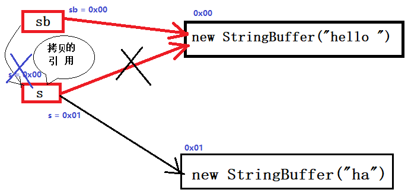

<div align="center"><h1>一、JAVA基础知识</h1></div>

#### java是一种强语言，它是纯面向对象的。

### 1.面向对象和面向过程的区别
* 面向过程
	* 优点： 性能比面向对象高，因为类调用时需要实例化，开销比较大，比较消耗资源;比如单片机、嵌入式开发、Linux/Unix等一般采用面向过程开发，性能是最重要的因素。
	* 缺点： 没有面向对象易维护、易复用、易扩展
* 面向对象
	* 优点： 易维护、易复用、易扩展，由于面向对象有封装、继承、多态性的特性，可以设计出低耦合的系统，使系统更加灵活、更加易于维护
	* 缺点： 性能比面向过程低
* 面向对象的特征：（封装、继承、多态）
	* A：封装（encapsulation）：就是把对象的属性和操作（或服务）结合为一个独立的整体，并尽可能隐藏对象的内部实现细节，仅对外公开接口，**用于控制在程序中属性的读和修改的访问级别**（private、protected、public）。（总之一句话，封装就是指隐藏对象的属性和实现细节，仅仅对外提供公共方法去访问它。）
		* 封装的好处：
			* **将变化隔离**。不难理解，都包装好了，不让你知道它内部是怎么实现的了，你能知道它发生啥变化吗？当然是false了。
			* **便于使用，不用了解内部构造**。
			* **提高重用性**。这个就好玩了，将一个事物封装起来之后，必须要对外暴露一些接口（好让人使用啊），不然，就没有存在的必要了，没有意义。而这暴露出来的方法（一般我们用public修饰），当然就不止一个人能使用了，那是千千万万的用户啊，可以重复使用。这就像是，你电脑上的USB接口，不止你一个人能用吧？ 
			* **提高安全性**。私有仅仅是封装的一种表现形式。之所以对外提供访问方式，就是因为**可以在访问方式中加入逻辑判断等语句，对访问的数据进行操作，提高代码健壮性**。
		* 封装的原则：
			* 将不需要对外提供的内容都隐藏起来。这个不解释，你要是不隐藏，那能叫封装吗？ 
			* 把属性都隐藏，提供公共方法对其访问。
		* 常用之一：将成员变量私有化，对外提供对应的set、get方法对其进行访问，提高对数据访问的安全性。
	* B：继承（inheritance）：特殊类的对象拥有一般类的全部属性与行为，称为特殊类对一般类的**继承**。
		* 子类对象在进行实例化前首先调用父类构造方法，再调用子类构造方法实例化子类对象。
			* 类实例化的过程：最先调用静态代码块（只会调用一次），然后是构造块，最后才是构造方法。
		* Java只允许单继承不允许多继承（一个子类继承一个父类），但是**接口可以多继承**。（一个类只能继承一个类，一个接口可以继承多个接口，一个类可以实现多个接口）
		* 在继承时，子类会继承父类的所有结构。
			* 子类可以继承父类private的属性和方法，只不过父类的私有属性和方法，子类是无法直接访到的（即**只是拥有，但是无法使用**）；
			* 子类不能继承父类中的构造方法；
			* 子类可以继承父类的final方法，但是不可重写；
			* 子类不会继承父类的static方法与属性，因为这是属于类本身的，但是是可以访问；
				* 子类和父类中同名的static变量和方法都是相互独立的，并不存在任何的重写的关系。
			* 
		* 子类可以拥有自己的属性和方法，也可以对父类进行扩展；
		* 子类可以用自己的方法去实现父类的方法；
		* 子类可以重写父类的（非final方法、非private方法、非构造方法）方法；
		* 对于父类的final方法，子类只能继承，不能重写；
		* 在子类构造方法中，代码块第一行都会默认调用父类的无参构造方法；
	* C：多态（polymorphic）：
		* 向上类型转换
		  ```java
		  Animal animal = new Cat();//猫是动物
		  ```
		* 向下类型转换
		  ```java
		  Animal animal = new Cat();
		  Cat cat = (Cat)animal;//ok

		  Animal animal1 = new Animal();
		  //Exception in thread "main" java.lang.ClassCastException: Animal cannot be cast to Cat
		  Cat cat1 = (Cat)animal1;
		  ```


### 2.Java 语言有哪些特点
* 1)简单易学；
* 2)面向对象（封装，继承，多态）；
* 3)平台无关性（ Java 虚拟机实现平台无关性）；
* 4)可靠性；
* 5)安全性；
* 6)支持多线程（ C++ 语言没有内置的多线程机制，因此必须调用操作系统的多线程功能来进行多线程程序设计，而 Java 语言却提供了多线程支持）；
* 7)支持网络编程并且很方便（ Java 语言诞生本身就是为简化网络编程设计的，因此 Java 语言不仅支持网络编程而且很方便）；
* 8)编译与解释并存；

### 3.关于 JVM JDK 和 JRE 最详细通俗的解答

<div align="center"></div>

* JVM
	* Java虚拟机（JVM）是运行 Java 字节码的虚拟机。JVM有针对不同系统的特定实现（Windows，Linux，macOS），目的是使用相同的字节码，它们都会给出相同的结果。
	* 什么是字节码?采用字节码的好处是什么?
	
	  >在 Java 中，JVM可以理解的代码就叫做 字节码（即扩展名为 .class 的文件），它不面向任何特定的处理器，只面向虚拟机。Java 语言通过字节码的方式，在一定程度上解决了传统解释型语言执行效率低的问题，同时又保留了解释型语言可移植的特点。所以 Java 程序运行时比较高效，而且，由于字节码并不专对一种特定的机器，因此，Java程序无须重新编译便可在多种不同的计算机上运行。
	
	* Java 程序从源代码到运行一般有下面3步：

	  <div align="center"></div>

		* 我们需要格外注意的是 `.class->机器码` 这一步。在这一步 jvm 类加载器首先加载字节码文件，然后通过解释器逐行解释执行，这种方式的执行速度会相对比较慢。而且，有些方法和代码块是经常需要被调用的，也就是所谓的热点代码，所以后面引进了 **JIT**（`Just In Time Compiler，即时编译器`） 编译器，JIT 属于运行时编译。当 JIT 编译器完成第一次编译后，其会将字节码对应的机器码保存下来，下次可以直接使用。而我们知道，机器码的运行效率肯定是高于 Java 解释器的。**这也解释了我们为什么经常会说 Java 是编译与解释共存的语言**。
		* HotSpot采用了惰性评估(Lazy Evaluation)的做法，根据二八定律，消耗大部分系统资源的只有那一小部分的代码（热点代码），而这也就是JIT所需要编译的部分。JVM会根据代码每次被执行的情况收集信息并相应地做出一些优化，因此执行的次数越多，它的速度就越快。JDK 9引入了一种新的编译模式**AOT**(`Ahead of Time Compilation，事前编译`)，它是直接将字节码编译成机器码，这样就避免了JIT预热等各方面的开销。JDK支持分层编译和AOT协作使用。但是 ，AOT 编译器的编译质量是肯定比不上 JIT 编译器的。

	* 总结：Java虚拟机（JVM）是运行 Java 字节码的虚拟机。JVM有针对不同系统的特定实现（Windows，Linux，macOS），目的是使用相同的字节码，它们都会给出相同的结果。**字节码和不同系统的 JVM 实现是 Java 语言“一次编译，随处可以运行”的关键所在**。
* JDK 和 JRE
	* **JDK是Java Development Kit，它是功能齐全的Java SDK。它拥有JRE所拥有的一切，还有编译器（javac）和工具（如javadoc和jdb）。它能够创建和编译程序**。
	* **JRE 是 Java运行时环境。它是运行已编译 Java 程序所需的所有内容的集合，包括 Java虚拟机（JVM），Java类库，java命令和其他的一些基础构件。但是，它不能用于创建新程序**。
	* 如果你只是为了运行一下 Java 程序的话，那么你只需要安装 JRE 就可以了。如果你需要进行一些 Java 编程方面的工作，那么你就需要安装JDK了。但是，这不是绝对的。有时，即使您不打算在计算机上进行任何Java开发，仍然需要安装JDK。例如，如果要使用JSP部署Web应用程序，那么从技术上讲，您只是在应用程序服务器中运行Java程序。那你为什么需要JDK呢？因为应用程序服务器会将 JSP 转换为 Java servlet，并且需要使用 JDK 来编译 servlet。

### 4.Oracle JDK 和 OpenJDK 的对比

  >问：OpenJDK存储库中的源代码与用于构建Oracle JDK的代码之间有什么区别？
  >
  >答：非常接近 - 我们的Oracle JDK版本构建过程基于OpenJDK 7构建，只添加了几个部分，例如部署代码，其中包括Oracle的Java插件和Java WebStart的实现，以及一些封闭的源代码派对组件，如图形光栅化器，一些开源的第三方组件，如Rhino，以及一些零碎的东西，如附加文档或第三方字体。展望未来，我们的目的是开源Oracle JDK的所有部分，除了我们考虑商业功能的部分。

* 1)Oracle JDK版本将每三年发布一次，而OpenJDK版本每三个月发布一次；
* 2)OpenJDK 是一个参考模型并且是完全开源的，而Oracle JDK是OpenJDK的一个实现，并不是完全开源的；
* 3)Oracle JDK 比 OpenJDK 更稳定。OpenJDK和Oracle JDK的代码几乎相同，但Oracle JDK有更多的类和一些错误修复。因此，如果您想开发企业/商业软件，我建议您选择Oracle JDK，因为它经过了彻底的测试和稳定。某些情况下，有些人提到在使用OpenJDK 可能会遇到了许多应用程序崩溃的问题，但是，只需切换到Oracle JDK就可以解决问题；
* 4)在响应性和JVM性能方面，Oracle JDK与OpenJDK相比提供了更好的性能；
* 5)Oracle JDK不会为即将发布的版本提供长期支持，用户每次都必须通过更新到最新版本获得支持来获取最新版本；
* 6)Oracle JDK根据二进制代码许可协议获得许可，而OpenJDK根据GPL v2许可获得许可。

### 5.Java和C++的区别
* 都是面向对象的语言，都支持封装、继承和多态；
* Java 不提供指针来直接访问内存，程序内存更加安全；
* Java 的类是单继承的，C++ 支持多重继承；虽然 Java 的类不可以多继承，但是**接口可以多继承**；
* Java 有自动内存管理机制，不需要程序员手动释放无用内存。

### 6.什么是 Java 程序的主类 应用程序和小程序的主类有何不同
* 一个程序中可以有多个类，但只能有一个类是主类。
* 在 Java 应用程序中，这个主类是指包含 main（）方法的类。
* 而在 Java 小程序中，这个主类是一个继承自系统类 JApplet 或 Applet 的子类。
* 应用程序的主类不一定要求是 public 类，但小程序的主类要求必须是 public 类。
* 主类是 Java 程序执行的入口点。

### 7.Java 应用程序与小程序之间有那些差别
* 简单说应用程序是从主线程启动(也就是 main() 方法)。
* applet 小程序没有main方法，主要是嵌在浏览器页面上运行(调用init()线程或者run()来启动)，嵌入浏览器这点跟 flash 的小游戏类似。

### 8.字符型常量和字符串常量的区别
* 形式上: 字符常量是单引号引起的一个字符 字符串常量是双引号引起的若干个字符
* 含义上: 字符常量相当于一个整形值( ASCII 值),可以参加表达式运算 字符串常量代表一个地址值(该字符串在内存中存放位置)
* 占内存大小 字符常量只占2个字节 字符串常量占若干个字节(至少一个字符结束标志) (注意： char在Java中占两个字节)

>java编程思想第四版：2.2.2节
<div align="center"></div>

### 9.构造器 Constructor 是否可被 override
* 在讲继承的时候我们就知道**父类的私有属性和构造方法并不能被继承**，所以 Constructor 也就不能被 override（重写）,但是可以 overload（重载）,所以你可以看到一个类中有多个构造函数的情况。

### 10.重载和重写的区别
* **重载**： 发生在**同一个类**中，方法名必须相同，参数类型不同、个数不同、顺序不同，方法返回值和访问修饰符可以不同，发生在编译时（**编译时的多态**）。
	* 当参数列表相同但返回值不同时，将会出现编译错误，这并不是重载，因为jvm无法根据返回值类型来判断应该调用哪个方法。 　　
* **重写(覆盖)**： 发生在**父子类**中，方法名、参数列表必须相同，**返回值范围小于等于父类**，抛出的异常范围小于等于父类，**访问修饰符范围大于等于父类**；如果父类方法访问修饰符为 private 则子类就不能重写该方法。
	* 通过子类创建的实例对象调用这个方法时，将调用子类中的定义方法，这相当于把父类中定义的那个完全相同的方法给覆盖了，这也是面向对象编程的多态性的一种表现。

### 11.Java 面向对象编程三大特性: 封装 继承 多态
* 封装
	* 封装把一个对象的属性私有化，同时提供一些可以被外界访问的属性的方法，如果属性不想被外界访问，我们大可不必提供方法给外界访问。但是如果一个类没有提供给外界访问的方法，那么这个类也没有什么意义了。
* 继承
	* 继承是使用已存在的类的定义作为基础建立新类的技术，新类的定义可以增加新的数据或新的功能，也可以用父类的功能，但不能选择性地继承父类。通过使用继承我们能够非常方便地复用以前的代码。
	* 关于继承如下 3 点请记住：
		* 子类拥有父类非 private 的属性和方法。
		* 子类可以拥有自己属性和方法，即子类可以对父类进行扩展。
		* 子类可以用自己的方式实现父类的方法。（以后介绍）。
* 多态
	* 所谓多态就是指程序中定义的引用变量所指向的具体类型和通过该引用变量发出的方法调用在编程时并不确定，而是在程序运行期间才确定，即一个引用变量到底会指向哪个类的实例对象，该引用变量发出的方法调用到底是哪个类中实现的方法，必须在由程序运行期间才能决定。
	* 在Java中有两种形式可以实现多态：继承（多个子类对同一方法的重写）和接口（实现接口并覆盖接口中同一方法）。

### 12.String、StringBuffer 和 StringBuilder 的区别是什么？ String 为什么是不可变的？

* String 为什么是final的？
	* String类用final修饰是为了保证线程安全，很多情况下存储密码、ip......所以得用final修饰设置为不可变的。（保证呗修饰的属性是安全的）
	* 为了字符串池更好的存储字符串
* StringBuffer 和 StringBuilder 默认大小是 16。

* 可变性　
	* 简单的来说：String 类中使用 final 关键字修饰保存字符串的字符数组,`private final char[] value`，所以 String 对象是**不可变**的。
	* 而StringBuilder 与 StringBuffer 都继承自 AbstractStringBuilder 类，在 AbstractStringBuilder 中也是使用字符数组保存字符串 `char[] value` 但是没有用 final 关键字修饰，所以这两种对象都是**可变**的。
	* StringBuilder 与 StringBuffer 的构造方法都是调用父类构造方法也就是 AbstractStringBuilder 实现的，大家可以自行查阅源码。
	  ```java
	  AbstractStringBuilder.java
	
	  abstract class AbstractStringBuilder implements Appendable, CharSequence {
	        char[] value;
	        int count;
	        AbstractStringBuilder() {
	       
	        }
	        AbstractStringBuilder(int capacity) {
	             value = new char[capacity];
	        }
	  }
	  ```

* 线程安全性
	* String 中的对象是不可变的，也就可以理解为常量，**线程安全**。
	* AbstractStringBuilder 是 StringBuilder 与 StringBuffer 的公共父类，定义了一些字符串的基本操作，如 expandCapacity、append、insert、indexOf 等公共方法。
	* StringBuffer 对方法加了同步锁或者对调用的方法加了同步锁，所以是**线程安全**的。
	* StringBuilder 并没有对方法进行加同步锁，所以是**非线程安全**的。　　

* 性能
	* 每次对 String 类型进行改变的时候，都会生成一个新的 String 对象，然后将指针指向新的 String 对象。
	* StringBuffer 每次都会对 StringBuffer 对象本身进行操作，而不是生成新的对象并改变对象引用。
	* 相同情况下使用 StringBuilder 相比使用 StringBuffer 仅能获得 10%~15% 左右的性能提升，但却要冒多线程不安全的风险。
  
  ```java
  String s = "hello"+"world"+"i love you";
  StringBuffer Sb = new StringBuilder("hello").append("world").append("i love you");
  ```
	* 这个时候s有多个字符串进行拼接，按理来说会有多个对象产生，但是jvm会对此进行一个优化，也就是说只创建了一个对象，此时它的执行速度要比StringBuffer拼接快.再看下面这个:

	  ```java
	  String s2 = "hello";  
	  String s3 = "world";  
	  String s4 = "i love you";  
	  String s1 = s2 + s3 + s4;
	  ```
		* 上面这种情况，就会多创建出来三个对象，造成了内存空间的浪费.
* 对于三者使用的总结：
	* 操作少量的数据 = String
	* 单线程操作字符串缓冲区下操作大量数据 = StringBuilder
	* **多线程**操作字符串缓冲区下操作大量数据 = StringBuffer（**线程安全**）

### 13.Java支持的基本数据类型有哪些？什么是自动拆装箱？
* java支持的基本数据类型有以下9种:byte,shot,int,long,float,double,char,boolean,void.
* 自动拆装箱是java从jdk1.5引用，目的是将原始类型自动的装换为相对应的对象，也可以逆向进行，即拆箱。这也**体现java中一切皆对象的宗旨**。
* 所谓自动装箱就是将原始类型自动的转换为对应的对象，而拆箱就是将对象类型转换为基本类型。java中的自动拆装箱通常发生在变量赋值的过程中，
* **装箱**：将基本类型用它们对应的引用类型包装起来；
* **拆箱**：将包装类型转换为基本数据类型；

  ```java
  int val = 6
  Integer object = val; //自动装箱
  int o = object; //自动拆箱
  ```

* 在使用包装类过程中需要比较大小时，最好使用equals方法。因为`==`只能正确判断`-128~127`之间的值。
  ```java
  //语法糖
  /** 
   * Cache to support the object identity semantics of autoboxing for 
   * values between -128 and 127 (inclusive) as required by JLS.
   * 缓存以支持jls要求的值在-128和127（包括）之间的自动修改的对象标识语义。
   */
  Integer a = -129;
  Integer b = -129;
  System.out.println(a==b);//false

  Integer c = -128;
  Integer d = -128;
  System.out.println(c==d);//true

  Integer e = 127;
  Integer f = 127;
  System.out.println(e==f);//true

  Integer g = 128;
  Integer h = 128;
  System.out.println(g==h);//false
  ```
* 在java中，应该注意自动拆装箱，因为有时可能因为java自动装箱机制，而导致创建了许多对象，对于内存小的平台会造成压力。

### 14.静态与实例

* 1）静态变量与实例变量的区别：
	* 静态变量依赖于类生存的，**当类加载时静态变量就出现了**，所有对象共享一个静态变量，静态变量存储在**静态区（全局区）**；
	* 每当生成一个对象，实例变量就生成一次，实例变量存储在**堆区**。
* 2）静态方法与实例方法的：

* 3)在一个静态方法内调用一个非静态成员为什么是非法的
	* 由于静态方法可以不通过对象进行调用，因此在静态方法里，不能调用其他非静态变量，也不可以访问非静态变量成员。

### 15.在 Java 中定义一个不做事且没有参数的构造方法的作用
* Java 程序在执行子类的构造方法之前，**如果没有用 super() 来调用父类特定的构造方法，则会调用父类中“没有参数的构造方法”**。
* 因此，如果父类中只定义了有参数的构造方法，而在子类的构造方法中又没有用 super() 来调用父类中特定的构造方法，则编译时将发生错误，因为 Java 程序在父类中找不到没有参数的构造方法可供执行。
* 解决办法是在父类里加上一个不做事且没有参数的构造方法(或在父类增加相应的带参数的构造方法)。

### 16.import java和javax有什么区别
* 刚开始的时候 JavaAPI 所必需的包是 java 开头的包，javax 当时只是扩展 API 包来说使用。
* 然而随着时间的推移，javax 逐渐的扩展成为 Java API 的组成部分。但是，将扩展从 javax 包移动到 java 包将是太麻烦了，最终会破坏一堆现有的代码。因此，最终决定 javax 包将成为标准API的一部分。
* 所以，**实际上java和javax没有区别。这都是一个名字**。

## 17.接口和抽象类的区别是什么
* 接口的方法**默认是 public**，所有方法在接口中不能有实现(Java 8 开始接口方法可以有默认实现），抽象类可以有非抽象的方法,抽象类的成员函数可以是 private，protected 或者是 public 。
* 接口中的实例变量**默认是 final 类型**的，而抽象类中则不一定,抽象类可以包含非 final 的变量。
* 接口不能用 new 实例化，但可以声明，但是必须引用一个实现该接口的对象（或者用内部类实现）；从设计层面来说：
	* 抽象是对类的抽象，是一种**模板设计**，
	* 接口是行为的抽象，是一种**行为的规范**。
* 接口中所有的方法隐含的都是抽象的。而抽象类则可以同时包含抽象和非抽象的方法。
* 一个类可以实现多个接口，但最多只能实现一个抽象类；
* 类如果要实现一个接口，它必须要实现接口声明的所有方法。但是，类可以不实现抽象类声明的所有方法，当然，在这种情况下，类也必须得声明成是抽象的。
* 抽象类可以在不提供接口方法实现的情况下实现接口。

	* 备注:在JDK8中，接口也可以定义静态方法，可以直接用接口名调用，实现类和实现是不可以调用的。如果同时实现两个接口，接口中定义了一样的默认方法，必须重写，不然会报错。

### 18.成员变量与局部变量的区别有那些
* 从语法形式上，看成员变量是属于类的，而局部变量是在方法中定义的变量或是方法的参数；成员变量可以被 public,private,static 等修饰符所修饰，而局部变量不能被访问控制修饰符及 static 所修饰；但是，成员变量和局部变量都能被 final 所修饰；
* 从变量在内存中的存储方式来看:如果成员变量是使用 static修饰的，那么这个成员变量是属于类的，如果没有使用使用 static修饰，这个成员变量是属于实例的。而对象存在于堆内存，局部变量存在于栈内存
* 从变量在内存中的生存时间上看:成员变量是对象的一部分，它随着对象的创建而存在，而局部变量随着方法的调用而自动消失。
* 成员变量如果没有被赋初值:则会自动以类型的默认值而赋值（一种情况例外被 final 修饰的成员变量也必须显示地赋值）；而局部变量则不会自动赋值。

### 19.创建一个对象用什么运算符?对象实体与对象引用有何不同?
* new运算符，new创建对象实例（对象实例在堆内存中），对象引用指向对象实例（对象引用存放在栈内存中）。
* 一个对象引用可以指向0个或1个对象（一根绳子可以不系气球，也可以系一个气球）;
* 一个对象可以有n个引用指向它（可以用n条绳子系住一个气球）。

### 20.什么是方法的返回值?返回值在类的方法里的作用是什么?
* 方法的返回值是指我们获取到的某个方法体中的代码执行后产生的结果！（前提是该方法可能产生结果）。
* 返回值的作用:接收出结果，使得它可以用于其他的操作！

### 21.一个类的构造方法的作用是什么 若一个类没有声明构造方法,该程序能正确执行吗 ?为什么?
* 主要作用是完成对类对象的初始化工作。
* 可以执行。因为一个类即使没有声明构造方法也会有默认的不带参数的构造方法。

### 22.构造方法有哪些特性
* 名字与类名相同；
* 没有返回值，但不能用void声明构造函数；
* 生成类的对象时自动执行，无需调用。

### 23.静态方法和实例方法有何不同
* 在外部调用静态方法时，可以使用"类名.方法名"的方式，也可以使用"对象名.方法名"的方式。而实例方法只有后面这种方式。也就是说，调用静态方法可以无需创建对象。
* 静态方法在访问本类的成员时，只允许访问静态成员（即静态成员变量和静态方法），而不允许访问实例成员变量和实例方法；实例方法则无此限制.

### 24.对象的相等与指向他们的引用相等,两者有什么不同?
* 对象的相等，比的是内存中存放的内容是否相等。
* 而引用相等，比较的是他们指向的内存地址是否相等。

## 25.在调用子类构造方法之前会先调用父类没有参数的构造方法,其目的是?
* 帮助子类做初始化工作。

### 26.`==` 与 equals(重要)
* `==` : 它的作用是**判断两个对象的地址是不是相等**。即，判断两个对象是不是同一个对象。(基本数据类型`==`比较的是值，引用数据类型`==`比较的是内存地址)
* `equals()` : 它的作用也是判断两个对象是否相等。但它一般有两种使用情况：
	* 情况1：类没有覆盖 equals() 方法。则通过 equals() 比较该类的两个对象时，等价于通过`==`比较这两个对象。
	* 情况2：类覆盖了 equals() 方法。一般，我们都覆盖 equals() 方法来判断两个对象的内容相等；若它们的内容相等，则返回 true (即，认为这两个对象相等)。

  >举个栗子：
  
  ```java
  String a = new String("ab"); // a 为一个引用
  String b = new String("ab"); // b为另一个引用,对象的内容一样

  String aa = "ab"; // 放在常量池中
  String bb = "ab"; // 从常量池中查找

  if (aa == bb) { // true
      System.out.println("aa==bb");
  }

  if (a == b) { // false，非同一对象
      System.out.println("a==b");
  }

  if (a.equals(b)) { // true
      System.out.println("a EQ b");
  }
 
  if (42 == 42.0) { // true
      System.out.println("true");
  }
  ```

	* 说明：
		* String 中的 equals 方法是被重写过的，因为 object 的 equals 方法是比较的对象的内存地址，而 String 的 equals 方法比较的是对象的值。
		* 当创建 String 类型的对象时，虚拟机会在常量池中查找有没有已经存在的值和要创建的值相同的对象，如果有就把它赋给当前引用。如果没有就在常量池中重新创建一个 String 对象。

* **字符串池（String Pool）**
	* 1)`String s = "aaa";`（采用字面值方式赋值）
		* 1>首先查找 String Pool 中是否存在“aaa”这个对象，如果不存在，则在 String Pool 中创建 一个“aaa”对象，然后将 String Pool 中的这个“aaa”对象的地址返回来，赋给引用变量 s，这样 s 会指向 String Pool 中的这个“aaa”字符串对象
		* 2>如果存在，则不创建任何对象，直接将 String Pool 中的这个“aaa”对象地址返回来， 赋给 s 引用。
	* 2)String s = new String(“aaa”);
		* 1>首先在 String Pool 中查找有没有“aaa”这个字符串对象，如果有，则不在 String Pool 中再去创建“aaa”这个对象了，直接在堆中（heap）中创建一个“aaa”字符串对象，然后将堆中的这个“aaa”对象的地址返回来，赋给 s 引用，导致 s 指向了堆中创建的这个“aaa”字符串对象。
		* 2>如果没有，则首先在 String Pool 中创建一个“aaa“对象，然后再在堆中（heap）创 建一个”aaa“对象，然后将堆中的这个”aaa“对象的地址返回来，赋给 s 引用， 导致 s 指向了堆中所创建的这个”aaa“对象。

### 27.hashCode 与 equals (重要)

面试官可能会问你：“你重写过 hashcode 和 equals 么，为什么重写equals时必须重写hashCode方法？”

* Hash是散列的意思，就是把任意长度的输入，通过散列算法变换成固定长度的输出，该输出就是散列值。关于散列值，有以下几个关键讨论：
	* 不同关键字经过散列算法变换后可能得到同一个散列地址，这种现象称为碰撞：**hash碰撞**；
	* 如果两个hash值不同（前提是同一个hash算法），那么这两个hash值对应的原始输入必定不同。

* hashCode（）介绍
	* hashCode() 的作用是获取哈希码，也称为散列码；它实际上是返回一个int整数；
	* 这个哈希码的作用是确定该对象在哈希表中的索引位置。hashCode() 定义在JDK的`Object.java`中，这就意味着Java中的任何类都包含有hashCode() 函数；
	* 散列表存储的是键值对(key-value)，它的特点是：能根据“键”快速的检索出对应的“值”。这其中就利用到了散列码！（可以快速找到所需要的对象）；
	* **hashCode的存在主要是为了提高散列结构存储中查找的效率，在线性表中没有作用**；
	* Integer类型的值的hashCode值就是它本身的值。

* 为什么要有 hashCode
  * 我们以“HashSet 如何检查重复”为例子来说明为什么要有 hashCode：

    >当你把对象加入 HashSet 时，HashSet 会先计算对象的 hashcode 值来判断对象加入的位置，同时也会与其他已经加入的对象的 hashcode 值作比较，如果没有相符的hashcode，HashSet会假设对象没有重复出现。但是如果发现有相同 hashcode 值的对象，这时会**调用 equals（）方法来检查** hashcode 相等的对象是否真的相同。如果两者相同，HashSet 就不会让其加入操作成功。如果不同的话，就会重新散列到其他位置。（摘自我的Java启蒙书《Head first java》第二版）。这样我们就大大减少了 equals 的次数，相应就大大提高了执行速度。

* hashCode（）与equals（）的相关规定
	* 如果两个对象相等，则hashcode一定也是相同的；
	* 两个对象相等,对两个对象分别调用equals方法都返回true；
	* （两个对象有相同的hashcode值，它们也不一定是相等的）如果两个对象的hashCode相同，不代表两个对象就相同，只能说明这两个对象在散列存储结构中，存放于同一个位置；
	* 因此，equals 方法被覆盖过，则 hashCode 方法也必须被覆盖；
	* hashCode() 的默认行为是对**堆**上的对象产生独特值。如果没有重写 hashCode()，则该 class 的两个对象无论如何都不会相等（即使这两个对象指向相同的数据）

```java
package com.edu.test.faceTest;

import java.util.Objects;

/**
 * @Author: 王仁洪
 * @Date: 2019/4/7 10:26
 */
public class TestHash {
    public static void main(String[] args) {
        String a = "100";
        String b = "EFG";
        String c = "100";
        String d = "EFG";
        String e = "EFGH";
        String g = "100F";
        String bb = new String("EFG");

        Integer f = 100;

        /**
         * public final class String{
         *     public int hashCode() {
         *         int h = hash;
         *         if (h == 0 && value.length > 0) {
         *             char val[] = value;
         *
         *             for (int i = 0; i < value.length; i++) {
         *                 h = 31 * h + val[i];
         *             }
         *             hash = h;
         *         }
         *         return h;
         *     }
         * }
         *
         * public final class Integer extends Number implements Comparable<Integer> {
         *     @Override
         *     public int hashCode() {
         *         return Integer.hashCode(value);
         *     }
         *
         *     public static int hashCode(int value) {
         *         return value;
         *     }
         * }
         */
        System.out.println(a.hashCode());//48625
        System.out.println(b.hashCode());//68550
        System.out.println(c.hashCode());//48625
        System.out.println(d.hashCode());//68550
        System.out.println(e.hashCode());//2125122
        System.out.println(g.hashCode());//1507445
        System.out.println(f.hashCode());//100

        /**
         * public final class String{
         * public boolean equals(Object anObject) {
         *         if (this == anObject) {
         *             return true;
         *         }
         *         if (anObject instanceof String) {
         *             String anotherString = (String)anObject;
         *             int n = value.length;
         *             if (n == anotherString.value.length) {
         *                 char v1[] = value;
         *                 char v2[] = anotherString.value;
         *                 int i = 0;
         *                 while (n-- != 0) {
         *                     if (v1[i] != v2[i])
         *                         return false;
         *                     i++;
         *                 }
         *                 return true;
         *             }
         *         }
         *         return false;
         *     }
         * }
         */
        System.out.println(b.equals(bb));//true
        System.out.println(bb.equals(b));//true

        System.out.println(b.hashCode());//68550
        System.out.println(bb.hashCode());//68550

        System.out.println(b==bb);//false
    }
}

class Person{
    private String name;
    private Integer age;

    public Person(String name, Integer age) {
        this.name = name;
        this.age = age;
    }

    @Override
    public boolean equals(Object o) {
        if (this == o) return true;
        if (o == null || getClass() != o.getClass()) return false;
        Person person = (Person) o;
        return Objects.equals(name, person.name) &&
                Objects.equals(age, person.age);
    }

    @Override
    public int hashCode() {
        return Objects.hash(name, age);
    }
    /**
     * public final class Objects {
     *      public static int hash(Object... values) {
     *         return Arrays.hashCode(values);
     *       }
     * }
     *
     * public class Arrays {
     *     public static int hashCode(Object a[]) {
     *         if (a == null)
     *             return 0;
     *
     *         int result = 1;
     *
     *         for (Object element : a)
     *             result = 31 * result + (element == null ? 0 : element.hashCode());
     *
     *         return result;
     *     }
     * }
     *
     * public class Object {
     *     public native int hashCode();
     * }
     */
}

/**
 * public class Object {
 *     public boolean equals(Object obj) {
 *         return (this == obj);
 *     }
 *
 *     public native int hashCode();
 * }
 */
```

### 28.什么是值传递和引用传递？java中是值传递还是引用传递，还是都有?为什么Java中只有值传递?
* **值传递** 就是在方法调用的时候，实参是将自己的一份拷贝赋给形参，在方法内，对该参数值的修改不影响原来实参，常见的例子就是刚开始学习C语言的时候那个交换方法的例子了。
* **引用传递** 是在方法调用的时候，实参将自己的地址传递给形参，此时方法内对该参数值的改变，就是对该实参的实际操作。
* **在java中只有一种传递方式，那就是值传递**.可能比较让人迷惑的就是java中的对象传递时，对形参的改变依然会影响到该对象的内容。 
* 下面这个例子来说明java中是值传递.
  ```java
  public class Test {
    public static void main(String[] args) {
        StringBuffer sb = new StringBuffer("hello ");
        getString(sb);
        System.out.println(sb);//hello world
    }
    public static void getString(StringBuffer s) {
  //        s = new StringBuffer("ha");
        s.append("world");
    }
  }
  ```
  * 在上面这个例子中,当前输出结果为:hello world。这并没有什么问题，可能就是大家平常所理解的引用传递，那么当然会改变StringBuffer的内容。但是如果把上面的注释去掉，那么就会输出:hello.此时sb的值并没有变成ha hello. 假如说是引用传递的话，那么形参的s也就是sb的地址，此时在方法里new StringBuffer（），并将该对象赋给s，也就是说s现在指向了这个新创建的对象.按照引用传递的说法，此时对s的改变就是对sb的操作，也就是说sb应该也指向新创建的对象，那么输出的结果应该为ha world.但实际上输出的仅是hello.这说明sb指向的还是原来的对象，而形参s指向的才是创建的对象,这也就验证了java中的对象传递也是值传递。

    <div align="enter"></div>
* Java中其实还是值传递的，只不过对于对象参数，值的内容是对象的引用。
* 无论是值传递还是引用传递，其实都是一种求值策略(Evaluation strategy)。

### 29.简述线程,程序,进程的基本概念.以及他们之间关系是什么?
* **线程**与进程相似，但线程是一个比进程更小的执行单位。一个进程在其执行的过程中可以产生多个线程。与进程不同的是同类的多个线程共享同一块内存空间和一组系统资源，所以系统在产生一个线程，或是在各个线程之间作切换工作时，负担要比进程小得多，也正因为如此，**线程也被称为轻量级进程**。
* **程序**是含有指令和数据的文件，被存储在磁盘或其他的数据存储设备中，也就是说程序是静态的代码。
* **进程**是程序的一次执行过程，是系统运行程序的基本单位，因此进程是动态的。系统运行一个程序即是一个进程从创建，运行到消亡的过程。简单来说，一个进程就是一个执行中的程序，它在计算机中一个指令接着一个指令地执行着，同时，每个进程还占有某些系统资源如CPU时间，内存空间，文件，文件，输入输出设备的使用权等等。换句话说，当程序在执行时，将会被操作系统载入内存中。
	* 线程是进程划分成的更小的运行单位。
	* 线程和进程最大的不同在于基本上**各进程是独立**的，而各线程则不一定，因为**同一进程中的线程极有可能会相互影响**。
	* 从另一角度来说，进程属于操作系统的范畴，主要是同一段时间内，可以同时执行一个以上的程序，而线程则是在同一程序内几乎同时执行一个以上的程序段。


### 30.线程有哪些基本状态?

* >Java 线程在运行的生命周期中的指定时刻只可能处于下面6种不同状态的其中一个状态（图源《Java 并发编程艺术》4.1.4节）。

  <div align="center"></div>

* >线程在生命周期中并不是固定处于某一个状态而是随着代码的执行在不同状态之间切换。Java 线程状态变迁如下图所示（图源《Java 并发编程艺术》4.1.4节）：
   <div align="center"></div>

   * 由上图可以看出：
     * 线程创建之后它将处于 NEW**（新建/初始） 状态**，
     * 调用 start() 方法后开始运行，线程这时候处于 READY**（可运行） 状态**。
     * 可运行状态的线程获得了 cpu 时间片（timeslice）后就处于 RUNNING**（运行） 状态**。

     * >操作系统隐藏 Java虚拟机（JVM）中的 RUNNABLE 和 RUNNING 状态，它只能看到 RUNNABLE 状态（图源：HowToDoInJava：Java Thread Life Cycle and Thread States），所以 Java 系统一般将这两个状态统称为 RUNNABLE（运行中） 状态 。

          <div align="center"></div>

     * 当线程执行 wait()方法之后，线程进入 WAITING**（等待）状态**。
     * 进入等待状态的线程需要依靠其他线程的通知才能够返回到**运行状态**，
     * 而 TIME_WAITING(超时等待) 状态相当于在等待状态的基础上增加了超时限制，比如通过 sleep（longmillis）方法或 wait（longmillis）方法可以将 Java 线程置于 TIMED WAITING**(超时等待)状态**。
     * 当超时 时间 到达后 Java 线程将会返回到 RUNNABLE**（运行）状态**。
     * 当线程调用同步方法时，在没有获取到锁的情况下，线程将会进入到 BLOCKED**（阻塞） 状态**。
     * 线程在执行 Runnable 的 run()方法之后将会进入到 TERMINATED**（终止） 状态**。

### 31.关于 final 关键字的一些总结
* final关键字主要用在三个地方：变量、方法、类。
* 对于一个final变量，如果是基本数据类型的变量，则其数值一旦在初始化之后便不能更改；如果是引用类型的变量，则在对其初始化之后便不能再让其指向另一个对象。
* 当用final修饰一个类时，表明这个类不能被继承。final类中的所有成员方法都会被隐式地指定为final方法。
* 使用final方法的原因有两个。
	* 第一个原因是把方法锁定，以防任何继承类修改它的含义；
	* 第二个原因是效率。在早期的Java实现版本中，会将final方法转为内嵌调用。但是如果方法过于庞大，可能看不到内嵌调用带来的任何性能提升（现在的Java版本已经不需要使用final方法进行这些优化了）。类中所有的private方法都隐式地指定为final。

### 32、Java 中的异常处理

- 运行时异常和受检异常有何异同？
  - 运行时异常和受检异常都是Exception类的子类；
  - **运行时异常**是RuntimeException及其子类（编译不会出错，是运行过程中会出现错误的异常）；
  - **受检异常**是除了RuntimeException及其子类的其他类（可以人为控制的异常，需要手动捕获）。
- 简单说说Java异常处理机制的简单原理和应用
  - 原理：
    - java中Throwable这个类可以被作为异常抛出的类,继承它的分为异常Exception和错误Error。
      - Exception表示程序需要捕捉和处理的的异常;
      - Error表示系统级别的错误和程序无需处理的。
  - 我们所需要关心的是Exception. Execption可以分为**java标准定义的异常**和**程序员自定义异常**2种.
     - （1）一种是当程序违反了java语法规则的时候,JAVA虚拟机就会将发生的错误表示为一个异常.这里语法规则指的是JAVA类库内置的语义检查。
     - （2）另一种情况就是JAVA允许程序员扩展这种语义检查，程序员可以创建自己的异常，并自由选择在何时用throw关键字引发异常。所有的异常都是Thowable的子类。
     - **异常处理是与程序执行是并行的**。
  - 应用：
- 有没有自定义过异常？为什么要自定义异常？

  - 封装起来，让架构更加健壮。
- 异常处理方式:
  - 1)检查到异常出现，设置对象值为空字符串或一个默认值； 
  - 2)检测到异常出现，根本不执行某操作，直接跳转到其他处理中。 
  - 3)检查到异常出现，提示用户操作有错误。
- Java异常类层次结构图
   <div align="center"></div>
   - Java异常

     - Error：表示应用程序本身无法恢复的一种严重问题；比如：内存溢出、系统问题
     - Exception：
       - 运行时异常：开发人员编码所引发的问题；如：NullPointerException、ArrayIndexOutOfBoundsException、by Zero算术异常；也叫做**Uncharted异常**。
       - 普通异常：编辑时需要手动try catch处理或运行环境变化所导致；如：网络连接失败、硬盘空间不够；也叫**checked异常**。

   - 在 Java 中，所有的异常都有一个共同的祖先java.lang包中的 Throwable类。Throwable： 有两个重要的子类：Exception（异常） 和 Error（错误） ，二者都是 Java 异常处理的重要子类，各自都包含大量子类。
   - Error（错误）:是程序无法处理的错误，表示运行应用程序中较严重问题。大多数错误与代码编写者执行的操作无关，而表示代码运行时 JVM（Java 虚拟机）出现的问题。例如，Java虚拟机运行错误（Virtual MachineError），当 JVM 不再有继续执行操作所需的内存资源时，将出现 OutOfMemoryError。这些异常发生时，Java虚拟机（JVM）一般会选择线程终止。

     * 这些错误表示故障发生于虚拟机自身、或者发生在虚拟机试图执行应用时，如Java虚拟机运行错误（Virtual MachineError）、类定义错误（NoClassDefFoundError）等。这些错误是不可查的，因为它们在应用程序的控制和处理能力之 外，而且绝大多数是程序运行时不允许出现的状况。对于设计合理的应用程序来说，即使确实发生了错误，本质上也不应该试图去处理它所引起的异常状况。在 Java中，错误通过Error的子类描述。

   - Exception（异常）:是程序本身可以处理的异常。Exception 类有一个重要的子类 RuntimeException。

     * RuntimeException 异常由Java虚拟机抛出。NullPointerException（要访问的变量没有引用任何对象时，抛出该异常）、ArithmeticException（算术运算异常，一个整数除以0时，抛出该异常）和 ArrayIndexOutOfBoundsException （下标越界异常）。

   - 注意：异常和错误的区别：异常能被程序本身可以处理，错误是无法处理。
   - Throwable类常用方法
     ```java
     public string getMessage():返回异常发生时的详细信息
     
     public string toString():返回异常发生时的简要描述
     
     public string getLocalizedMessage():返回异常对象的本地化信息。使用Throwable的子类覆盖这个方法，可以声称本地化信息。
     								  如果子类没有覆盖该方法，则该方法返回的信息与getMessage（）返回的结果相同
     
     public void printStackTrace():在控制台上打印Throwable对象封装的异常信息
     ```

- 异常处理总结
  * try 块：用于捕获异常。其后可接零个或多个catch块，如果没有catch块，则必须跟一个finally块。
  * catch 块：用于处理try捕获到的异常。
  * finally 块：无论是否捕获或处理异常，finally块里的语句都会被执行。当在try块或catch块中遇到return语句时，finally语句块将在方法返回之前被执行。

  * 在以下4种特殊情况下，finally块不会被执行：
  	* 在finally语句块第一行发生了异常。 因为在其他行，finally块还是会得到执行
  	* 在前面的代码中用了`System.exit(int)`已退出程序。 exit是带参函数 ；若该语句在异常语句之后，finally会执行
  	* 程序所在的线程死亡。
  	* 关闭CPU。

- 关于返回值：如果try语句里有return，返回的是try语句块中变量值。 详细执行过程如下：
  * 如果有返回值，就把返回值保存到局部变量中；
  * 执行jsr指令跳到finally语句里执行；
  * 执行完finally语句后，返回之前保存在局部变量表里的值。
  * 如果try，finally语句里均有return，忽略try的return，而使用finally的return.

### 33.Java序列化中如果有些字段不想进行序列化 怎么办
* 对于不想进行序列化的变量，使用**transient关键字修饰**。
* transient关键字的作用是：阻止实例中那些用此关键字修饰的的变量序列化；当对象被反序列化时，被transient修饰的变量值不会被持久化和恢复。transient只能修饰变量，不能修饰类和方法。

### 34.获取用键盘输入常用的的两种方法
* 方法1：通过 Scanner
  ```java
  Scanner input = new Scanner(System.in);
  String s = input.nextLine();
  input.close();
  ```
* 方法2：通过 BufferedReader
  ```java
  BufferedReader input = new BufferedReader(new InputStreamReader(System.in)); 
  String s = input.readLine(); 
  ```

### 35.JVM内存分哪几个区，每个区的作用是什么?
* 方法区：
	* 1)有时候也成为永久代，在该区内很少发生垃圾回收，但是并不代表不发生GC，在这里进行的GC主要是对方法区里的常量池和对类型的卸载
	* 2)方法区主要用来存储已被虚拟机加载的类的信息、常量、静态变量和即时编译器编译后的代码等数据。
	* 3)该区域是被线程共享的。
	* 4)方法区里有一个运行时常量池，用于存放静态编译产生的字面量和符号引用。该常量池具有动态性，也就是说常量并不一定是编译时确定，运行时生成的常量也会存在这个常量池中。
* 虚拟机栈:
	* 1)虚拟机栈也就是我们平常所称的栈内存,它为java方法服务，每个方法在执行的时候都会创建一个栈帧，用于存储局部变量表、操作数栈、动态链接和方法出口等信息。
	* 2)虚拟机栈是线程私有的，它的生命周期与线程相同。
	* 3)局部变量表里存储的是基本数据类型、returnAddress类型（指向一条字节码指令的地址）和对象引用，这个对象引用有可能是指向对象起始地址的一个指针，也有可能是代表对象的句柄或者与对象相关联的位置。局部变量所需的内存空间在编译器间确定
	* 4)操作数栈的作用主要用来存储运算结果以及运算的操作数，它不同于局部变量表通过索引来访问，而是压栈和出栈的方式
	* 5)每个栈帧都包含一个指向运行时常量池中该栈帧所属方法的引用，持有这个引用是为了支持方法调用过程中的动态连接.动态链接就是将常量池中的符号引用在运行期转化为直接引用。
* 本地方法栈
	* 本地方法栈和虚拟机栈类似，只不过本地方法栈为Native方法服务。
* 堆
	* java堆是所有线程所共享的一块内存，在虚拟机启动时创建，几乎所有的对象实例都在这里创建，因此该区域经常发生垃圾回收操作。
* 程序计数器
	* 内存空间小，字节码解释器工作时通过改变这个计数值可以选取下一条需要执行的字节码指令，分支、循环、跳转、异常处理和线程恢复等功能都需要依赖这个计数器完成。该内存区域是唯一一个java虚拟机规范没有规定任何OOM情况的区域。

### 36.如和判断一个对象是否存活?(或者GC对象的判定方法)——判断一个对象是否存活有两种方法:
* 1）引用计数法
	* 所谓引用计数法就是给每一个对象设置一个引用计数器，每当有一个地方引用这个对象时，就将计数器加一，引用失效时，计数器就减一。**当一个对象的引用计数器为零时，说明此对象没有被引用，也就是“死对象”,将会被垃圾回收**.
	* 引用计数法有一个缺陷就是无法解决循环引用问题，也就是说当对象A引用对象B，对象B又引用者对象A，那么此时A,B对象的引用计数器都不为零，也就造成无法完成垃圾回收，所以主流的虚拟机都没有采用这种算法。
* 2）可达性算法(引用链法)
	* 该算法的思想是：从一个被称为GC Roots的对象开始向下搜索，如果一个对象到GC Roots没有任何引用链相连时，则说明此对象不可用。
	* 在java中可以作为GC Roots的对象有以下几种:
		* 虚拟机栈中引用的对象
		* 方法区类静态属性引用的对象
		* 方法区常量池引用的对象
		* 本地方法栈JNI（Java Native Interface）引用的对象

* 虽然这些算法可以判定一个对象是否能被回收，但是当满足上述条件时，一个对象并 不一定会被回收。
* 当一个对象不可达GC Root时，这个对象并 不会立马被回收，而是出于一个死缓的阶段，若要被真正的回收需要**经历两次标记**。
* 如果对象在可达性分析中没有与GC Root的引用链，那么此时就会被第一次标记并且进行一次筛选，筛选的条件是 是否有必要执行finalize()方法。当对象没有覆盖finalize()方法或者已被虚拟机调用过，那么就认为是没必要的。
* 如果该对象有必要执行finalize()方法，那么这个对象将会放在一个称为`F-Queue`的对队列中，虚拟机会触发一个Finalize()线程去执行，此线程是**低优先级**的，并且虚拟机不会承诺一直等待它运行完，这是因为如果finalize()执行缓慢或者发生了死锁，那么就会造成`F-Queue`队列一直等待，造成了内存回收系统的崩溃。GC对处于`F-Queue`中的对象进行**第二次被标记**，这时，该对象将被移除”即将回收”集合，等待回收。

### 37.简述java垃圾回收机制?
* 在java中，程序员是不需要显示的去释放一个对象的内存的，而是由虚拟机自行执行。在JVM中，有一个垃圾回收线程，它是低优先级的，在正常情况下是不会执行的，只有在虚拟机空闲或者当前堆内存不足时，才会触发执行，扫灭那些没有被任何引用的对象，并将它们添加到要回收的集合中，进行回收。

### 38.java内存模型
* java内存模型(**JMM**:Java Memory Model)是线程间通信的控制机制,**JMM定义了主内存和线程之间抽象关系**。线程之间的共享变量存储在主内存（main memory）中，每个线程都有一个私有的本地内存（local memory），本地内存中存储了该线程以读/写共享变量的副本。本地内存是JMM的一个抽象概念，并不真实存在。它涵盖了缓存，写缓冲区，寄存器以及其他的硬件和编译器优化。Java内存模型的抽象示意图如下：
  <div align="center"></div>

	* 从上图来看，线程 A 与线程 B 之间如要通信的话，必须要经历下面 2 个步骤：
		* 首先，线程 A 把本地内存 A 中更新过的共享变量刷新到主内存中去。
		* 然后，线程 B 到主内存中去读取线程 A 之前已更新过的共享变量。

### 39.java中垃圾收集的方法有哪些?
* 标记-清除:
	* 这是垃圾收集算法中最基础的，根据名字就可以知道，它的思想就是标记哪些要被回收的对象，然后统一回收。这种方法很简单，但是会有两个主要问题：1.效率不高，标记和清除的效率都很低；2.会产生大量不连续的内存碎片，导致以后程序在分配较大的对象时，由于没有充足的连续内存而提前触发一次GC动作。
* 复制算法:
	* 为了解决效率问题，复制算法将可用内存按容量划分为相等的两部分，然后每次只使用其中的一块，当一块内存用完时，就将还存活的对象复制到第二块内存上，然后一次性清楚完第一块内存，再将第二块上的对象复制到第一块。但是这种方式，内存的代价太高，每次基本上都要浪费一般的内存。
	* 于是将该算法进行了改进，内存区域不再是按照1：1去划分，而是将内存划分为8:1:1三部分，较大那份内存交Eden区，其余是两块较小的内存区叫Survior区。每次都会优先使用Eden区，若Eden区满，就将对象复制到第二块内存区上，然后清除Eden区，如果此时存活的对象太多，以至于Survivor不够时，会将这些对象通过分配担保机制复制到老年代中。(java堆又分为新生代和老年代)
* 标记-整理
	* 该算法主要是为了解决标记-清除，产生大量内存碎片的问题；当对象存活率较高时，也解决了复制算法的效率问题。它的不同之处就是在清除对象的时候现将可回收对象移动到一端，然后清除掉端边界以外的对象，这样就不会产生内存碎片了。
* 分代收集 
	* 现在的虚拟机垃圾收集大多采用这种方式，它根据对象的生存周期，将堆分为新生代和老年代。在新生代中，由于对象生存期短，每次回收都会有大量对象死去，那么这时就采用复制算法。老年代里的对象存活率较高，没有额外的空间进行分配担保，所以可以使用标记-整理 或者 标记-清除。

### 40.java类加载过程?(java类加载需要经历一下5个过程)

类从被加载到虚拟机内存中开始，直到卸载出内存为止，它的整个生命周期包括了：加载、验证、准备、解析、初始化、使用和卸载这7个阶段。其中，验证、准备和解析这三个部分统称为连接（linking）。
  <div align="center"></div>


* **一、加载**:加载是类加载的第一个过程，在这个阶段，将完成一下三件事情：
	* 1)通过一个类的 全限定名 获取该类的二进制流。
	* 2)将该二进制流中的 静态存储结构 转化为 方法去运行时数据结构。 
	* 3)在内存中生成该类的Class对象，作为该类的数据访问入口。
* **二、验证**验证的目的是为了确保Class文件的字节流中的信息不会危害到虚拟机.在该阶段主要完成以下四钟验证:
	* 1)文件格式验证：验证字节流是否符合Class文件的规范，如主次版本号是否在当前虚拟机范围内，常量池中的常量是否有不被支持的类型.
	* 2)元数据验证:对字节码描述的信息进行语义分析，如这个类是否有父类，是否集成了不被继承的类等。
	* 3)字节码验证：是整个验证过程中最复杂的一个阶段，通过验证数据流和控制流的分析，确定程序语义是否正确，主要针对方法体的验证。如：方法中的类型转换是否正确，跳转指令是否正确等。
	* 4)符号引用验证：这个动作在后面的解析过程中发生，主要是为了确保解析动作能正确执行。
* **三、准备**
	* 准备阶段是为类的静态变量分配内存并将其初始化为默认值，这些内存都将在方法区中进行分配。准备阶段不分配类中的实例变量的内存，实例变量将会在对象实例化时随着对象一起分配在Java堆中。
	  ```java
	  public static int value=123;//在准备阶段value初始值为0 。在初始化阶段才会变为123 。
	  ```
* **四、解析**

  * 该阶段主要完成符号引用到直接引用的转换动作。解析动作并不一定在初始化动作完成之前，也有可能在初始化之后。
* **五、初始化**

  * 初始化是类加载的最后一步，前面的类加载过程，除了在加载阶段用户应用程序可以通过自定义类加载器参与之外，其余动作完全由虚拟机主导和控制。到了初始化阶段，才真正开始执行类中定义的Java程序代码。

### 41.简述java类加载机制?
* 虚拟机把描述类的数据从Class文件加载到内存，并对数据进行校验，解析和初始化，最终形成可以被虚拟机直接使用的java类型。

### 42.类加载器双亲委派模型机制？
* 当一个类收到了类加载请求时，不会自己先去加载这个类，而是将其委派给父类，由父类去加载，如果此时父类不能加载，反馈给子类，由子类去完成类的加载。

### 43.什么是类加载器，类加载器有哪些?
* 实现通过类的权限定名获取该类的二进制字节流的代码块叫做类加载器。
* 主要有一下四种类加载器:
	* 1)启动类加载器(Bootstrap ClassLoader)用来加载java核心类库，无法被java程序直接引用。
    * 2)扩展类加载器(extensions class loader):它用来加载 Java 的扩展库。Java 虚拟机的实现会提供一个扩展库目录。该类加载器在此目录里面查找并加载 Java 类。
    * 3)系统类加载器（system class loader）：它根据 Java 应用的类路径（CLASSPATH）来加载 Java 类。一般来说，Java 应用的类都是由它来完成加载的。可以通过 ClassLoader.getSystemClassLoader()来获取它。
    * 4)用户自定义类加载器，通过继承 java.lang.ClassLoader类的方式实现。

### 44.简述java内存分配与回收策率以及Minor GC和Major GC
>* jvm区域总体分两类，heap区和非heap区。
	* heap区又分：Eden Space（伊甸园）、Survivor Space(幸存者区)、Tenured Gen（老年代-养老区）。 
	* 非heap区又分：Code Cache(代码缓存区)、Perm Gen（永久代）、Jvm Stack(java虚拟机栈)、Local Method Statck(本地方法栈)。
>* **新生代GC（Minor GC）**：指发生在新生代的垃圾收集动作，因为Java对象大多都具备朝生夕灭的特性，所以Minor GC非常频繁，一般回收速度也比较快。
>* **老年代GC（Major GC/Full GC）**：指发生在老年代的GC，出现了Major GC，经常会伴随至少一次的Minor GC（但非绝对的，在Parallel Scavenge收集器的收集策略里就有直接进行Major GC的策略选择过程）。Major GC的速度一般会比Minor GC慢10倍以上。

* 对象优先在堆的Eden区分配。
* 大对象直接进入老年代.
* 长期存活的对象将直接进入老年代.
* 当Eden区没有足够的空间进行分配时，虚拟机会执行一次Minor GC.Minor Gc通常发生在新生代的Eden区，在这个区的对象生存期短，往往发生Gc的频率较高，回收速度比较快;Full Gc/Major GC 发生在老年代，一般情况下，触发老年代GC的时候不会触发Minor GC,但是通过配置，可以在Full GC之前进行一次Minor GC这样可以加快老年代的回收速度。

### 45.什么是Java虚拟机？为什么Java被称作是“平台无关的编程语言”？
* **Java 虚拟机**是一个可以执行 Java 字节码的虚拟机进程。Java 源文件被编译成能被 Java 虚拟机执行的字节码文件。
* Java 被设计成允许应用程序可以运行在任意的平台，而不需要程序员为每一个平台单独重写或者是重新编译。
* Java 虚拟机让这个变为可能，因为它知道底层硬件平台的指令长度和其他特性。

### 46.“static”关键字是什么意思？Java中是否可以覆盖一个private或者是static的方法？
* 1)static 修饰属性：
	* 无论一个类生成了多少个对象，所有这些对象**共同使用唯一 一份静态的成员变量**；一个对象对该静态成员变量进行了修改，其他对象的该静态成员变量的值也会随之发生变化。
	* 如果一个成员变量是 static 的，那么我们可以通过`类名.成员变量名`的方式来使用它（推荐使用这种方式）。 
	* 非静态的成员变量在每个对象中是独立的（对象的非静态成员变量独立存在）
* 2)static 修饰方法（static 修饰的方法叫做静态方法）
	* **static方法其实就是没有this的方法**
	* 所以**静态方法内不能调用非静态方法** 
	* 对于静态方法来说，可以使用`类名.方法名`的方式来访问。 
	* 方法的重写与隐藏：**静态方法只能继承，不能重写（Override）**。 

父类方法 | 子类方法 | 解释   |
:-------|:--------|:-------|
非静态方法|非静态方法|非静态方法可以被非静态方法重写
非静态方法|静态方法  | 静态方法不可覆盖非静态方法
静态方法  |非静态方法|（静态方法只能继承、不能重写）静态方法不可被非静态方法覆盖
静态方法  |静态方法  |静态方法可隐藏静态方法（当哪个类的引用调用哪个类的静态方法）

  >eg

  ```java   
  M m = new N();
  m.output();//该引用调用M类的output()静态方法
  ```
* 3)static修饰类：静态内部类

* 4)static 代码块：静态代码块。
	* 静态代码块的作用也是完成一些初始化工作。**首先执行静态代码块，然后执行构造方法**。静态代码块在类被加载的时候执行， 而构造方法是在生成对象的时候执行；要想调用某个类来生成对象，首先需要将类加载到 Java 虚拟机上（JVM），然后由 JVM 加载这个类来生成对象。 
	* **类的静态代码块只会执行一次**，是在类被加载的时候执行的，因为每个类只会被加载一次，所以静态代码块也只会被执行一次；而构造方法则不然，每次生成一个对象的时候都会调用类的构造方法，所以 new 一次就会调用构造方法一次。 
	* 如果继承体系中既有构造方法，又有静态代码块，那么首先执行最顶层的类 的静态代码块，一直执行到最底层类的静态代码块，然后再去执行最顶层类的构造方法，一直执行到最底层类的构造方法。**注意：静态代码块只会执行一次、再次new对象时只会执行构造方法**。 

* 5)在方法中访问成员变量
	* 不能在静态方法中访问非静态成员变量
	* 可以在静态方法中访问静态的成员变量
	* 可以在非静态方法中访问静态的成员变量
	* 总结：静态的只能访问静态的；非静态的可以访问一切。 

* 6)不能在静态方法中使用 this 关键字。 
	* this关键字表示对当前对象的引用，对于一个静态方法来说可以不生成对象，直接通过类来调用，那么当前类便不知是谁，所以在静态方法中不能使用this关键字，this关键字可看做是一个非静态的成员变量。


* 如果一个类的变量或者方法前面有static修饰，那么表明**这个方法或者变量属于这个类**，也就是说可以在不创建对象的情况下直接使用。
* 当父类的方法被private修饰时，表明该方法为父类私有，对其他任何类都是不可见的，因此如果子类定了一个与父类一样的方法，这对于子类来说相当于是一个新的私有方法，且如果要进行向上转型，然后去调用该“覆盖方法”，会产生编译错误。
* 静态方法只能继承，不能重写（Override）。static方法是编译时**静态绑定**的，属于类，而覆盖是运行时**动态绑定**的(动态绑定的多态),因此不能覆盖.

### 47.接口是否可以继承接口？Java支持多继承么？如果不支持，如何实现?
* **接口可以用extends继承接口，并且还可以多继承**。
* 在Java中是单继承的，也就是说一个类只能继承一个父类。
* java中实现多继承有两种方式,一是接口，二是内部类。
	* 实现多个接口：如果两个接口的变量相同，那么在调用该变量的时候，编译出错。
	  ```java
	  interface interface1 {
         static String field = "dd";
         public void fun1();

         }
	  interface interface2 {
         static String field = "dddd";
         public void fun2();

	     }
	  class child implements interface1,interface2 {
         static String field = "dddd";
         @Override
         public void fun2() {
        
         }
         @Override
         public void fun1() {
        
         }
	  }
	  ```
	* 内部类 间接多继承
	  ```
	  class Child {
          class Father {
               private void strong() {
                    System.out.println("父类");
               }
          }
          class Mother {
               public void getCute() {
                    System.out.println("母亲");
               }
          }
          public void getStrong() {
              Father f = new Father();
              f.strong();
          }
          public void getCute() {
              Mother m = new Mother();
              m.getCute();
          }
	  }
	  ```

### 48、Math.round(11.5) 等于多少? Math.round(-11.5)等于多少?
* round 方法返回与参数 最接近的长整数，参数加 1/2 后求其 floor.
```java
Math.round(11.5) == 12 
Math.round(-11.5) == -11 
```

### 49.HashMap的工作原理是什么?
```java
/**
 * The table, initialized on first use, and resized as
 * necessary. When allocated, length is always a power of two.
 * (We also tolerate length zero in some operations to allow
 * bootstrapping mechanics that are currently not needed.)
 * 表，在第一次使用时初始化，并根据需要调整大小。分配时，长度总是2的幂
 * （在某些操作中，我们还允许长度为零，以允许当前不需要的引导机制）。
 */
transient Node<K,V>[] table;

/**
 * The default initial capacity - MUST be a power of two.
 */
static final int DEFAULT_INITIAL_CAPACITY = 1 << 4; // aka 16
```
* HashMap内部是通过一个**数组实现**的，只是这个数组比较特殊，数组里存储的元素是一个Entry实体(jdk 8为Node)，这个Entry实体主要包含key、value以及一个指向自身的next指针。
* HashMap是基于hashing实现的，当我们进行put操作时，根据传递的key值得到它的hashcode，然后再用这个hashcode与数组的长度进行模运算，得到一个int值，就是Entry要存储在数组的位置（下标）；
* 当通过get方法获取指定key的值时，会根据这个key算出它的hash值（数组下标），根据这个hash值获取数组下标对应的Entry，然后判断Entry里的key，hash值 或者通过equals()比较是否与要查找的相同，如果相同，返回value，否则的话，遍历该链表（有可能就只有一个Entry，此时直接返回null），直到找到为止，否则返回null。
* HashMap之所以在每个**数组元素存储的是一个链表**，是为了解决hash冲突问题，当两个对象的hash值相等时，那么一个位置肯定是放不下两个值的，于是hashmap采用链表来解决这种冲突，hash值相等的两个元素会形成一个链表。
* HashMap小知识：
	* **HashMap线程不安全（默认大小16，扩容为原容量的一倍）；**
	* **允许key/value为null；**
	* 加载因子为0.75：即当 元素个数超过 容量长度的0.75倍时， 进行扩容；
	* 长度始终保持2的n次方；
	* 如果不需要对数据进行排序选用HashMap；对数据进行排序时选用TreeMap。

### 50.HashMap与HashTable的区别是什么?
```java
public class HashMap<K,V> extends AbstractMap<K,V>
    implements Map<K,V>, Cloneable, Serializable {

}

public class Hashtable<K,V>
    extends Dictionary<K,V>
    implements Map<K,V>, Cloneable, java.io.Serializable {

}
```
* 1)**HashTable基于Dictionary类，而HashMap是基于AbstractMap**。
  * Dictionary是任何可将键映射到相应值的类的抽象父类，
  * 而AbstractMap是基于Map接口的实现，它以最大限度地减少实现此接口所需的工作。
* 2)**HashMap的key和value都允许为null，而Hashtable的key和value都不允许为null**。
  * HashMap遇到key为null的时候，调用putForNullKey方法进行处理，而对value没有处理；
  * Hashtable遇到null，直接返回NullPointerException。
* 3)**Hashtable是同步的，而HashMap是非同步的**，
  * 但是我们也可以通过Collections.synchronizedMap(hashMap),使其实现同步。
* 4)容量
	* 
* HashTable线程安全（默认大小11，扩容为原容量2倍+1）;但是速度慢，不允许key/value为null,加载因子为0.75：即当 元素个数 超过 容量长度的0.75倍 时，进行扩容。
* HashMap线程不安全（默认大小16，扩容为原容量的一倍）；允许key/value为null；加载因子为0.75：即当 元素个数超过 容量长度的0.75倍时， 进行扩容；长度始终保持2的n次方， 如果不需要对数据进行排序选用HashMap

### 51.ConcurrentHashMap的工作原理?
```java
public class ConcurrentHashMap<K,V> extends AbstractMap<K,V>
    implements ConcurrentMap<K,V>, Serializable {
	/**
     * The default initial table capacity.  Must be a power of 2
     * (i.e., at least 1) and at most MAXIMUM_CAPACITY.
     */
    private static final int DEFAULT_CAPACITY = 16;
}
```
* jdk 1.6版: ConcurrenHashMap可以说是HashMap的升级版，**ConcurrentHashMap是线程安全的**，但是与Hashtablea相比，实现线程安全的方式不同。
	* Hashtable是通过对hash表结构进行锁定，是**阻塞式**的，当一个线程占有这个锁时，其他线程必须阻塞等待其释放锁。
	* ConcurrentHashMap是采用**分离锁的方式**，它并没有对整个hash表进行锁定，而是局部锁定，也就是说当一个线程占有这个局部锁时，不影响其他线程对hash表其他地方的访问。
	* **具体实现**: ConcurrentHashMap内部有一个Segment数组, 该Segment对象可以充当锁。Segment对象内部有一个HashEntry数组，于是每个Segment可以守护若干个桶(HashEntry),每个桶又有可能是一个HashEntry连接起来的链表，存储发生碰撞的元素
	* 每个ConcurrentHashMap在默认并发级下会创建包含**16个Segment对象的数组**，每个数组有若干个桶，当我们进行put方法时，通过hash方法对key进行计算，得到hash值，找到对应的segment，然后对该segment进行加锁，然后调用segment的put方法进行存储操作，此时其他线程就不能访问当前的segment，但可以访问其他的segment对象，不会发生阻塞等待。
* jdk 1.8版 在jdk 8中，ConcurrentHashMap不再使用Segment分离锁，而是采用一种乐观锁CAS算法来实现同步问题，但其底层还是“**数组+链表->红黑树**”的实现。

### 52.遍历一个List有哪些不同的方式？
```java
List<String> strList = new ArrayList<>();
//for-each
for(String str:strList) {
    System.out.print(str);
}

//use iterator 尽量使用这种 更安全(fail-fast)
Iterator<String> it = strList.iterator();
while(it.hasNext()) {
    System.out.printf(it.next());
}
```

### 53.fail-fast与fail-safe有什么区别？
* Iterator的fail-fast属性与当前的集合共同起作用，因此它不会受到集合中任何改动的影响。
* Java.util包中的所有集合类都被设计为fail-fast的，
* 而java.util.concurrent中的集合类都为fail-safe的。
* 当检测到正在遍历的集合的结构被改变时，
	* fail-fast迭代器抛出ConcurrentModificationException，
	* 而fail-safe迭代器从不抛出ConcurrentModificationException。

### 54.Array和ArrayList有何区别？什么时候更适合用Array？
* Array可以容纳基本类型和对象，而ArrayList只能容纳对象。
* Array是指定大小的，而ArrayList大小是可变的。
* ArrayList线程不安全（默认大小10，扩容为原容量0.5倍）；查询速度快，底层数据结构是数组结构；当刚创建时容量为0，在第一次向里边添加元素时容量变为10。

### 54.哪些集合类提供对元素的随机访问？
* ArrayList、HashMap、TreeMap和HashTable类提供对元素的随机访问。

### 55.HashSet的底层实现是什么?
```java
public class HashSet<E>
    extends AbstractSet<E>
    implements Set<E>, Cloneable, java.io.Serializable{
	
	static final long serialVersionUID = -5024744406713321676L;

    private transient HashMap<E,Object> map;

    // Dummy value to associate with an Object in the backing Map
    private static final Object PRESENT = new Object();

    /**
     * Constructs a new, empty set; the backing <tt>HashMap</tt> instance has
     * default initial capacity (16) and load factor (0.75).
     */
    public HashSet() {
        map = new HashMap<>();
    }
}

public class TestHashSet {
    public static void main(String[] args) {
        Set<String> words = new HashSet<>();
        words.add("hello");
        words.add("world");

		System.out.println(hello + " " + world1 + " " + world2);//true true false
        System.out.println(words);//[world, hello]
    }
}
```
* 通过看源码知道**HashSet的实现是依赖于HashMap的**，HashSet的值都是存储在HashMap中的。在HashSet的构造法中会初始化一个HashMap对象，**HashSet不允许值重复**，因此，**HashSet的值是作为HashMap的key存储在HashMap中**的，当存储的值已经存在时返回false。
* HashSet线程不安全（默认大小16，扩容为原容量的一倍）;存取速度快,底层实现是一个HashMap（保存数据），实现Set接口,加载因子为0.75：即当 元素个数 超过 容量长度的0.75倍 时，进行扩容；如果不需要对数据进行排序选用HashSet。

### 56.LinkedHashMap的实现原理?
```java
public class LinkedHashMap<K,V>
    extends HashMap<K,V>
    implements Map<K,V>{
	/**
     * Constructs an empty insertion-ordered <tt>LinkedHashMap</tt> instance
     * with the default initial capacity (16) and load factor (0.75).
     */
    public LinkedHashMap() {
        super();
        accessOrder = false;
    }
}
```
* LinkedHashMap也是基于HashMap实现的，不同的是它定义了一个Entry header，这个header不是放在Table里，它是额外独立出来的。
* LinkedHashMap通过继承hashMap中的Entry,并添加两个属性Entry before,after,和header结合起来组成一个双向链表，来实现按插入顺序或访问顺序排序。
* LinkedHashMap定义了排序模式accessOrder，该属性为boolean型变量，**对于访问顺序，为true；对于插入顺序，则为false**。一般情况下，不必指定排序模式，其迭代顺序即为默认为插入顺序。


### 57.LinkedList和ArrayList的区别是什么?
* ArrayList是基于数组实现，LinkedList是基于链表实现;
* ArrayList在查找时速度快，LinkedList在插入与删除时更具优势;
* ArrayList线程不安全（默认大小10，扩容为原容量0.5倍）；查询速度快，底层数据结构是数组结构
* LinkedList线程不安全（没有初始化大小，也没有扩容的机制）便于插入、删除；以 Node对象为节点，实现了双向链表；

### 58.volatile关键字
* volatile关键字强制从公共堆栈获取变量值，而不是从线程私有数据栈获取数据。
* volatile不会发生堵塞；
* 是线程同步的轻量级实现，性能比synchronized强；
* volatile实现线程间数据的可见性，但不能保证原子性。

### 59.volatile关键字与synchronized的区别
* volatile是线程同步的轻量级实现，性能比synchronized强；
* volatile不会发生堵塞，而synchronized可能会发生堵塞；
* volatile实现线程间数据的可见性，但不能保证原子性。synchronized可以实现原子性从而间接实现线程间可见性，因为synchronized在线程私有存储区与公共存储区做了同步；
* volatile使变量在线程间可见，而synchronized是使多个线程间资源同步；
* volatile修饰变量，而synchronized修饰方法或代码块。

### 60.如果main方法被声明为private会怎样？(java核心卷3.1节)

* 这种做法是错误的：
	* 根据 Java语言规范，main方法必须声明为 public( Java语言规范是描述 Java语言的官方文档。)

    <div align="center"></div>

* 不过，当 main 方法不是public时，有些版本的 Java解释器也可以执行 Java应用程序。在 JavaSE 1.4及以后的版本中强制 main方法是 public的。

### 61.&和&&的区别在哪里？

* & 是位运算的与操作；
* && 的逻辑判断的与操作，的短路运算（如果前边的运算能够得出这个逻辑运算的解，那么后边的运算就不会执行）。

```java
public class Demo1 {
    public static void main(String[] args){
    	//&（与）：位运算，按二进制位进行运算
    	/**
    	 *  0101->5
    	 *  0100->4
    	 * ------
    	 *  0100
    	 */
        System.out.println(5 & 4);//4

        //&&（与）和||（或）都是短路运算
        System.out.println(false && (20 > 10));//false

        System.out.println(true || (1 < 0.5));//true
    }
}
```


### 62.char类型变量能不能存储一个中文汉字？

* 一个中文字符占2个字节；char类型也是两个字节的；所以**char类型变量可以存储一个中文汉字**。

   <div align="center"></div>

   <div align="center"></div>


### 63.++a 和 a++ 的区别

* 都是一元运算符，只有一个操作数
* ++在前：先自加后运算
* ++在后：先运算后自加

   <div align="center"></div>


### 64.`a+=b` 与 `a=a+b` 的区别
* **数字类型的常量在Java里面默认是int类型**；
* **byte、short类型的数相加，都会向上类型转换为int类型**；
* `a+=b` 的 `+=` 与 `=` 一样，是赋值运算符；
* `a=a+b` 的 `a+b` 在执行过程中会将short类型的a向上转型为int类型，因此运算后的值是int类型，再将int类型的值赋给short类型的变量，由于类型不匹配，所以导致编译错误。


   <div align="center"></div>

### 65.浮点数运算为什么会有精度丢失？该怎么解决精度丢失问题？
* 由于计算机执行运算都是用二进制进行计算的，所以在计算过程中，会将十进制数转换为二进制数再计算，在转换过程中就有可能导致精度丢失。
* 用**BigDecimal 类**代替浮点数进行计算。

### 66.在不使用第三变量交换两个变量的值

* 方法一：
  ```java
  public class Demo1 {
    public static void main(String[] args){
    	int a = 10;
    	int b = 20;
    	a = a + b;
    	b = a - b;
    	a = a - b;
        System.out.println("a=" + a);//a=20
        System.out.println("b=" + b);//b=10
    }
  }
  ```

* 方法二：
  ```java
  public class Demo1 {
    public static void main(String[] args){
    	int a = 10;
    	int b = 20;
    	a = a * b;
    	b = a / b;
    	a = a / b;
        System.out.println("a=" + a);//a=20
        System.out.println("b=" + b);//b=10
    }
  }
  ```

* 方法三：
  ```java
  public class Demo1 {
    public static void main(String[] args){
    	int a = 10;
    	int b = 20;
    	a = b + (b = a)*0;
        System.out.println("a=" + a);//a=20
        System.out.println("b=" + b);//b=10
    }
  }
  ```

### 67.在JAVA中如何跳出当前的多重循环？

* break只能跳出当前层循环；

```java
public class Demo1 {
    public static void main(String[] args){
    	//break只能跳出当前层循环
    	mark:
        for (int i=0; i<10; i++ ) {
        	for (int j=0; j<10; j++) {
        		if (i==9) {
        			break mark;
        		}
        	}
        }
    }
}
```

### 68.`String s = new String("xyz");`创建了几个String Object？

* 可以说一个也可以说两个。

   <div align="center"></div>

* 拓展 
  ```java
  public class Demo1 {
    public static void main(String[] args){
        String s1 = new String("xyz");//创建了2个对象
        String s2 = "xyz";//创建了0个对象
        String s3 = "xyz";//创建了0个对象
        String s4 = s2;//创建了0个对象
        String s5 = new String("xyz");//创建了1个对象

        System.out.println(s2 == "xyz");//true
        System.out.println(s2 == s3);//true
        System.out.println(s2 == s4);//true
        System.out.println(s1 == s5);//false
        System.out.println(s1 == s2);//false
        System.out.println(s1 == "xyz");//false
    }
  }
  ```
   <div align="center"></div>


### 69.求最大公约数和最小公倍数

```java
package com.edu.test.faceTest;

/**
 * @Author: 王仁洪
 * @Date: 2019/4/7 11:24
 */
public class MaxMinCommonDivisorMultiple {
    public static void main(String[] args) {
        int a = 7;
        int b = 20;

        MaxMinCommonDivisorMultiple commonDivisorMultiple = new MaxMinCommonDivisorMultiple();
        Integer commonDivisor = commonDivisorMultiple.greatestCommonDivisor(a, b);
        Integer commonMultiple = commonDivisorMultiple.minimumCommonMultiple(a, b);
        System.out.println(a + "和" + b + "的最大公约数为：" + commonDivisor);
        //7和20的最大公约数为：1
        System.out.println(a + "和" + b + "的最小公倍数为：" + commonMultiple);
        //7和20的最小公倍数为：140
    }

    /**
     * 最大公约数
     * @param a
     * @param b
     * @return
     */
    public Integer greatestCommonDivisor(int a,int b){
        int min = a > b ? b : a;

        int greatestCommonDivisor = 1;

        for (int i=min;i>1;i--){
            if (a%i==0 && b%i==0){
                greatestCommonDivisor = i;
                break;
            }
        }
        return greatestCommonDivisor;
    }

    /**
     * 最小公倍数
     * @param a
     * @param b
     * @return
     */
    public Integer minimumCommonMultiple(int a,int b){
        int max = a > b ? a : b;

        int minimumCommonMultiple = max;

        for (int i=max;;i++){
            if (i%a==0 && i%b==0){
                minimumCommonMultiple = i;
                break;
            }
        }
        return minimumCommonMultiple;
    }
}
```

### 70.Java的内存结构，也就是运行时的数据区域：

* Java虚拟机在执行Java程序的过程中，会把它管理的内存划分为几个不同的数据区域，这些区域都有各自的用途、创建时间、销毁时间。
* Java运行时数据区分为下面几个内存区域：

  <div align="center"></div>

  * 1)PC寄存器/程序计数器：
  	* 严格来说是一个数据结构，用于保存当前正在执行的程序的内存地址，
  	* 由于Java是支持多线程执行的，所以程序执行的轨迹不可能一直都是线性执行。
  	* 当有多个线程交叉执行时，被中断的线程的程序当前执行到哪条内存地址必然要保存下来，以便用于被中断的线程恢复执行时再按照被中断时的指令地址继续执行下去。
  	* 为了线程切换后能恢复到正确的执行位置，每个线程都需要有一个独立的程序计数器，
  	* 各个线程之间计数器互不影响，独立存储，我们称这类内存区域为“**线程私有**”的内存,这在某种程度上有点类似于“ThreadLocal”，是**线程安全**的。
  * 2)Java栈 Java Stack：
  	* Java栈总是**与线程关联在一起**的，每当创建一个线程，JVM就会为该线程创建对应的Java栈，
  	* 在这个Java栈中又会包含多个**栈帧(Stack Frame)**，这些栈帧是与每个方法关联起来的，每运行一个方法就创建一个栈帧，每个栈帧会含有一些**局部变量、操作栈和方法返回值等信息**。
  	* 每当一个方法执行完成时，该栈帧就会弹出栈帧的元素作为这个方法的返回值，并且清除这个栈帧，
  	* Java栈的栈顶的栈帧就是当前正在执行的**活动栈**，也就是当前正在执行的方法，PC寄存器也会指向该地址。只有这个活动的栈帧的本地变量可以被操作栈使用，当在这个栈帧中调用另外一个方法时，与之对应的**一个新的栈帧被创建**，这个新创建的栈帧被放到Java栈的栈顶，变为当前的活动栈。同样现在只有这个栈的本地变量才能被使用，当这个栈帧中所有指令都完成时，这个栈帧被移除Java栈，刚才的那个栈帧变为活动栈帧，前面栈帧的返回值变为这个栈帧的操作栈的一个操作数。
  	* **由于Java栈是与线程对应起来的，Java栈数据不是线程共有的，所以不需要关心其数据一致性，也不会存在同步锁的问题**。
  	* 在Java虚拟机规范中，对这个区域规定了两种异常状况：
  		* 如果线程请求的栈深度大于虚拟机所允许的深度，将抛出StackOverflowError异常；
  		* 如果虚拟机可以动态扩展，如果扩展时无法申请到足够的内存，就会抛出OutOfMemoryError异常。在Hot Spot虚拟机中，可以使用-Xss参数来设置栈的大小。栈的大小直接决定了函数调用的可达深度。
  	
  	<div align="center"></div>

  * 3)堆 Heap:
  	* 堆是JVM所管理的内存中最大的一块，是被所有Java线程锁共享的，**不是线程安全的**，**在JVM启动时创建**。
  	* 堆是存储Java对象的地方，这一点Java虚拟机规范中描述是：所有的**对象实例**以及**数组**都要在堆上分配。
  	* Java堆是GC管理的主要区域，从内存回收的角度来看，由于现在GC基本都采用分代收集算法，所以Java堆还可以细分为：**新生代**和**老年代**；
  		* 新生代再细致一点有 **Eden空间、From Survivor空间、To Survivor空间**等。
  * 4)方法区Method Area:
  	* 方法区存放了要加载的类的信息（名称、修饰符等）、类中的静态常量、类中定义为final类型的常量、类中的Field信息、类中的方法信息，当在程序中通过Class对象的`getName.isInterface`等方法来获取信息时，这些数据都来源于方法区。
  	* **方法区是被Java线程锁共享的，不像Java堆中其他部分一样会频繁被GC回收**，它存储的信息相对比较稳定，**在一定条件下会被GC**，
  	* 当方法区要使用的内存超过其允许的大小时，会抛出OutOfMemory的错误信息。
  	* 方法区也是堆中的一部分，就是我们通常所说的Java堆中的**永久区** Permanet Generation，大小可以通过参数来设置,可以通过-XX:PermSize指定初始值，`-XX:MaxPermSize`指定最大值。
  * 5)常量池Constant Pool:
  	* 常量池本身是方法区中的一个数据结构。
  	* 常量池中存储了如**字符串、final变量值、类名和方法名常量**。
  	* **常量池在编译期间就被确定，并保存在已编译的`.class`文件中**。一般分为两类：**字面量**和**引用量**。
  		* 字面量就是字符串、final变量等。
  		* 类名和方法名属于引用量。引用量最常见的是在调用方法的时候，根据方法名找到方法的引用，并以此定为到函数体进行函数代码的执行。引用量包含：类和接口的权限定名、字段的名称和描述符，方法的名称和描述符。
  * 6)本地方法栈 Native Method Stack:

    * 本地方法栈和Java栈所发挥的作用非常相似，区别不过是Java栈为JVM执行Java方法服务，而**本地方法栈为 JVM 执行 Native方法 服务**。本地方法栈也会抛出StackOverflowError和OutOfMemoryError异常。

### 71.Java内存模型--JMM(Java Memory Model)

* 1)在并发编程中，多个线程之间采取什么机制进行通信（信息交换），什么机制进行数据的同步？
	* 在Java语言中，采用的是**共享内存模型来实现多线程之间的信息交换和数据同步的**。
	* 线程之间通过共享程序 公共的状态，通过读-写内存中公共状态的方式来进行隐式的通信。
	* 同步指的是程序在控制多个线程之间执行程序的相对顺序的机制，在共享内存模型中，同步是显式的，程序员必须显式指定某个方法/代码块需要在多线程之间互斥执行。
* 2)主内存和工作内存：
	* <u>Java内存模型的主要目标是**定义程序中各个变量（共享）的访问规则**</u>，即在JVM中将变量存储到内存和从内存中取出变量这样的底层细节。
		* 此处的变量与Java编程里面的变量有所不同步，它包含了**实例字段**、**静态字段**和**构成数组对象的元素**，但**不包含局部变量和方法参数**，因为后者是线程私有的，不会共享，当然不存在数据竞争问题；
		* （如果局部变量是一个reference引用类型，它引用的对象在Java堆中可被各个线程共享，但是reference引用本身在Java栈的局部变量表中，是线程私有的）。
		* 为了获得较高的执行效能，Java内存模型并没有限制执行引起使用处理器的特定寄存器或者缓存来和主内存进行交互，也没有限制即时编译器进行调整代码执行顺序这类优化措施。
	* <u>JMM（Java内存模型）规定了**所有的变量都存储在主内存（Main Memory）中**。每个线程还有自己的工作内存（Working Memory）</u>;
	* 线程的工作内存中保存了该线程使用到的变量的主内存的副本拷贝，线程对变量的所有操作（读取、赋值等）都必须在工作内存中进行，而**不能直接读写主内存中的变量**（**volatile变量仍然有工作内存的拷贝，但是由于它特殊的操作顺序性规定，所以看起来如同直接在主内存中读写访问一般**）。
	* 不同的线程之间也无法直接访问对方工作内存中的变量，线程之间值的传递都需要通过主内存来完成。

		<div align="center"></div>

		* 线程1和线程2要想进行数据的交换一般要经历下面的步骤：

			* 1>线程1把工作内存1中的更新过的共享变量刷新到主内存中去。

			* 2>线程2到主内存中去读取线程1刷新过的共享变量，然后copy一份到工作内存2中去。

* 3)Java内存模型是围绕着并发编程中原子性、可见性、有序性这三个特征来建立的，那我们依次看一下这三个特征：
	* 1>原子性（Atomicity）：一个操作不能被打断，要么全部执行完毕，要么不执行。在这点上有点类似于事务操作，要么全部执行成功，要么回退到执行该操作之前的状态。
		* 基本类型数据的访问大都是原子操作，long 和double类型的变量是64位，但是在32位JVM中，32位的JVM会将64位数据的读写操作分为2次32位的读写操作来进行，这就导致了long、double类型的变量在32位虚拟机中是非原子操作，数据有可能会被破坏，也就意味着多个线程在并发访问的时候是线程非安全的。
		* 在32位JVM中，64位的long数据的读和写都不是原子操作，即不具有原子性，并发的时候相互干扰。要想保证对long、double类型数据的操作的原子性，可以对访问该数据的方法进行同步。

	* 2>可见性：一个线程对共享变量做了修改之后，其他的线程立即能够看到（感知到）该变量这种修改（变化）。
		* **Java内存模型是通过将在工作内存中的变量修改后的值同步到主内存，在读取变量前从主内存刷新最新值到工作内存中，这种依赖主内存的方式来实现可见性的**。
		* 无论是普通变量还是volatile变量都是如此，区别在于：volatile的特殊规则保证了**volatile变量值修改后的新值立刻同步到主内存**，每次使用volatile变量前立即从主内存中刷新，因此volatile保证了多线程之间的操作变量的可见性，而普通变量则不能保证这一点。
		* 除了volatile关键字能实现可见性之外，还有synchronized,Lock,final也是可以的。
			* 使用synchronized关键字，在同步方法/同步块开始时（Monitor Enter）,使用共享变量时会从主内存中刷新变量值到工作内存中（即从主内存中读取最新值到线程私有的工作内存中），在同步方法/同步块结束时(Monitor Exit),会将工作内存中的变量值同步到主内存中去（即将线程私有的工作内存中的值写入到主内存进行同步）。
			* 使用Lock接口的最常用的实现ReentrantLock(重入锁)来实现可见性：当我们在方法的开始位置执行lock.lock()方法，这和synchronized开始位置（Monitor Enter）有相同的语义，即使用共享变量时会从主内存中刷新变量值到工作内存中（即从主内存中读取最新值到线程私有的工作内存中），在方法的最后finally块里执行lock.unlock()方法，和synchronized结束位置（Monitor Exit）有相同的语义,即会将工作内存中的变量值同步到主内存中去（即将线程私有的工作内存中的值写入到主内存进行同步）。
			* final关键字的可见性是指：被final修饰的变量，在构造函数数一旦初始化完成，并且在构造函数中并没有把“this”的引用传递出去（“this”引用逃逸是很危险的，其他的线程很可能通过该引用访问到只“初始化一半”的对象），那么其他线程就可以看到final变量的值。
	* 3>有序性：
		* 对于一个线程的代码而言，我们总是以为代码的执行是从前往后的，依次执行的。
			* 这么说不能说完全不对，在单线程程序里，确实会这样执行；但是在多线程并发时，程序的执行就有可能出现乱序。
			* 用一句话可以总结为：在本线程内观察，操作都是有序的；如果在一个线程中观察另外一个线程，所有的操作都是无序的。前半句是指“线程内表现为串行语义（WithIn Thread As-if-Serial Semantics）”,后半句是指“指令重排”现象和“工作内存和主内存同步延迟”现象。
		* Java提供了两个关键字volatile和synchronized来保证多线程之间操作的有序性,
			* volatile关键字本身通过加入内存屏障来禁止指令的重排序，
			* 而synchronized关键字通过一个变量在同一时间只允许有一个线程对其进行加锁的规则来实现，
		* 在单线程程序中，不会发生“指令重排”和“工作内存和主内存同步延迟”现象，只在多线程程序中出现。

* 4)happens-before原则：(以前发生过)
	* Java内存模型中定义的两项操作之间的次序关系，如果说操作A先行发生于操作B，操作A产生的影响能被操作B观察到，<u>“影响”包含了修改了内存中共享变量的值、发送了消息、调用了方法等</u>。
	* 下面是Java内存模型下一些"天然的"happens-before关系，这些happens-before关系无须任何同步器协助就已经存在，可以在编码中直接使用。如果两个操作之间的关系不在此列，并且无法从下列规则推导出来的话，它们就没有顺序性保障，虚拟机可以对它们进行随意地重排序。
		* a.程序次序规则(Pragram Order Rule)：在一个线程内，按照程序代码顺序，书写在前面的操作先行发生于书写在后面的操作。准确地说应该是控制流顺序而不是程序代码顺序，因为要考虑分支、循环结构。
		* b.管程锁定规则(Monitor Lock Rule)：一个unlock操作先行发生于后面对同一个锁的lock操作。这里必须强调的是同一个锁，而”后面“是指时间上的先后顺序。
		* c.volatile变量规则(Volatile Variable Rule)：对一个volatile变量的写操作先行发生于后面对这个变量的读取操作，这里的”后面“同样指时间上的先后顺序。
		* d.线程启动规则(Thread Start Rule)：Thread对象的start()方法先行发生于此线程的每一个动作。
		* e.线程终于规则(Thread Termination Rule)：线程中的所有操作都先行发生于对此线程的终止检测，我们可以通过Thread.join()方法结束，Thread.isAlive()的返回值等作段检测到线程已经终止执行。
		* f.线程中断规则(Thread Interruption Rule)：对线程interrupt()方法的调用先行发生于被中断线程的代码检测到中断事件的发生，可以通过Thread.interrupted()方法检测是否有中断发生。
		* g.对象终结规则(Finalizer Rule)：一个对象初始化完成(构造方法执行完成)先行发生于它的finalize()方法的开始。
		* g.传递性(Transitivity)：如果操作A先行发生于操作B，操作B先行发生于操作C，那就可以得出操作A先行发生于操作C的结论。
	* 一个操作”时间上的先发生“不代表这个操作会是”先行发生“，那如果一个操作”先行发生“是否就能推导出这个操作必定是”时间上的先发生 “呢？也是不成立的，一个典型的例子就是指令重排序。所以时间上的先后顺序与happens-before原则之间基本没有什么关系，所以衡量并发安全问题一切必须以happens-before 原则为准。


### 72.private方法可以通过反射访问，那么private的意义是什么？

* private并不是解决安全问题的，如果想让解决代码的安全问题，请用别的办法。
* private的意义是OOP（面向对象编程）的封装概念。
	* 举例说明就是，我是个开饭店的，我跟身为顾客的你说，厨房不能进，而且厨房里的刀具厨具都不能动。但是毕竟没有警卫拿着霰弹枪在门口守着，你非得闯进厨房动道具厨具，肯定也是可以的。
	* 还有对于setAccessible(true)破坏类的访问规则，带来安全隐患问题。

* 1)`public/protected/private`的区分，想做到的是不暴露内部实现，
	* 但确实在特殊情況下，需要关注甚至修改内部实现（性能/测试环境/使用场杲）；
	* 这种例外的存在并不影响封装的理念；这更多的是一种“知道这么多就够别人用了”而不是“这是机密，坚决不能让外人知道”。
* 2)`setAccessible` 是一种 `hack`
	* 潜台词是：你清楚内部实现，你知暹你在做卄么，相信你不会搞砸；
	* 平时不需要过分袒心“如果别人用`setAccessible`来搞我怎么办”之类的问题；
	* 死代码昉不了活人，也没必要。
* 3)只有江瑚骗子对会鼓吹"只要.....，你就安全了”
	*  安全是一整套体系，环环相扣，每一环没扣上时都是隐患；
	*  Java是有SecurityManager，那又怎么样呢，听说过金山游侠吧；
	*  围绕真正的敏感数据单独防护，对是正道。

### 73.Java类初始化顺序
* 静态的属性和代码块只执行一次；
* **加载顺序**：父类静态代码块 || 父类静态成员属性（这两谁在前就先执行谁，后同）-> 子类静态代码块 || 子类静态成员属性 -> 父类普通代码块 || 父类普通成员字段 -> 父类构造方法 -> 子类普通代码块 || 子类普通成员字段 -> 子类构造方法


### 74.局部变量使用前需要显式的赋值，否则编译过不了，为什么这么设计?
```java
package com.edu.test.faceTest;

/**
 * @Author: 王仁洪
 * @Date: 2019/4/8 19:31
 */
public class TestVariable {
    public static int val;//交给JVM去做

    public static void main(String[] args) {
        int var;//局部变量交给编译器
        var = 1;
        System.out.println("var=" + var);//var=1
        System.out.println("val=" + val);//val=0
    }
}
```

* 全局变量属于类，类里边的代码执行顺序不确定，所以需要这一种机制给没有赋值的变量赋予默认值；
* 局部变量的执行顺序是确定的，就无需自动赋予默认值，须由程序员显式的赋初值。

### 75.代码解析题
* 静态的属性和代码块只执行一次；
* 加载顺序：父类静态代码块 || 父类静态成员属性（这两谁在前就先执行谁，后同）-> 子类静态代码块 || 子类静态成员属性 -> 父类普通代码块 || 父类普通成员字段 -> 父类构造方法 -> 子类普通代码块 || 子类普通成员字段 -> 子类构造方法

* 题目一：  
  ```java
  package com.edu.test.faceTest;
  
  /**
   * @Author: 王仁洪
   * @Date: 2019/4/8 20:16
   */
  public class CodeTest {
      Book book1 = new Book("book1成员变量初始化");
      static Book book2 = new Book("static成员book2成员变量初始化");
  
      public CodeTest(String msg){
          System.out.println(msg);
      }
  
      Book book3 = new Book("book3成员变量初始化");
      static Book book4 = new Book("static成员book4成员变量初始化");
  
      public static void funStatic(){
          System.out.println("static修饰的funStatic方法");
      }
  
      public static void main(String[] args) {
          CodeTest.funStatic();
          System.out.println("------------------");
          CodeTest codeTest = new CodeTest("p1初始化");
  
          /**
           * static成员book2成员变量初始化
           * static成员book4成员变量初始化
           * static修饰的funStatic方法
           * ------------------
           * book1成员变量初始化
           * book3成员变量初始化
           * p1初始化
           */
      }
  }
  class Book{
      public Book(String msg){
          System.out.println(msg);
      }
  }
  ```

* 题目二：
  ```java
  package com.edu.test.faceTest;
  
  /**
   * @Author: 王仁洪
   * @Date: 2019/4/8 20:16
   */
  public class CodeTest {
      Book book1 = new Book("book1成员变量初始化");
      static Book book2;
  
      static {
          book2 = new Book("static成员book2成员变量初始化");
          book4 = new Book("static成员book4成员变量初始化");
      }
  
      public CodeTest(String msg){
          System.out.println(msg);
      }
  
      Book book3 = new Book("book3成员变量初始化");
      static Book book5 = new Book("static成员book5成员变量初始化");
      static Book book4;
  
      public static void funStatic(){
          System.out.println("static修饰的funStatic方法");
      }
  
      public static void main(String[] args) {
          CodeTest.funStatic();
          System.out.println("------------------");
          CodeTest codeTest = new CodeTest("p1初始化");
  
          /**
           * static成员book2成员变量初始化
           * static成员book4成员变量初始化
           * static成员book5成员变量初始化
           * static修饰的funStatic方法
           * ------------------
           * book1成员变量初始化
           * book3成员变量初始化
           * p1初始化
           */
      }
  }
  class Book{
      public Book(String msg){
          System.out.println(msg);
      }
  }
  ```
* 题目三：
  ```java
  package com.edu.test.faceTest;
  
  /**
   * @Author: 王仁洪
   * @Date: 2019/4/8 20:43
   */
  public class CodeTestDadSon {
      public static void main(String[] args) {
          Dad dad = new Dad();
          System.out.println("--------------");
          Son son = new Son();
          son.sayHello();
          son.sayHelloWorld();
          /**
           * com.edu.test.faceTest.Dad
           * 父类构造方法
           * --------------
           * com.edu.test.faceTest.Son
           * 父类构造方法
           * 子类构造方法
           * com.edu.test.faceTest.Son
           * 父类私有说hello
           * com.edu.test.faceTest.Son
           * 子类 Hello World!
           */
      }
  }
  class Dad{
      public Dad(){
          System.out.println(this.getClass().getName());
          System.out.println("父类构造方法");
      }
  
      /**
       * 为什么子类存在该方法，却没有调用子类的方法，而去调用父类私有方法？
       * 涉及静态绑定和动态绑定
       * 静态绑定 编译时，就近原则，private不参与动态绑定
       */
      private void hello(){
          System.out.println("父类私有说hello");
      }
      public void sayHello(){
          System.out.println(this.getClass().getName());
          /**
           * 这个this指什么？指的是实例化的类对象
           * 如果 new Son(); 则是子类son对象
           * 如果 new Dad(); 则是父类对象
           */
          this.hello();
      }
  
      public void helloWorld(){
          System.out.println("父类 Hello World!");
      }
      public void sayHelloWorld(){
          System.out.println(this.getClass().getName());
          /**
           * 这个this指什么？指的是实例化的类对象
           * 如果 new Son(); 则是子类son对象
           * 如果 new Dad(); 则是父类对象
           */
          this.helloWorld();
      }
  }
  
  class Son extends Dad{
      public Son() {
          System.out.println("子类构造方法");
      }
      public void hello(){
          System.out.println("子类说hello");
      }
  
      @Override
      public void helloWorld() {
          System.out.println("子类 Hello World!");
      }
  }
  ```

### 76.final、finally、finalize的区别
* final：最终的（知识点31）
	* 修饰**变量**时：该变量变为常量，不可修改；
		* 当final修饰一个**基本数据类型**时，表示该基本数据类型的值一旦在初始化后便不能发生变化；如果final修饰一个**引用类型**时，则在对其初始化之后便不能再让其指向其他对象了，但该引用所指向的对象的内容是可以发生变化的。本质上是一回事，因为引用的值是一个地址，final要求值，即地址的值不发生变化。　
		* final修饰一个成员变量（属性），必须要显示初始化。这里有两种初始化方式，
			* 一种是在变量声明的时候初始化；
			* 第二种方法是在声明变量的时候不赋初值，但是要在这个变量所在的类的**所有的构造函数**中对这个变量赋初值。
		* 当函数的参数类型声明为final时，说明该参数是只读型的。即你可以读取使用该参数，但是无法改变该参数的值。
	* 修饰**方法**时：该方法只能继承，不能被重写；
		* 若父类中final方法的访问权限为private，将导致子类中不能直接继承该方法，因此，此时可以在子类中定义相同方法名的函数，此时不会与重写final的矛盾，而是在子类中重新地定义了新方法。
	* 修饰**类**时：表示这个类不可以被继承。final类中所有的成员方法都会隐式的定义为final方法。
* finally：（知识点32）
	* finally作为异常处理的一部分，它只能用在try/catch语句中，并且附带一个语句块，表示这段语句最终**一定会被执行**（不管有没有抛出异常），经常被用在需要释放资源的情况下。
	* 很多人都认为finally语句块一定会执行，但真的是这样么？答案是否定的。
		* **只有与finally对应的try语句块得到执行的情况下，finally语句块才会执行**。
		* 但是，在某些情况下，即使try语句执行了，finally语句也不一定执行。
			* 在 try(或catch) 语句块中执行了 System.exit (0) 语句，终止了 Java 虚拟机的运行。
			* 当一个线程在执行 try 语句块或者 catch 语句块时被打断（interrupted）或者被终止（killed），与其相对应的 finally 语句块可能不会执行。
			* 还有更极端的情况，就是在线程运行 try 语句块或者 catch 语句块时，突然死机或者断电，finally 语句块肯定不会执行了。
* finalize：
	* finalize()是在java.lang.Object里定义的，也就是说每一个对象都有这么个方法。这个方法在gc启动，该对象被回收的时候被调用。其实gc可以回收大部分的对象（凡是new出来的对象，gc都能搞定，一般情况下我们又不会用new以外的方式去创建对象），所以一般是不需要程序员去实现finalize的。 
	* 特殊情况下，需要程序员实现finalize，当对象被回收的时候释放一些资源，比如：一个socket链接，在对象初始化时创建，整个生命周期内有效，那么就需要实现finalize，关闭这个链接。 
	* 使用finalize还需要注意一个事，调用super.finalize();
	* 一个对象的finalize()方法只会被调用一次，而且finalize()被调用不意味着gc会立即回收该对象，所以有可能调用finalize()后，该对象又不需要被回收了，然后到了真正要被回收的时候，因为前面调用过一次，所以不会调用finalize()，产生问题。 所以，推荐不要使用finalize()方法，它跟析构函数不一样。


### 77.try语句块与return

* 1)try语句块里有一个return语句，那么跟在这个try后的finally语句块里的代码会不会执行？什么时候被执行？在return前还是后？
  ```java
  package com.edu.test.faceTest;
  
  /**
   * @Author: 王仁洪
   * @Date: 2019/4/8 21:49
   */
  public class TryReturn {
      public static void main(String[] args) {
          System.out.println("结果： " + TryReturn.test());
          /**
           * try里的i ：1
           * 进入finally...
           * finally里面的i ：2
           * 结果： 1
           */
      }
  
      public static int test(){
          int i = 1;
          try {
              System.out.println("try里的i ：" + i);
              return i;
          }finally {
              System.out.println("进入finally...");
              ++i;
              System.out.println("finally里面的i ：" + i);
          }
      }
  }
  ```

    <div align="center"></div>

* 2)关于返回值：如果try语句里有return，返回的是try语句块中变量值。 详细执行过程如下：
	* 如果有返回值，就把返回值保存到局部变量中；
	* 执行jsr指令跳到finally语句里执行；
	* 执行完finally语句后，返回之前保存在局部变量表里的值。
	* 如果try，finally语句里均有return，忽略try的return，而使用finally的return

### 78.在java中，String被设计成final类，那为什么平时使用时，String的值可以被改变呢？
* 字符串常量池是java堆内存中一个特殊的存储区域，当我们建立一个String对象时，假设常量池不存在该字符串，则创建一个，若存在则直接引用已经存在的字符串。当我们对String对象值改变的时候，例如 String a="A"; a="B" 。a是String对象的一个引用（我们这里所说的String对象其实是指字符串常量），当a=“B”执行时，**并不是原本String对象("A")发生改变，而是创建一个新的对象("B")，令a引用它**。

### 79.List、Set、Map三者的区别？
<div align="center"></div>

- 类结构：
  - List和Set来自Collection接口
  - Map是顶级接口
- 元素重复：
  - List：元素可以重复，可以添加空值；
  - Set：元素不可以重复，允许有一个空值；
  - Map：Key，Value存储，key可以有一个null值，value可以存在多个空值。
- 元素顺序：
	- List：有序的，可以根据下标存取
	- Set：无序
	- Map：默认无序

### 80.说出ArrayList、LinkedList、Vector的存储性能和特性

- 结构见知识点79的图；
  - ArrayList和Vector都继承自AbstractList类；
  - 而LinkedList继承自AbstractSequentialList类并实现了Deque接口；
  - AbstractSequentialList继承自AbstractList；而AbstractList实现了List接口；
  - Deque接口继承自Queue接口；
  - Queue接口和List接口都继承自Collection接口。
- Vector：
  - 线程安全，同步的；
  - 默认大小10，扩容为原容量的一倍；
  - 加载因子为1：即当元素 个数 超过 容量 长度时，进行扩容；
  - 速度慢；
  - 底层数据结构是**数组**结构；
  - 可以通过下标访问，实现了RandomAccess接口，可以随机访问；
- ArrayList：
  - 线程不安全，非同步的；
  - 默认大小10，扩容为原容量0.5倍；当刚创建时容量为0，在第一次向里边添加元素时容量变为10。
  - 查询速度快（利于遍历查询，不利于插入删除）；
  - 底层数据结构是**数组**结构，数组的增强版本；
  - 可以通过下标访问，实现了RandomAccess接口，可以随机访问；
- LinkedList：
  - 线程不安全，非同步的；
  - 没有初始化大小，也没有扩容的机制；
  - 便于插入、删除（不利于遍历查询），Node与Node之间存在指向关系；
  - 以 Node对象为节点，实现了**双向链表**；
  - 通过节点访问，继承了AbstractSequentialList类，做有次序访问，里面采用迭代器实现；
- 总结：
  - 做查询量比较大的操作，首选**ArrayList**和Vector；
  - 当要求线程安全则选择**Vector**，否则选择ArrayList；
  - 做插入量比较大的操作，首选**LinkedList**，插入效率高，但不利于查询；


<div align="center"><h1>二、设计模式</h1></div>


<div align="center"><h1>三、Web基础知识</h1></div>

### 1.Tomcat的原理
* tomat是一个servlet容器，用来处理http请求。
* 在平时的使用中我们都会再浏览器中输入http地址（URL：统一资源标识符）来访问服务资源，比如格式`http://host[":"port][abs_path]`(`http://localhost:8080/123.jpg`)。
* 从浏览器到服务端的每一次请求都遵循http协议，在网络上其实仍然是走tcp协议，即我们常使用的socket来处理客户端和服务器的交互。
* 根据输入的http地址可以知道服务器的IP地址和端口，根据这两个参数就可以定位到服务器的唯一地址。
* tomcat根据http地址端口后面的资源路径就可以知道反馈什么样的资源给浏览器。

### 2.


<div align="center"><h1>四、框架基础知识</h1></div>


<div align="center"><h1>五、数据库基础知识</h1></div>

### 1.数据库的范式
* 总结
   * 1NF： 字段是最小的的单元不可再分
   * 2NF：满足1NF,表中的字段必须完全依赖于全部主键而非部分主键 (一般我们都会做到)
   * 3NF：满足2NF,非主键外的所有字段必须互不依赖
   * BCNF：在 3NF 的基础上，没有任何属性完全函数依赖于非候选码的任何一组属性
   * 4NF：在 BCNF 的基础上，消除表中的多值依赖
<div align="center"></div>

* 第一范式（1NF）无重复的列：
    * 所谓第一范式（1NF）是指数据库表的每一列都是不可分割的基本数据项，同一列中不能有多个值，即实体中的某个属性不能有多个值或者不能有重复的属性。如果出现重复的属性，就可能需要定义一个新的实体，新的实体由重复的属性构成，新实体与原实体之间为一对多关系。在第一范式（1NF）中表的每一行只包含一个实例的信息。简而言之，第一范式就是无重复的列。
    * 1NF的定义为：符合1NF的关系中的每个属性都不可再分。
* 第二范式（2NF）属性完全依赖于主键：
    * 第二范式（2NF）是在第一范式（1NF）的基础上建立起来的，即满足第二范式（2NF）必须先满足第一范式（1NF）。第二范式（2NF）要求数据库表中的每个实例或行必须可以被惟一地区分。为实现区分通常需要为表加上一个列，以存储各个实例的惟一标识。例如员工信息表中加上了员工编号（emp_id）列，因为每个员工的员工编号是惟一的，因此每个员工可以被惟一区分。这个惟一属性列被称为主关键字或主键、主码。 
    * 第二范式（2NF）要求实体的属性完全依赖于主关键字。所谓完全依赖是指不能存在仅依赖主关键字一部分的属性，如果存在，那么这个属性和主关键字的这一部分应该分离出来形成一个新的实体，新实体与原实体之间是一对多的关系。为实现区分通常需要为表加上一个列，以存储各个实例的惟一标识。简而言之，**第二范式就是属性完全依赖于主键**。
* 第三范式（3NF）属性不依赖于其它非主属性：
    * 满足第三范式（3NF）必须先满足第二范式（2NF）。简而言之，**第三范式（3NF）要求一个数据库表中不包含已在其它表中已包含的非主关键字信息**。例如，存在一个部门信息表，其中每个部门有部门编号（dept_id）、部门名称、部门简介等信息。那么在的员工信息表中列出部门编号后就不能再将部门名称、部门简介等与部门有关的信息再加入员工信息表中。如果不存在部门信息表，则根据第三范式（3NF）也应该构建它，否则就会有大量的数据冗余。简而言之，**第三范式就是属性不依赖于其它非主属性。 也就是说， 如果存在非主属性对于码的传递函数依赖，则不符合3NF的要求**。

### 2.索引的作用
* 优点：创建索引可以大大提高系统的性能。 
    * 第一，通过创建唯一性索引，可以保证数据库表中每一行数据的唯一性。 
    * 第二，可以大大加快 数据的检索速度，这也是创建索引的最主要的原因。 
    * 第三，可以加速表和表之间的连接，特别是在实现数据的参考完整性方面特别有意义。 
    * 第四，在使用分组和排序 子句进行数据检索时，同样可以显著减少查询中分组和排序的时间。 
    * 第五，通过使用索引，可以在查询的过程中，使用优化隐藏器，提高系统的性能。
* 缺点：
    * 第一，创建索引和维护索引要耗费时间，这种时间随着数据量的增加而增加。 
    * 第二，索引需要占物理空间，除了数据表占数据空间之外，每一个索引还要占一定的物理空间，如果要建立聚簇索引，那么需要的空间就会更大。 
    * 第三，当对表中的数据进行增加、删除和修改的时候，索引也要动态的维护，这样就降低了数据的维护速度。


<div align="center"><h1>六、算法</h1></div>

### 1.冒泡排序的思想
* 冒泡排序的中心思想是：从无序序列头部开始，进行两两比较，根据大小交换位置，直到最后将最大（小）的数据元素交换到了无序队列的队尾，从而成为有序序列的一部分；下一次继续这个过程，直到所有数据元素都排好序。算法的核心在于每次通过两两比较交换位置，选出剩余无序序列里最大（小）的数据元素放到队尾。
* 冒泡排序算法的运作如下：
    * 1.比较相邻的元素。如果第一个比第二个大（小），就交换他们两个。
    * 2.对每一对相邻元素作同样的工作，从开始第一对到结尾的最后一对。这步做完后，最后的元素会是最大（小）的数。
    * 3.针对所有的元素重复以上的步骤，除了最后已经选出的元素（有序）。
    * 4.持续每次对越来越少的元素（无序元素）重复上面的步骤，直到没有任何一对数字需要比较，则序列最终有序。


<div align="center"><h1>七、逻辑题</h1></div>


### 1、10个台阶，每次只能上1个或者2个，一共有多少种走法

#### 第一种，递归思路。

* 如果你上10个台阶，可以分解成下面两种情况：

	* 上9个台阶，最后上1个台阶。假设这种情况下，上前面9个台阶的方法数为m。

	* 上8个台阶，最后上2个台阶。假设这种情况下，上前面8个台阶的方法数为n。

* 所以，上10个台阶的方法数，其实就是 m + n。

* 可以递归为:

  ```java
  f(n) = f(n - 1) + f(n - 2),   n > 2
  f(n) = 2                  ,   n = 2
  f(n) = 1                  ,   n = 1

  private static int step(int n) {
     if (n == 1) return 1;
     if (n == 2) return 2;
     else return step(n - 1) + step(n - 2);
  }
  ```


#### 第二种，排列思路。

10个台阶，全部都走两步的话，无非就是5个两步。

* 全是一步，10个一步。1种。
* 1个两步，8个一步。相当于从9个坑里放1个两步。9C1 = 9种。
* 2个两步，6个一步。相当于从8个坑里放2个两步。8C2 = 28种。
* 3个两步，4个一步。相当于从7个坑里放3个两步。7C3 = 35种。
* 4个两步，2个一步。相当于从6个坑里放4个两步。6C4 = 15种。
* 5个两步。1种。

所以一共有：1 + 9 + 28 + 35 + 15 + 1 = 89种。