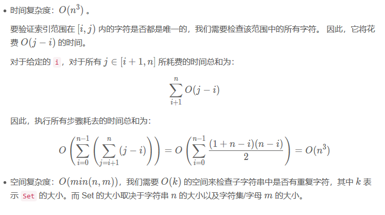

# 无重复字符的最长子串

[OJ](https://leetcode-cn.com/problems/longest-substring-without-repeating-characters/description/)

## 题目
&nbsp;&nbsp;&nbsp;&nbsp;&nbsp;&nbsp;给定一个字符串，请你找出其中不含有重复字符的 最长子串 的长度。

* 示例 1:

  >输入: "abcabcbb"
  >
  >输出: 3 
  >
  >解释: 因为无重复字符的最长子串是 "abc"，所以其长度为 3。

* 示例 2:

  >输入: "bbbbb"
  >
  >输出: 1
  >
  >解释: 因为无重复字符的最长子串是 "b"，所以其长度为 1。

* 示例 3:

  >输入: "pwwkew"
  >
  >输出: 3
  >
  >解释: 因为无重复字符的最长子串是 "wke"，所以其长度为 3。
  
>请注意，你的答案必须是 子串 的长度，"pwke" 是一个子序列，不是子串。


## 解答

### 方法一：暴力法

* 题目分析

    * 思路：
    	* 逐个检查所有的子字符串，看它是否不含有重复的字符。
    * 算法：
		* 假设我们有一个函数 `boolean allUnique(String substring)` ，如果子字符串中的字符都是唯一的，它会返回true，否则会返回false。 我们可以遍历给定字符串 s 的所有可能的子字符串并调用函数 allUnique。 如果事实证明返回值为true，那么我们将会更新无重复字符子串的最大长度的答案。
		* 现在让我们填补缺少的部分：
			* 为了枚举给定字符串的所有子字符串，我们需要枚举它们开始和结束的索引。假设开始和结束的索引分别为 i 和 j 。那么我们有 `0≤i<j≤n`（这里的结束索引 j 是按惯例排除的）。因此，使用 i 从0到 n−1 以及 j 从 i+1 到 n 这两个嵌套的循环，我们可以枚举出 s 的所有子字符串。
			* 要检查一个字符串是否有重复字符，我们可以使用集合。我们遍历字符串中的所有字符，并将它们逐个放入 set 中。在放置一个字符之前，我们检查该集合是否已经包含它。如果包含，我们会返回 false。循环结束后，我们返回 true。


* 代码
  ```java
  package com.edu.leetCode;

  import java.util.HashSet;
  import java.util.Scanner;
  import java.util.Set;
  
  /**
   * @Author: 王仁洪
   * @Date: 2019/3/17 0:32
   */
  public class Solution0003 {
      public int lengthOfLongestSubstring(String s) {
          int len = s.length();
          int ans = 0;
          for (int i = 0; i < len; i++) {
              for (int j = i + 1; j <= len; j++) {
                  boolean flag = allUnique(s, i, j);
                  if (flag) {
                      ans = Math.max(ans, j - i);
                  }
              }
          }
  
  //        int p = len;
  //
  //        for (int i = 0; i < len; i++) {
  //            if (p!=len){
  //                break;
  //            }
  //            for (int j = i + 1; j <= len; j++) {
  //                boolean flag = allUnique(s, i, j);
  //                //System.out.println((ans==j-i) + " " + ans + " " + (j-i));
  //                if (flag && ans==j-i) {
  //                    String str = s.substring(i, j);
  //                    System.out.println(str);
  //                    p = j;
  //                    break;
  //                }
  //            }
  //        }
  
          return ans;
      }
  
      public boolean allUnique(String s, int start, int end) {
          Set<Character> set = new HashSet<>();
          for (int i = start; i < end; i++) {
              Character ch = s.charAt(i);
              if (set.contains(ch)) {
                  return false;
              }
              set.add(ch);
          }
          return true;
      }
  
      public static void main(String[] args) {
          Scanner input = new Scanner(System.in);
          String s = input.next();
          Solution0003 solution = new Solution0003();
          int length = solution.lengthOfLongestSubstring(s);
          System.out.println(length);
      }
  }
  ```
* 复杂度分析：

  <div align="center"><>

### 方法一：滑动窗口

* 题目分析

    * 

* 代码
  ```java
  
  ```

* 复杂度分析：


