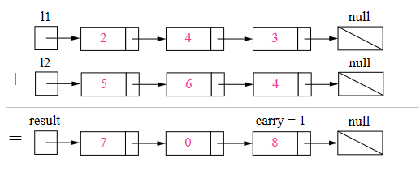

# 两数相加

## 题目

&nbsp;&nbsp;&nbsp;&nbsp;&nbsp;&nbsp;给定两个**非空**链表来表示两个非负整数。位数按照**逆序**方式存储，它们的每个节点只存储单个数字。将两数相加返回一个新的链表。 
&nbsp;&nbsp;&nbsp;&nbsp;&nbsp;&nbsp;你可以假设除了数字 0 之外，这两个数字都不会以零开头。

  >示例：

&nbsp;&nbsp;&nbsp;&nbsp;&nbsp;&nbsp;输入：(2 -> 4 -> 3) + (5 -> 6 -> 4) 
&nbsp;&nbsp;&nbsp;&nbsp;&nbsp;&nbsp;输出：7 -> 0 -> 8 
&nbsp;&nbsp;&nbsp;&nbsp;&nbsp;&nbsp;原因：342 + 465 = 807 

## 解答

### 问题分析

* 我们使用变量来跟踪进位，并从包含最低有效位的表头开始模拟逐位相加的过程。

 

图1，对两数相加方法的可视化: 342 + 465 = 807342+465=807， 每个结点都包含一个数字，并且数字按位逆序存储。

* 算法

&nbsp;&nbsp;&nbsp;&nbsp;&nbsp;&nbsp;就像你在纸上计算两个数字的和那样，我们首先从最低有效位也就是列表 l1 和 l2 的表头开始相加。由于每位数字都应当处于 0...9 的范围内，我们计算两个数字的和时可能会出现“溢出”。例如，5 + 7 = 12。在这种情况下，我们会将当前位的数值设置为 2，并将进位 carry = 1 带入下一次迭代。进位 carry 必定是 0 或 1，这是因为两个数字相加（考虑到进位）可能出现的最大和为 9 + 9 + 1 = 19。

&nbsp;&nbsp;&nbsp;&nbsp;&nbsp;&nbsp;伪代码如下：

   * 将当前结点初始化为返回列表的哑结点。
   * 将进位 carrycarry 初始化为 00。
   * 将 pp 和 qq 分别初始化为列表 l1l1 和 l2l2 的头部。
   * 遍历列表 l1l1 和 l2l2 直至到达它们的尾端。
   
        *　将 xx 设为结点 pp 的值。如果 pp 已经到达 l1l1 的末尾，则将其值设置为 00。
        *　将 yy 设为结点 qq 的值。如果 qq 已经到达 l2l2 的末尾，则将其值设置为 00。
        *　设定 sum = x + y + carrysum=x+y+carry。
        *　更新进位的值，carry = sum / 10carry=sum/10。
        *　创建一个数值为 (sum \bmod 10)(summod10) 的新结点，并将其设置为当前结点的下一个结点，然后将当前结点前进到下一个结点。
        *　同时，将 pp 和 qq 前进到下一个结点。
        
   * 检查 carry = 1carry=1 是否成立，如果成立，则向返回列表追加一个含有数字 11 的新结点。
   * 返回哑结点的下一个结点。
请注意，我们使用哑结点来简化代码。如果没有哑结点，则必须编写额外的条件语句来初始化表头的值。

请特别注意以下情况：

<table>
   <tr>
      <td>测试用例</td>
      <td>说明</td>
   </tr>
   <tr>
      <td>l1=[0,1];l2=[0,1,2]</td>
      <td>当一个列表比另一个列表长时。</td>
   </tr>
   <tr>
      <td>l1=[];l2=[0,1]</td>
      <td>当一个列表为空时，即出现空列表。</td>
   </tr>
   <tr>
      <td>l1=[9,9];l2=[1]</td>
      <td>求和运算最后可能出现额外的进位，这一点很容易被遗忘</td>
   </tr>
</table>

### 代码

    /**
     * Definition for singly-linked list.
     * public class ListNode {
     *     int val;
     *     ListNode next;
     *     ListNode(int x) { val = x; }
     * }
     */
    class Solution {
        public ListNode addTwoNumbers(ListNode l1, ListNode l2) {
            ListNode addHead = new ListNode(0);
            ListNode p = l1, q = l2, curr = addHead;
            int carry = 0;
            while (p != null || q != null) {
                int x = (p != null) ? p.val : 0;
                int y = (q != null) ? q.val : 0;
                int sum = carry + x + y;
                carry = sum / 10;
                curr.next = new ListNode(sum % 10);
                curr = curr.next;
                if (p != null) p = p.next;
                if (q != null) q = q.next;
            }
            if (carry > 0) {
                curr.next = new ListNode(carry);
            }
            return addHead.next;
        }
    }

