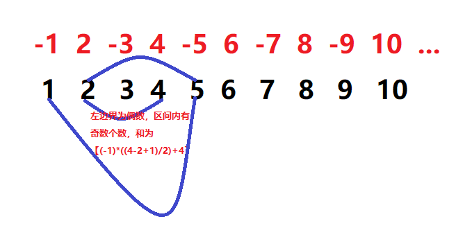

<h1 align="center">2019-03-09腾讯提前批笔试题</h1>

### 一、神奇的货币

* 题目描述：牛家村的货币是一种很神奇的连续货币。他们货币的最大面额是n，并且一共有面额为1，面额为2......面额为n，n种面额的货币。牛牛每次购买商品都会带上所有面额的货币，支付时会选择给出硬币数量最小的方案。现在告诉你牛牛将要购买的商品的价格，你能算出牛牛支付的硬币数量吗？（假设牛牛每种面额的货币都拥有无限个。）
	* 输入描述：

	  >第一行两个整数n，m。表示货币的最大面额和商品的价格。1<=n<=100000,1<=m<=1000000000

	* 输出描述：

	  >一个整数表示牛牛支付的硬币数量。

* 示例：
	* 示例一：
		* 输入：

		  >6 7
		* 输出：

		  >2

	* 示例二：
		* 输入：

		  >4 10
		* 输出：

		  >3

* 解题思路：

  >当面额大于等于价格时，只需支付一枚硬币；当面额小于价格时，用价格除最大面额取商加一则为需支付的硬币数。

* JAVA代码实现
  ```java
  package com.edu.tencent1;

  import java.util.Scanner;

  /**
   * @Author: 王仁洪
   * @Date: 2019/3/9 19:34
   */
  public class Main {
    public static void main(String[] args) {
        Scanner input = new Scanner(System.in);
        int maxFace = input.nextInt();
        int price = input.nextInt();

        int num = 0;

        if (maxFace>=1 && maxFace <= 100000 && price >= 1 && price <= 1000000000){
            if (maxFace >= price){
                num = 1;
            }else{
                num = price / maxFace + 1;
            }

            System.out.println(num);
        }
    }
  }
  ```

### 二、奇妙的数列
* 题目描述：妞妞最近迷上了王者杗耀。小Q得到了一个奇妙的数列，这个数列有无限多项，数列中的第i 个数字为`i*(-1)^i`比如数列的前几项为-1, 2, -3, 4, -5......。小Q兴奋地把这个数列拿去绐妞妞看，并希望借此邀请妞妞吃饭。姐姐想了想，对小Q说：“对于这个数列，我每次询问你一个区间，你在1秒内把这个区间里数字的和舌诉我，如果你答得上来，我就跟你你一起去吃饭"由于妞妞最近沉迷王者荣耀，已经很久没有理小Q了。小Q不想放过这次珍责的机会，你能帮帮小Q吗？
	* 输入描述
	
	  >第一行一个整数，q。表示妞妞一共询问了多少次。接下来q行，每行两个整数l和r。表示妞妞询问的区间的左端点和右端点。1<=q<=100000,1<=l<=r<=1000000000
	* 输出描述

	  >共q行，每行一个整数，表示妞妞询问的区间和。
* 示例：
	* 示例一：
		* 输入：

		  >4
		  >
		  >2 4
		  >
		  >2 2
		  >
		  >3 3
		  >
		  >1 5
		* 输出：

		  >3
		  >
		  >2
		  >
		  >-3
		  >
		  >-3

	* 示例二：
		* 输入：

		  >1
		  >
		  >1 1000000000
		* 输出：

		  >500000000

* 解题思路：

  >先判断左边界为奇数？还是偶数？如果为奇数，则判断区间内有多少个数，如果区间内有奇数个数，则该区间里数字之和为`区间内数字个数除2取商 乘 （-1） 加 右边界对应的数字`；如果区间内有偶数个数，则该区间里数字之和为`区间内数字个数除2取商 乘 （-1）`；如果左边界为偶数，则判断区间内有多少个数，如果区间内有奇数个数，则该区间里数字之和为`区间内数字个数除2取商 加 右边界对应的数字`；如果区间内有偶数个数，则该区间里数字之和为`区间内数字个数除2取商`

  <div align="center"></div>

* JAVA代码实现
  ```java
  package com.edu.tencent2;

  import java.util.Scanner;

  /**
   * @Author: 王仁洪
   * @Date: 2019/3/9 19:50
   */
  public class Main {
    public static void main(String[] args) {
        Scanner input = new Scanner(System.in);

        int q = input.nextInt();
        if (q>=1 && q<=100000){
            int[] left = new int[q];
            int[] right = new int[q];
            for (int i=0;i<q;i++){
                left[i] = input.nextInt();
                right[i] = input.nextInt();
            }

            int[] value = new int[q];

            for (int i=0;i<q;i++){
                if (left[i]>=1 && left[i]<=right[i] && right[i]<=1000000000){
                    if (left[i] == right[i]){
                        value[i] = (int)(left[i] * Math.pow(-1,left[i]));
                    }else {
                        int sub = right[i]-left[i] + 1;
                        int subBinary = sub / 2;
                        if (left[i]%2==0){//开始的数是偶数（正数）
                            if (sub%2==0){//区间内有偶数个数
                                value[i] = (-1) * subBinary;
                            }else {//区间内有奇数个数
                                value[i] = (-1) * subBinary  + (int)(right[i] * Math.pow(-1,right[i]));
                            }
                        }else {//开始的数是奇数(负数)
                            if (sub%2==0){
                                value[i] = subBinary;
                            }else {
                                value[i] = subBinary + (int)(right[i] * Math.pow(-1,right[i]));
                            }
                        }
                    }
                }
            }

            for (int i=0;i<q;i++){
                System.out.println(value[i]);
            }
        }
    }
  }
  ```

### 三、剪刀石头布游戏
* 题目描述：小Q和牛妹参加一个剪刀石头布的游戏，游戏用卡片来玩，每张卡片是剪刀，石头，布中的一种，每种类型的卡片有无限个。牛妹从中选了n张卡片排成一排,正面朝下，小Q也会选择n张卡片排成一排，然后小Q和牛妹的卡片会依次进行比对，第一张对第一张，第二张对第二张......如果小Q嬴，小Q会得到一分，现在已知牛妹的每一张牌以及小Q最终的得分，请问小Q有多少种选择卡片的方案（多少不同的排列） 
	* 输入描述：
	
	  >第一行输入两个数n,s（1 <= n <= 2000,0 <= S <= 2000），
	  >第二行输入n个整数表示牛妹的每张卡片，每个数在[0, 2]之间，0代表石头,1代表布，2代表剪刀。
	* 输出描述：

	  >输出一个整数，对1e9+7取模

* 示例：

	* 输入：

	  >3 2
	  >
	  >0 1 2
	* 输出：

	  >6

* 解题思路：

  >

* JAVA代码实现
  ```java
  package com.edu;

  import java.util.HashMap;
  import java.util.Map;
  import java.util.Scanner;

  /**
   * @Author: 王仁洪
   * @Date: 2019/3/9 21:31
   */
  public class Main {
    static Map<String, Long> map = new HashMap<String, Long>();

    private static long comb(int m, int n) {
        String key = m + "," + n;
        if (n == 0)
            return 1;
        if (n == 1)
            return m;
        if (n > m / 2)
            return comb(m, m - n);
        if (n > 1) {
            if (!map.containsKey(key))
                map.put(key, comb(m - 1, n - 1) + comb(m - 1, n));
            return map.get(key);
        }
        return -1;
    }

    public static void main(String[] args) {
        // TODO Auto-generated method stub
        Scanner scanner = new Scanner(System.in);
        int n = scanner.nextInt();
        int s = scanner.nextInt();
        for (int i = 0; i < n; i++) {
            scanner.nextInt();
        }
        long allAbel = Wrh.comb(n, s) * (int)Math.pow(2,(n-s));
        //long outPut = allAbel % 1000000007;
        System.out.println(allAbel);
    }
  }

  ```

### 四、射击气球
* 题目描述：小Q在进行射击气球的游戏，如果小Q在连续T枪中打爆了所有颜色的气球，将得到一只QQ公仔作为奖励。（每种颜色的气球至少被打爆一只。这个游戏中有m种不同颜色的气球，编号1到m。小Q一共有n发子弹，然后连续开了n枪。小Q想知道在这n枪中，打爆所有颜色的气球最少用了连续几枪？
	* 输入描述：
	
	  >第一行两个空格间隔的整数数n,m。 n<=1000000 , m<=2000 , 第二行一共n个空格间隔的整数，分别表示每一枪打中的气球的颜色，0表示没打中任何颜色的气球。
	* 输出描述：

	  >一个整数表示小Q打爆所有颜色气球用的最少枪数。如果小Q无法在这n枪打爆所有颜色的气球，则输出-1。

* 示例：

	* 输入：

	  >12 5
	  >
	  >2 5 3 1 3 2 4 1 0 5 4 3
	* 输出：

	  >6
	* 说明：
	
	  >样例1解释：有五种颜色的气球，编号1到5。澥客从第2枪开始直到第7枪，这连续六枪打爆了 5 3 1 3 2 4这几种颜色的气球，包含了从1到5所有的颜色，所以最少枪数为6。
* 解题思路：

  >

* JAVA代码实现
  ```java
  package com.edu.tencent4;

  import java.util.*;

  /**
   * @Author: 王仁洪
   * @Date: 2019/3/9 20:36
   */
  public class Main {
    public static void main(String[] args) {
        Scanner input = new Scanner(System.in);

        int gunNum = input.nextInt();
        int colorNum = input.nextInt();
        int[] target = new int[gunNum];
        for (int i=0;i<gunNum;i++){
            target[i] = input.nextInt();
        }

        List<Integer> colorList = new ArrayList<>();
        List<Integer> listCopy = new ArrayList<>();
        for (int i=0;i<colorNum;i++){
            colorList.add(i+1);
        }
        int[] result = new int[gunNum-colorNum+1];

        for (int j=0;j<gunNum-colorNum+1;j++){
            int index = 0;
            int num = 0;
            boolean flag = false;

            for (int i=j;i<gunNum;i++){
                if (listCopy.size()==colorNum){
                    flag = true;
                    break;
                }
                Iterator<Integer> iterator = colorList.iterator();
                while (iterator.hasNext()){
                    Integer color = iterator.next();
                    if (color.equals(target[i])){
                        if (!listCopy.contains((Object)color)){
                            listCopy.add(color);
                        }
                        index = i;
                        continue;
                    }
                }
            }

            //System.out.println(listCopy);

            for (int i=0;i<colorNum;i++){
                listCopy.clear();
            }

            if (flag){
                boolean flag1 = false;
                for (int i=index;i>=0;i--){
                    if (listCopy.size()==colorNum){
                        flag1 = true;
                        break;
                    }

                    //System.out.println(target[i]);

                    Iterator<Integer> iterator = colorList.iterator();
                    while (iterator.hasNext()){
                        Integer color = iterator.next();
                        if (color.equals(target[i])){
                            if (!listCopy.contains((Object)color)){
                                listCopy.add(color);
                            }
                            continue;
                        }
                    }
                    num++;
                }
                if (!flag1){
                    num = -1;
                }
            }else {
                num = -1;
            }
            result[j] = num;

            System.out.println(num);

            //System.out.println(listCopy);
        }

        int num = 0;
        boolean flag = false;
        for (int i=0;i<result.length;i++){
            if (result[i]!=(-1)){
                num = -1;
                flag = true;
            }
        }

        if (flag){
            Arrays.sort(result);
            for (int i=0;i<result.length;i++){
                if (result[i]!=(-1)){
                    num = result[i];
                    break;
                }
            }
        }

        System.out.println(num);
    }
  }
  /*
  12 5
  2 5 3 1 3 2 4 1 0 5 4 3
  //6

  12 5
  2 3 3 1 3 2 4 1 0 5 4 3
  //6

  12 5
  2 0 3 1 3 2 4 1 0 1 4 3
  //-1
   */
  ```

### 五、
* 题目描述：小Q给你n个数1、2、3、......、n,代表n个楼，第i个楼的高度为i,每个楼会有一种颜色，现在问有多少的排列满足从左往右（站在左边很远的地方看）看，能看到L种颜色（即看到了L-1次颜色的变化），答妄对1e9+9取模，如栗两个相同颜色楼的髙度分别为H1，H2 (H1 < H2), H1在左边，且H1、H2之间的楼都比H1矮，那么站在左边来看就是一种颜色，你能看到一个楼的前提是这个楼之前的楼都比它矮。

	* 输入描述：
	
	  >第—行输入两个整数n, L(1 <= n <= 1296) ,(1 <= L <= n),
	  >
	  >第二行输入n个整数 Ci表示每个楼的颜色(1 <= Ci <= n)

	* 输出描述：

	  >输出一个整数

* 示例：

	* 输入：

	  >4 3
	  >
	  >1 1 2 1
	* 输出：

	  >6

* 解题思路：

  >

* JAVA代码实现
  ```java
  
  ```