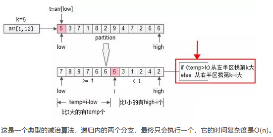

# 一面
## 壹、内推一面
### 1、自我介绍、项目

### 2、Linux查看CPU命令，常用命令
- 监控CPU的性能一般包括以下3点：运行队列、CPU使用率和上下文切换。
	- 1)`#top -bn 1 -i -c` ：在第三行有显示CPU当前的使用情况。
	- 2)`#vmstat 1 5`
	- 3)`#sar -u 1 5` ：sar命令语法和vmstat一样。命令不存在时需要安装sysstat包
	- 4)`#mpstat 1 5` ： 这个命令也在sysstat包中，语法类似。例如每1秒收集一次，共5次。
	- 5)`#iostat -c 1 2` ：查看io使用情况，也可以来查看cpu
	- 6)`#dstat -c` ：每秒cpu使用率情况获取
- 常用命令:cd切换目录，mkdir创建文件夹，ls查看目录下内容，rm删除，mv修改，vi编辑，chmod修改权限，cp复制，sl跑火车，

### 3、Linux程序如何调试
- 基本调试，获得关键变量 - print 语句
- 获取有关文件系统支持，可用内存，CPU，运行程序的内核状态等信息 - 查询 /proc 文件系统
- 最初的问题诊断，系统调用或库调用的相关问题，了解程序流程 – strace / ltrace
- 应用程序内存空间的问题 – valgrind
- 检查应用程序运行时的行为，分析应用程序崩溃 – gdb

### 4、Top K

- 问题描述：

  - 从arr[1, n]这n个数中，找出最大的k个数，这就是经典的TopK问题。

- 方法一：全局排序
  - 排序是最容易想到的方法，将n个数排序之后，取出最大的k个，即为所得。
  - 伪代码：
    ```java
    sort(arr, 1, n);
    return arr[1, k];
    ```
  - 时间复杂度：O(n*lg(n))      (O的发音bigO)
  - 分析：明明只需要TopK，却将全局都排序了，这也是这个方法复杂度非常高的原因。那能不能不全局排序，而只局部排序呢？这就引出了第二个优化方法。不再全局排序，只对最大的k个排序。

- 方法二：局部排序
  - 冒泡是一个很常见的排序方法，每冒一个泡，找出最大值，冒k个泡，就得到TopK。
  - 伪代码：
    ```java
    for(i=1 to k){
    	bubble_find_max(arr,i);
    }
    return arr[1, k];
    ```
  - 时间复杂度：O(n*k)
  - 分析：冒泡，将全局排序优化为了局部排序，非TopK的元素是不需要排序的，节省了计算资源。不少朋友会想到，需求是TopK，是不是这最大的k个元素也不需要排序呢？这就引出了第三个优化方法。

- 方法三：**堆（求TopK的经典算法）**
  - 思路：只找到TopK，不排序TopK。
  	- 先用前k个元素生成一个小顶堆，这个小顶堆用于存储，当前最大的k个元素。
  	- 接着，从第k+1个元素开始扫描，和堆顶（堆中最小的元素）比较，
  		- 如果被扫描的元素大于堆顶，则替换堆顶的元素，并调整堆，以保证堆内的k个元素，总是当前最大的k个元素。
  		- 直到，扫描完所有n-k个元素，最终堆中的k个元素，就是猥琐求的TopK。

  - 伪代码：
    ```java
    heap[k] = make_heap(arr[1, k]);
    for(i=k+1 to n){
    	adjust_heap(heep[k],arr[i]);
    }
    return heap[k];
    ```
  - 时间复杂度：O(n*lg(k))

    - 画外音：n个元素扫一遍，假设运气很差，每次都入堆调整，调整时间复杂度为堆的高度，即lg(k)，故整体时间复杂度是n*lg(k)。
  - 分析：堆，将冒泡的TopK排序优化为了TopK不排序，节省了计算资源。**堆，是求TopK的经典算法**，那还有没有更快的方案呢？


- 方法四：随机选择
	- 随机选择算在是《算法导论》中一个经典的算法，其**时间复杂度为O(n)**，是一个线性复杂度的方法。
	- 思路：
		- TopK是希望求出arr[1,n]中最大的k个数，那如果找到了**第k大**的数，做一次partition，不就一次性找到最大的k个数了么？画外音：即partition后左半区的k个数。
		- 问题变成了arr[1, n]中找到第k大的数。
		- 再回过头来看看**第一次**partition，划分之后：`i = partition(arr, 1, n);`
			- 如果i大于k，则说明arr[i]左边的元素都大于k，于是只递归arr[1, i-1]里第k大的元素即可;
			- 如果i小于k，则说明说明第k大的元素在arr[i]的右边，于是只递归arr[i+1, n]里第k-i大的元素即可；
	- 这就是随机选择算法randomized_select，RS，其伪代码如下：
	  ```java
	  int RS(arr, low, high, k){
	  	if(low== high) return arr[low];
	  	i= partition(arr, low, high);
	  	temp= i-low; //数组前半部分元素个数
	  	if(temp>=k) 
	  		return RS(arr, low, i-1, k); //求前半部分第k大
	  	else
	  		return RS(arr, i+1, high, k-i); //求后半部分第k-i大
	  }
	  ```
	  
	  <div align="center"></div>
	- 再次强调一下：
		- 分治法，大问题分解为小问题，小问题都要递归各个分支，例如：快速排序
		- 减治法，大问题分解为小问题，小问题只要递归一个分支，例如：二分查找，随机选择
	- 通过随机选择（randomized_select），找到arr[1, n]中第k大的数，再进行一次partition，就能得到TopK的结果。

- 总结
   - TopK，不难；其思路优化过程，不简单：
    	- 全局排序，O(n*lg(n))
         	- 局部排序，只排序TopK个数，O(n*k)
        - 堆，TopK个数也不排序了，O(n*lg(k))
   	- 分治法，每个分支“都要”递归，例如：快速排序，O(n*lg(n))
   	- 减治法，“只要”递归一个分支，例如：二分查找O(lg(n))，随机选择O(n)
   	- TopK的另一个解法：随机选择+partition

### 5、数组乱序
- 方法一：（最优解）
  - 新建一个数组，每次从已知数组随机一个数 并把这个数复制到新数组中，
  - 然后将数组的最后一个值 赋值给前面随机到的数的位置上，然后将长度-1，
  - 再从原数组下标-1的数组中随机。 
  - 运算次数就是数组长度，这种方法真的很聪明啊，以下是代码：

  ```java
  import java.util.Arrays;
  import java.util.Random;
  
  /**
   * @Author: 王仁洪
   * @Date: 2019/4/18 11:31
   */
  public class ArrayDisorder {
      public static void main(String[] args) {
          int[] arr = {1,2,3,4,5,6,7,8,9};
          ArrayDisorder array = new ArrayDisorder();
          int[] ints = array.arrayDisorder(arr);
          System.out.println(Arrays.toString(ints));
      }
      public int[] arrayDisorder(int[] arr){
          int arrLength = arr.length;
          int[] newArr = new int[arrLength];
          int length = arrLength + 1;//arr长度减一后的长度
          int newArrIndex = 0;//新数组下标
          Random random = new Random();
          do {
              length = length - 1;
              int index = random.nextInt(length);
              newArr[newArrIndex++] = arr[index];
              arr[index] = arr[length-1];
          }while (length > 1);//count < arrLength
          return newArr;
      }
  }
  ```


