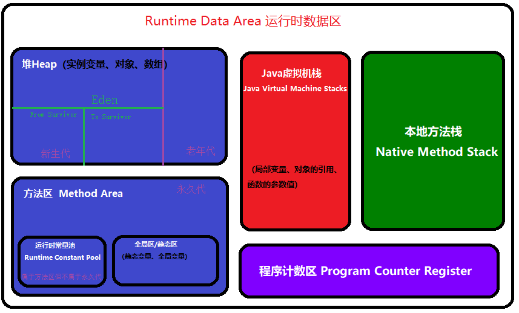

# 壹——JAVA知识
## 一、JAVA基础


## 二、异常


## 三、集合


## 四、多线程
### 1、不同子进程共享同一个父进程的什么资源？
- 子进程将获得父进程数据空间、堆、栈等资源的副本。


## 五、JAVA虚拟机
### 1、JVM内存分区
- Java虚拟机在执行Java程序的过程中，会把它管理的内存划分为几个不同的数据区域，这些区域都有各自的用途、创建时间、销毁时间。
- Java运行时数据区分为下面几个内存区域：

  <div align="center"></div>

  - 1)PC寄存器/程序计数器：
    - 严格来说是一个数据结构，用于保存当前正在执行的程序的内存地址，
    - 由于Java是支持多线程执行的，所以程序执行的轨迹不可能一直都是线性执行。
    - 当有多个线程交叉执行时，被中断的线程的程序当前执行到哪条内存地址必然要保存下来，以便用于被中断的线程恢复执行时再按照被中断时的指令地址继续执行下去。
    - 为了线程切换后能恢复到正确的执行位置，每个线程都需要有一个独立的程序计数器，
    - 各个线程之间计数器互不影响，独立存储，我们称这类内存区域为“**线程私有**”的内存,这在某种程度上有点类似于“ThreadLocal”，是**线程安全**的。
  - 2)Java栈 Java Stack：
    - Java栈总是**与线程关联在一起**的，每当创建一个线程，JVM就会为该线程创建对应的Java栈，
    - 在这个Java栈中又会包含多个**栈帧(Stack Frame)**，这些栈帧是与每个方法关联起来的，每运行一个方法就创建一个栈帧，每个栈帧会含有一些**局部变量、操作栈和方法返回值等信息**。
    - 每当一个方法执行完成时，该栈帧就会弹出栈帧的元素作为这个方法的返回值，并且清除这个栈帧，
    - Java栈的栈顶的栈帧就是当前正在执行的**活动栈**，也就是当前正在执行的方法，PC寄存器也会指向该地址。只有这个活动的栈帧的本地变量可以被操作栈使用，当在这个栈帧中调用另外一个方法时，与之对应的**一个新的栈帧被创建**，这个新创建的栈帧被放到Java栈的栈顶，变为当前的活动栈。同样现在只有这个栈的本地变量才能被使用，当这个栈帧中所有指令都完成时，这个栈帧被移除Java栈，刚才的那个栈帧变为活动栈帧，前面栈帧的返回值变为这个栈帧的操作栈的一个操作数。
    - **由于Java栈是与线程对应起来的，Java栈数据不是线程共有的，所以不需要关心其数据一致性，也不会存在同步锁的问题**。
    - 在Java虚拟机规范中，对这个区域规定了两种异常状况：
      - 如果线程请求的栈深度大于虚拟机所允许的深度，将抛出StackOverflowError异常；
      - 如果虚拟机可以动态扩展，如果扩展时无法申请到足够的内存，就会抛出OutOfMemoryError异常。在Hot Spot虚拟机中，可以使用-Xss参数来设置栈的大小。栈的大小直接决定了函数调用的可达深度。

    <div align="center"></div>

  - 3)堆 Heap:
    - 堆是JVM所管理的内存中最大的一块，是被所有Java线程锁共享的，**不是线程安全的**，**在JVM启动时创建**。
    - 堆是存储Java对象的地方，这一点Java虚拟机规范中描述是：所有的**对象实例**以及**数组**都要在堆上分配。
    - Java堆是GC管理的主要区域，从内存回收的角度来看，由于现在GC基本都采用分代收集算法，所以Java堆还可以细分为：**新生代**和**老年代**；
      - 新生代再细致一点有 **Eden空间、From Survivor空间、To Survivor空间**等。
  - 4)方法区Method Area:

    - 方法区存放了要加载的类的信息（名称、修饰符等）、类中的静态常量、类中定义为final类型的常量、类中的Field信息、类中的方法信息，当在程序中通过Class对象的`getName.isInterface`等方法来获取信息时，这些数据都来源于方法区。
    - **方法区是被Java线程锁共享的，不像Java堆中其他部分一样会频繁被GC回收**，它存储的信息相对比较稳定，**在一定条件下会被GC**，
    - 当方法区要使用的内存超过其允许的大小时，会抛出OutOfMemory的错误信息。
    - 方法区也是堆中的一部分，就是我们通常所说的Java堆中的**永久区** Permanet Generation，大小可以通过参数来设置,可以通过-XX:PermSize指定初始值，`-XX:MaxPermSize`指定最大值。
  - 5)常量池Constant Pool:
    - 常量池本身是方法区中的一个数据结构。
    - 常量池中存储了如**字符串、final变量值、类名和方法名常量**。
    - **常量池在编译期间就被确定，并保存在已编译的`.class`文件中**。一般分为两类：**字面量**和**引用量**。
      - 字面量就是字符串、final变量等。
      - 类名和方法名属于引用量。引用量最常见的是在调用方法的时候，根据方法名找到方法的引用，并以此定为到函数体进行函数代码的执行。引用量包含：类和接口的权限定名、字段的名称和描述符，方法的名称和描述符。


## 六、内部类


## 七、代码分析


# 贰——设计模式


# 叁——计算机网络
### 1、TCP协议和UDP协议的区别？
- TCP面向连接，UDP面向非连接；
- TCP是可靠传输,UDP是不可靠传输;
- TCP传输速度慢，UDP传输速度快；
- TCP传输数据有序,UDP不保证数据的有序性;
- TCP不保存数据边界,UDP保留数据边界;
- TCP有流量控制和拥塞控制,UDP没有;
- TCP保证数据正确性，UDP可能丢包；
- TCP是重量级协议,UDP是轻量级协议;
- TCP首部较长20字节,UDP首部较短８字节;


# 肆——Web


# 伍——框架
### 1、Spring框架的好处，为什么使用它？
* 我们是在使用Spring框架的过程中，其实就是为了使用IOC（依赖注入）和AOP（面向切面编程），这两个是Spring的灵魂。
* 方便解耦，简化开发
  * Spring就是一个大工厂，可以将所有对象创建和依赖关系维护，交给Spring管理
* AOP编程的支持
  * Spring提供面向切面编程，可以方便的实现对程序进行权限拦截、运行监控等功能
* 声明式事务的支持
  * 只需要通过配置就可以完成对事务的管理，而无需手动编程
* 方便程序的测试
  * Spring对Junit4支持，可以通过注解方便的测试Spring程序
* 方便集成各种优秀框架
  * Spring不排斥各种优秀的开源框架，其内部提供了对各种优秀框架（如：Struts2、Hibernate、MyBatis、Quartz等）的直接支持
* 降低JavaEE API的使用难度
  * Spring 对JavaEE开发中非常难用的一些API（JDBC、JavaMail、远程调用等），都提供了封装，使这些API应用难度大大降低
* Spring的高度开放性，并不强制应用完全依赖于Spring，开发者可以自由选择spring的部分或全部 
* Spring的DI机制降低了业务对象替换的复杂性

### 2、解释一下IOC、DI和AOP

- spring的IOC容器是spring的核心，spring AOP是spring框架的重要组成部分。
- **控制反转（IOC）**：控制反转也叫依赖注入。利用了工厂模式
  - 在传统的程序设计中，当调用者需要被调用者的协助时，通常由调用者来创建被调用者的实例。但在spring里创建被调用者的工作不再由调用者来完成，因此**控制反转（IOC）**，创建被调用者实例的工作通常由spring容器来完成；然后注入调用者，因此也被称为**依赖注入（DI）**，依赖注入和控制反转是同一个概念。
  - Spring以动态灵活的方式来管理对象 ， 注入的两种方式，**设置注入**和**构造注入**。 
  	- 设置注入的优点：直观，自然 
  	- 构造注入的优点：可以在构造器中决定依赖关系的顺序。 
  - 将对象交给容器管理，你只需要在spring配置文件中配置相应的bean，以及设置相关的属性，让spring容器来生成类的实例对象以及管理对象。在spring容器启动的时候，spring会把你在配置文件中配置的bean都初始化好，然后在你需要调用的时候，就把它已经初始化好的那些bean分配给你需要调用这些bean的类（假设这个类名是A），分配的方法就是调用A的setter方法来**注入**，而不需要你在A里面new这些bean了。
  ```java
  <bean id="student" class="com.edu.bean.Student">
      <property name="name" value="小红"></property>
      <property name="gender" value="女"></property>
  </bean>
  
  //1、创建ioc容器对象：
  ApplicationContext applicationContext = new ClassPathXmlApplicationContext("spring.xml");
  
  //2、从容器中获得维护的Student实例
  
  //2.1通过id
  Student student1 = (Student)applicationContext.getBean("student");
  //2.2通过类名
  Student student2 = applicationContext.getBean(Student.class);
  ```
- **面向切面编程（AOP)**（Aspect-Oriented Programming）：AOP就是典型的代理模式的体现。

  - OOP将应用程序分解成**各个层次的对象**，而AOP将程序**分解成多个切面**。springAOP 只实现了方法级别的连接点，在J2EE应用中，AOP拦截到方法级别的操作就已经足够。
  - 面向切面编程（AOP)是以另一个角度来考虑程序结构，通过分析程序结构的关注点来完善面向对象编程（OOP）。**AOP可以说是对OOP的补充和完善**。
  - OOP引入封装、继承和多态性等概念来建立一种对象层次结构，用以模拟公共行为的一个集合。当我们需要为分散的对象引入公共行为的时候，OOP则显得无能为力。也就是说，OOP允许你定义从上到下的关系，但并不适合定义从左到右的关系。例如日志功能。日志代码往往水平地散布在所有对象层次中，而与它所散布到的对象的核心功能毫无关系。在OOP设计中，它导致了大量代码的重复，而不利于各个模块的重用。将程序中的交叉业务逻辑（比如安全，日志，事务等），**封装成一个切面，然后注入到目标对象**（具体业务逻辑）中去。
  - 实现AOP的技术，主要分为两大类：
    - 一是采用**动态代理技术**，利用截取消息的方式，对该消息进行装饰，以取代原有对象行为的执行；
    - 二是采用**静态织入**的方式，引入特定的语法创建“方面”，从而使得编译器可以在编译期间织入有关“方面”的代码.
  - 面向切面编程（AOP）完善spring的依赖注入（DI），面向切面编程在spring中主要表现为两个方面 
  	- 面向切面编程提供声明式事务管理 
  	- spring支持用户自定义的切面 
  - aop框架具有的两个特征： 
  	- 各个步骤之间的良好隔离性 
  	- 源代码无关性 


### 3、Spring中用到的设模式
- 主要用到的设计模式有**工厂模式**和**代理模式**。
  - IOC就是典型的工厂模式，通过sessionfactory去注入实例。
  - AOP就是典型的代理模式的体现。
  	- 代理模式是常用的java设计模式，他的特征是代理类与委托类有同样的接口，代理类主要负责为委托类预处理消息、过滤消息、把消息转发给委托类，以及事后处理消息等。代理类与委托类之间通常会存在关联关系，一个代理类的对象与一个委托类的对象关联，代理类的对象本身并不真正实现服务，而是通过调用委托类的对象的相关方法，来提供特定的服务。
- spring中用到的九种设计模式(http://itxxz.com/a/javashili/tuozhan/2014/0601/7.html)
  - 第一种：简单工厂
    - 又叫做静态工厂方法（StaticFactory Method）模式，但不属于23种GOF设计模式之一。 
    - 简单工厂模式的实质是由一个工厂类根据传入的参数，动态决定应该创建哪一个产品类。 
    - spring中的BeanFactory就是简单工厂模式的体现，根据传入一个唯一的标识来获得bean对象，但是否是在传入参数后创建还是传入参数前创建这个要根据具体情况来定。如下配置，就是在 HelloItxxz 类中创建一个 itxxzBean。
  - 第二种：工厂方法（Factory Method）
    -  通常由应用程序直接使用new创建新的对象，为了将对象的创建和使用相分离，采用工厂模式,即应用程序将对象的创建及初始化职责交给工厂对象。
    -  一般情况下,应用程序有自己的工厂对象来创建bean.如果将应用程序自己的工厂对象交给Spring管理,那么Spring管理的就不是普通的bean,而是工厂Bean。
  - 第三种：单例模式（Singleton）
    - 保证一个类仅有一个实例，并提供一个访问它的全局访问点。 
    - Spring中的单例模式完成了后半句话，即提供了全局的访问点BeanFactory。但没有从构造器级别去控制单例，这是因为spring管理的是任意的java对象。 
    - 核心提示点：Spring下默认的bean均为singleton，可以通过singleton=“true|false” 或者 scope=“？”来指定
  - 第四种：适配器（Adapter）
    - 在Spring的Aop中，使用的Advice（通知）来增强被代理类的功能。
    - Spring实现这一AOP功能的原理就使用代理模式（1、JDK动态代理。2、CGLib字节码生成技术代理。）对类进行方法级别的切面增强，即，**生成被代理类的代理类**， 并在代理类的方法前，设置拦截器，通过执行拦截器重的内容增强了代理方法的功能，实现的面向切面编程。
      ```java
      Adapter类接口：Target
      public interface AdvisorAdapter {
          boolean supportsAdvice(Advice advice);
          MethodInterceptor getInterceptor(Advisor advisor);
      }
      MethodBeforeAdviceAdapter类，Adapter
      class MethodBeforeAdviceAdapter implements AdvisorAdapter, Serializable {
          public boolean supportsAdvice(Advice advice) {
              return (advice instanceof MethodBeforeAdvice);
          }
          public MethodInterceptor getInterceptor(Advisor advisor) {
              MethodBeforeAdvice advice = (MethodBeforeAdvice) advisor.getAdvice();
              return new MethodBeforeAdviceInterceptor(advice);
          }
      }
      ```
  - 第五种：包装器（Decorator）
    - 在我们的项目中遇到这样一个问题：我们的项目需要连接多个数据库，而且不同的客户在每次访问中根据需要会去访问不同的数据库。我们以往在spring和hibernate框架中总是配置一个数据源，因而sessionFactory的dataSource属性总是指向这个数据源并且恒定不变，所有DAO在使用sessionFactory的时候都是通过这个数据源访问数据库。但是现在，由于项目的需要，我们的DAO在访问sessionFactory的时候都不得不在多个数据源中不断切换，问题就出现了：如何让sessionFactory在执行数据持久化的时候，根据客户的需求能够动态切换不同的数据源？我们能不能在spring的框架下通过少量修改得到解决？是否有什么设计模式可以利用呢？ 
    - 首先想到在spring的applicationContext中配置所有的dataSource。这些dataSource可能是各种不同类型的，比如不同的数据库：Oracle、SQL Server、MySQL等，也可能是不同的数据源：比如apache 提供的org.apache.commons.dbcp.BasicDataSource、spring提供的org.springframework.jndi.JndiObjectFactoryBean等。然后sessionFactory根据客户的每次请求，将dataSource属性设置成不同的数据源，以到达切换数据源的目的。
    - spring中用到的包装器模式在类名上有两种表现：一种是类名中含有Wrapper，另一种是类名中含有Decorator。基本上都是动态地给一个对象添加一些额外的职责。 
  - 第六种：代理（Proxy）
    - 为其他对象提供一种代理以控制对这个对象的访问。 
    - 从结构上来看和Decorator模式类似，但Proxy是控制，更像是一种对功能的限制，而Decorator是增加职责。 
    - spring的Proxy模式在aop中有体现，比如JdkDynamicAopProxy和Cglib2AopProxy。 
  - 第七种：观察者（Observer）
    - 定义对象间的一种一对多的依赖关系，当一个对象的状态发生改变时，所有依赖于它的对象都得到通知并被自动更新。
    - spring中Observer模式常用的地方是listener的实现。如ApplicationListener。
  - 第八种：策略（Strategy）
    - 定义一系列的算法，把它们一个个封装起来，并且使它们可相互替换。本模式使得算法可独立于使用它的客户而变化。 
    - spring中在实例化对象的时候用到Strategy模式
  - 第九种：模板方法（Template Method）
    - 定义一个操作中的算法的骨架，而将一些步骤延迟到子类中。Template Method使得子类可以不改变一个算法的结构即可重定义该算法的某些特定步骤。
    - Template Method模式一般是需要继承的。这里想要探讨另一种对Template Method的理解。
    - spring中的JdbcTemplate，在用这个类时并不想去继承这个类，因为这个类的方法太多，但是我们还是想用到JdbcTemplate已有的稳定的、公用的数据库连接，那么我们怎么办呢？我们可以把变化的东西抽出来作为一个参数传入JdbcTemplate的方法中。但是变化的东西是一段代码，而且这段代码会用到JdbcTemplate中的变量。怎么办？那我们就用**回调对象**吧。在这个回调对象中定义一个操纵JdbcTemplate中变量的方法，我们去实现这个方法，就把变化的东西集中到这里了。然后我们再传入这个回调对象到JdbcTemplate，从而完成了调用。这可能是Template Method不需要继承的另一种实现方式吧。 


# 陆——数据库
### 1、根据以表格，以学号为主键，在数据库中创建表student
```sql
create table STUDENT{
  STU_NO char(20) NOT NULL PRIMARY KEY,
  STU_NAME char(20),
  STU_SEX char(1) default NULL,
  STU_AGE int,
  STU_SERI char(20)
}
```


# 柒——数据结构
### 1、堆和栈的区别？
- 栈：栈顶的地址和栈的最大容量是系统预先规定好的能从栈获得的空间较小；由系统自动分配，速度较快，但程序员是无法控制的。
- 堆：用户申请，并指明大小；堆获得的空间比较灵活，也比较大；是由new分配的内存，一般速度比较慢，而且容易产生内存碎片。

### 2、一棵完全二叉树中有65个节点，则该二叉树的深度为6
<div align="center"></div>

### 3、一个像素为1024*768的图片在没有压缩的情况下，占用多少存储空间？
```java
1024X768 = 786432像素
786432X2 = 1572864字节
1572864除以1024 = 1536K
1536除以1024 = 1.5M
```

### 4、快速排序的思想是递归，但是它的平均速率确实是众多排序算法中最快的，为什么？
- 用递归能解决的问题通常能将问题不断缩小为性质相同但规模更小的问题，直到问题足够小能够直接解决，而且递归程序看起来非常简洁，是一种非常好的手段；
- 但一般情况下会产出很多无用的东西，衡量好再用递归。

### 5、快排原理
- 问题描述：

  - 假设我们现在对`{6,1,2,7,9,3,4,5,10,8}`这个10个数进行排序。
- 方法一：
  - 原理分析：
    - 首先在这个序列中随便找一个数作为基准数。为了方便，就让第一个数6作为基准数。

    - 接下来，需要将这个序列中所有比基准数大的数放在6的右边，比基准数小的数放在6的左边，类似`{3,1,2,5,4, 6 ,9,7,10,8}`这种排列；

    - 分别从初始序列`{6,1,2,7,9,3,4,5,10,8}`两端开始“探测”。先从**右**往**左**找一个**小于**6的数，再从**左**往**右**找一个**大于**6的数，然后**交换**他们。这里可以用两个变量`i`和`j`，分别指向序列`最左边`和`最右边`。我们为这两个变量起个好听的名字`“哨兵i”`和`“哨兵j”`。刚开始的时候让哨兵i指向序列的最左边（即i=1），指向数字6。让哨兵j指向序列的最右边（即j=10），指向数字。

    

    -  首先哨兵j开始出动。因为此处设置的基准数是最左边的数，所以需要让哨兵j先出动，这一点非常重要（请自己想一想为什么）。哨兵j一步一步地向左挪动（即j--），直到找到一个小于6的数停下来。接下来哨兵i再一步一步向右挪动（即i++），直到找到一个数大于6的数停下来。最后哨兵j停在了数字5处，哨兵i停在了数字7处。

    

    - 现在交换哨兵i和哨兵j所指向的元素的值。交换之后的序列如下：{6  1  2  **5**  9 3  4  **7**  10  8}；到此，第一次交换结束。

       

    - 接下来开始哨兵j继续向左挪动（再友情提醒，每次必须是哨兵j先出发）。他发现了4（比基准数6要小，满足要求）之后停了下来。哨兵i也继续向右挪动的，他发现了9（比基准数6要大，满足要求）之后停了下来。此时再次进行交换，交换之后的序列如下：{6  1  2  5  **4**  3  **9**  7 10  8}

    

    

    - 第二次交换结束，“探测”继续。哨兵j继续向左挪动，他发现了3（比基准数6要小，满足要求）之后又停了下来。哨兵i继续向右移动，糟啦！此时哨兵i和哨兵j相遇了，哨兵i和哨兵j都走到3处。说明此时“探测”结束。我们**将基准数6和3进行交换**。交换之后的序列如下：{**3**  1  2  5  4  **6**  9 7  10  8}

    

    

    

    - 到此第一轮“探测”真正结束。此时以基准数6为分界点，6左边的数都小于等于6，6右边的数都大于等于6。回顾一下刚才的过程，其实哨兵j的使命就是要找小于基准数的数，而哨兵i的使命就是要找大于基准数的数，直到i和j碰头为止。
    - OK，解释完毕。现在基**准数6已经归位**，它正好处在序列的第6位。此时我们已经将原来的序列，以6为分界点拆分成了两个序列，左边的序列是{3  1  2  5  4}，右边的序列是{9  7  10   8}。接下来还需要分别处理这两个序列。因为6左边和右边的序列目前都还是很混乱的。不过不要紧，我们已经掌握了方法，接下来只要模拟刚才的方法分别处理6左边和右边的序列即可。现在先来处理6左边的序列现吧。
    - 左边的序列是{3  1  2  5  4}。请将这个序列以3为基准数进行调整，使得3左边的数都小于等于3，3右边的数都大于等于3。调整完毕之后的序列的顺序应该是：{2  1  **3**  5  4}
    - OK，现在**3已经归位**。接下来需要处理3左边的序列{2 1}和右边的序列{5 4}。对序列{2 1}以2为基准数进行调整，处理完毕之后的序列为{1  2}，到此**2已经归位**。序列{1}只有一个数，也不需要进行任何处理。至此我们对序列{2 1}已全部处理完毕，得到序列是{1 2}。序列{5  4}的处理也仿照此方法，最后得到的序列如下：{1  2  3 4  5  6  9  7  10  8}
    - 对于序列{9  7  10  8}也模拟刚才的过程，直到不可拆分出新的子序列为止。最终将会得到这样的序列，如下{1  2  3 4  5  6  7  8  9  10}
    - 到此，排序完全结束。细心的同学可能已经发现，快速排序的每一轮处理其实就是将这一轮的基准数归位，直到所有的数都归位为止，排序就结束了。下面上个霸气的图来描述下整个算法的处理过程。
      
        
      
    - 快速排序之所比较快，因为相比冒泡排序，每次交换是跳跃式的。每次排序的时候设置一个基准点，将小于等于基准点的数全部放到基准点的左边，将大于等于基准点的数全部放到基准点的右边。这样在每次交换的时候就不会像冒泡排序一样每次只能在相邻的数之间进行交换，交换的距离就大的多了。因此总的比较和交换次数就少了，速度自然就提高了。当然在最坏的情况下，仍可能是相邻的两个数进行了交换。因此快速排序的最差时间复杂度和冒泡排序是一样的都是`O(N*N)`，它的平均时间复杂度为`O(NlogN)`。其实快速排序是基于一种叫做“二分”的思想。
  - 代码实现：
      ```java
      public void quickSort(int[] arr,int begin,int end){
          if (begin>=end){
              return;
          }
          int key = arr[begin];
          int left = begin;
          int right = end;
      
          while (left<right){
              while (left<right && arr[right]>=key){
                  right--;
              }
              while (left<right && arr[left]<=key){
                  left++;
              }
              if (left<right){
                  int temp = arr[left];
                  arr[left] = arr[right];
                  arr[right] = temp;
              }
              //System.out.println(Arrays.toString(arr));
          }
          if (left==right){
              arr[begin] = arr[left];
              arr[left] = key;
          }
      
          quickSort(arr,begin,left-1);
          quickSort(arr, left+1,end);
      }
      ```

# 捌——算法
### 1.顺时针打印矩阵
- 题目描述：
  - 有一个n * n 的二阶数组，从右上角开始，顺时针，从外到内，依次遍历所有元素。
    ```java
    例如：
      1   2   3   4
      5   6   7   8
      9   10  11  12
      13  14  15  16
    输出：4 8 12 16 15 14 13 9 5 1 2 3 7 11 10 6
    ```
  - 代码实现：
    ```java
    public class Matrix {
          public static void main(String[] args){
              int[][] arr={
                      {1,2,3,4},
                      {5,6,7,8},
                      {9,10,11,12},
                      {13,14,15,16}
              };
              print(arr,4);
          }
          static void print(int[][] arr,int n){
              //先输出最右一列
              for(int i=0;i<n;i++){
                  System.out.print(arr[i][n-1]+" ");
              }
              //输出最下面一行
              for(int i=n-2;i>=0;i--){
                  System.out.print(arr[n-1][i]+" ");   
              }
              //输出最左一列
              for (int i=n-2;i>=0;i--){
                  System.out.print(arr[i][0]+" ");
              }
              //输出第一行
              for (int i=1;i<n-1;i++){
                  System.out.print(arr[0][i]+" ");
              }
              //关键，向左上平移剩余的元素,以[0][0]为起点
              for(int i=0;i<n-2;i++){
                  for(int j=0;j<n-2;j++){
                      arr[i][j]=arr[i+1][j+1];
                  }
              }
              //递归调用
              if(n>1)
                  print(arr,n-2);
          }
      }
    ```

### 2、写一个函数实现对已从小到大排序的数组执行二分法查找
```java
public int binarySearch(int[] arr,int num){
    int index = -1;
    int start = 0;
    int end = arr.length-1;
    int mid;
    while (start<=end){
        mid = (start + end)/2;
        if (arr[mid]==num){
            index = mid;
            break;
        }
        if (arr[mid]<num)
            start = mid + 1;
        if (arr[mid]>num)
            end = mid - 1;
    }
    return index;
}
```

### 3、五猴子分桃问题
- 问题描述：

  - 海滩上有一堆桃子，五只猴子来分。第一只猴子把这堆桃子平均分为五份，多了一个，这只猴子把多的一个扔入海中，拿走了一份。第二只猴子把剩下的桃子又平均分成五份，又多了一个，它同样把多的一个扔入海中，拿走了一份，第三、第四、第五只猴子都是这样做的，问海滩上原来最少有多少个桃子？ 
- 解题：
  ```java
  如果多给4个桃子，则5只猴子每次都可以平均分且无剩余。
  设多给4个后共有A个桃。
  第一只取走后剩下：A×4/5；
  第二只取走后剩下：A×4/5×4/5；
  第三只取走后剩下：A×4/5×4/5×4/5；
  第四只取走后剩下：A×4/5×4/5×4/5×4/5：
  第五只取走后剩下：A×4/5×4/5×4/5×4/5×4/5 = A×1024/3125
  因为A×1024/3125一定是整数，所以A最少是3125。
  所以原来的桃子最少有：3125-4=3121(个)
  ```
- 程序分析：
	- 五只猴子分了五次桃子，
	- 假设第一只猴子那份桃子的个数为x，桃子的总数：`x*5+1`，第一只猴子拿走一份，丢掉一个后还剩下4份。
	- 假设第二只猴子那份桃子的个数为y，第二次分桃子的总数：`4*x=y*5+1` 在此基础上再分5份，拿走一份，丢掉一个还剩四份。
	- 第三只猴子那份桃子也是在第二只猴子剩下的四分里面再分，到第四只，第五只猴子也是。
	- 如果知道了第一只猴子拿走那份桃子的个数x便可以知道所有桃子的总数。
	- x可以由第二只猴子那份桃子`y*5+1/4=x`,y可以从第三只猴子那里求出,第四次猴子求出第三只猴子桃子的个数，第五只猴子求出第四只猴子拿走桃子的个数。
	- 可以假设第一只猴子那份桃子为1开始计算，不满足继续增加，一直到满足为止。
- 程序代码:
  - 方法一：暴力法 
      ```java
      public int monkeyPeach(int monkeyNum){
              //int q = 0;
          int allPeach = monkeyNum * 2;//桃子总数
          while (true) {
             int flag = 0;
              allPeach++;
              int surplus = allPeach;//剩余桃子总数
              for (int j=1;j<=monkeyNum;j++){//有monkeyNu个猴子需要分桃
                  //猴子能够将剩余桃子扔一个，然后平分为monkeyNum份，再拿走自己的那份
                  if ((surplus-1)%monkeyNum==0){
                      surplus = (surplus-1)/monkeyNum * (monkeyNum-1);
                      flag++;
                  }
                      //q++;
              }
              if (flag==monkeyNum){
                  break;
              }
          }
              //System.out.println(q);
          return allPeach;
      }
      ```
  - 方法二：
      ```java
      public int monkey1(int monkeyNum) {
          int allPeach = 1;    // 桃子总数
          int surplus = 1;   //剩下的桃子数
          int count = 0;  // 可以分的猴子数
          //int q = 0;
          while(true){
              //q++;
              if((surplus - 1) % monkeyNum == 0){    // 可以再分一个猴子
                  ++count;
                  surplus = (surplus - 1) / monkeyNum * (monkeyNum-1);
              }else if(count != monkeyNum){    // 不可以再分猴子了
                  surplus = ++allPeach;
                  count = 0;
              }
              if(count == monkeyNum) {    // 满足猴子总数， okay， 找到了
                  //System.out.println(q);
                  return allPeach;
              }
          }
      }
      ```
  - 方法三：返回一个区间内的所有可能
      ```java
      public List<Integer> monkey2(int monkeyNum, int max) {
          List<Integer> list = new ArrayList<>();
          int allPeach = 1;    // 桃子总数
          int surplus = 1;   //剩下的桃子数
          int count = 0;  // 可以分的猴子数
          count = 0;
          while(true){
              if((surplus - 1) % monkeyNum == 0){    // 可以再分一个猴子
                  ++count;
                  surplus = (surplus - 1) / monkeyNum * (monkeyNum-1);
              }else if(count != monkeyNum){    // 不可以再分猴子了
                  surplus = ++allPeach;
                  count = 0;
              }
              if(count == monkeyNum){    // 满足猴子总数， okay， 找到了
                  list.add(allPeach);
                  surplus = ++allPeach;
                  count = 0;
              }
              if(allPeach > max)
                  return list;
          }
      }
      ```
  - 方法四：
      ```java
      public int monkeyPeach(int monkeyNum) {
          //int q = 0;
          int lastPart = 1;   //最后那只猴子拿到的那份桃子数，
          int onePart = 0;    //通过最后那份桃子推理出第一份的桃子数，
          int count = 1;      //循环的次数，设置为条件。一共要循环monkeyNum-1次
          while (count < monkeyNum) {
              onePart = lastPart;
              for (int i = 0; i < monkeyNum-1; i++) {
                  int allPeach = onePart * monkeyNum + 1; //假设第i次桃子的总数 ,从第五次开始
                  //如果不能整除monkeyNum-1就不能推理出上次桃子的分数，叠加桃子数重新开始循环
                  if(allPeach%(monkeyNum-1)!=0){ 
                      lastPart++;
                      //q++;
                      count = 1; //循环计数器次数重置为1
                       break;
                  }
                  onePart = allPeach / 4; //可以求出上次桃子的个数
                  count++; //叠加计数器
              }
          }
          //System.out.println(q);
          return onePart * monkeyNum + 1;
      }
      ```

### 4、去除多个字符串中相同的字符串。
- 例如：
  ```java
  abcded sdfef abcded sdjfk cnjdn sdjfk
  输出的结果
  abcded sdfef sdjfk cnjdn
  ```
- 代码实现  
	- 方法一：暴力实现
      ```java
      public String[] delete(String[] strArr){
          String[] arr = new String[strArr.length];
          for (int i=0;i<strArr.length;i++){
              arr[i] = null;
          }
          int index = 0;
          boolean flag;
          for (int i=0;i<strArr.length;i++){
              flag = false;
              for (int j=0;j<strArr.length;j++){
                  if (null!=arr[j] && arr[j].equals(strArr[i])){
                      flag = true;
                      break;
                  }
              }
              if (!flag){
                  arr[index++] = strArr[i];
              }
          }
          String[] returnArr = new String[index];
          for (int i=0;i<index;i++){
              returnArr[i] = arr[i];
          }
          return returnArr;
      }
      ```
	- 方法二：用List实现
      ```java
      public List<String> deleteSame(String[] strArr){
          List<String> list = new ArrayList<>();
          list.add(strArr[0]);
          for (int i=1;i<strArr.length;i++){
              if (!list.contains(strArr[i])){
                  list.add(strArr[i]);
              }
          }
          return list;
      }
      ````
  
### 5、算法：给出start和end两个数据，随机产生100个不重复的数据。举例说明：1-100
```java
public int[] erandomDistinct(int start,int end,int vector){
    Random random = new Random();
    int[] arr = new int[end-start+1];
    int[] newArr = new int[vector];
    int flag = 0;
    for (int i=start;i<=end;i++){
        arr[flag++] = i;
    }
    flag = end-start+1;
    for (int i=0;i<vector;i++){
        flag--;
        int index  = random.nextInt(flag);
        newArr[i] = arr[index];
        arr[index] = arr[flag-1];
    }
    return newArr;
}
```

### 6.求连续子数组的和
- 问题描述：
	- 给定一个数组` array[1, 4, -5, 9, 8, 3, -6]`，在这个数字中有多个子数组，子数组和最大的应该是：`[9, 8, 3]`，输出20，再比如数组为`[1, -2, 3, 10, -4, 7, 2, -5]`，和最大的子数组为`[3, 10, -4, 7, 2]`，输出18。


# 玖——逻辑
### 1.10个台阶，每次只能上1个或者2个，一共有多少种走法
- 第一种，递归思路。
    - 如果你上10个台阶，可以分解成下面两种情况：

      - 上9个台阶，最后上1个台阶。假设这种情况下，上前面9个台阶的方法数为m。
      - 上8个台阶，最后上2个台阶。假设这种情况下，上前面8个台阶的方法数为n。

    - 所以，上10个台阶的方法数，其实就是 m + n。

    - 可以递归为:

      ```java
      f(n) = f(n - 1) + f(n - 2),   n > 2
      f(n) = 2                  ,   n = 2
      f(n) = 1                  ,   n = 1

      private static int step(int n) {
         if (n == 1) return 1;
         if (n == 2) return 2;
         else return step(n - 1) + step(n - 2);
      }
      ```

- 第二种，排列思路。
    - 0个两步，10个一步。相对于全是一步。10C0 = 1种。
    - 1个两步，8个一步。相当于从9个坑里放1个两步。9C1 = 9种。
    - 2个两步，6个一步。相当于从8个坑里放2个两步。8C2 = 28种。
    - 3个两步，4个一步。相当于从7个坑里放3个两步。7C3 = 35种。
    - 4个两步，2个一步。相当于从6个坑里放4个两步。6C4 = 15种。
    - 5个两步，0个一步。相当于全是两步。5C5 = 1种。
- 所以一共有：1 + 9 + 28 + 35 + 15 + 1 = 89种。

### 2、给定两个排好序的数组，怎样高效得判断这两个数组中存在相同的数字？
- 方法一：时间复杂度（O(nlogn)）
  - 任意挑选一个数组，遍历这个数组的所有元素，遍历过程中，在另一个数组中对第一个数组中的每个元素进行binary search。
      ```java
      boolean findcommon(int a[],int b[]) {
          int i;
          for(i=0;i<a.length;i++) {
              int start = 0;
              int end = b.length-1;
              int mid;
              while(start<=end) {
                  mid = (start+end)/2;
                  if(a[i] == b[mid])
                      return true;
                  else if (a[i]<b[mid])
                      end = mid-1;
                  else
                      start = mid+1;
              }
          }
          return false;
      }
      ```
- 方法二：时间复杂度（O(n)）
    - 首先设两个下标，分别初始化为两个数组的起始地址，依次向前推进。
    - **推进的规则**：是比较两个数组中的数字，**小的那个数组的下标向前推进一步**，直到任何一个数组的下标到达数组末尾时，如果这时还没碰到相同的数字，说明数组中没有相同的数字。

      ```java
      public boolean findcommo(int a[], int b[]) {
          int i = 0;
          int j = 0;
          while (i < a.length && j < b.length) {
              if (a[i] == b[j])
                  return true;
              if (a[i] > b[j])
                  j++;
              if (a[i] < b[j])
                  i++;
          }
          return false;
      }
      ```


# 拾——操作系统
### 1、轮询任务调度和可抢占任务调度有什么区别？
- 轮询调度的原理是每一次把来自用户的请求轮流分配给内部中的服务器，从1开始，直到N(内部服务器个数)，然后重新开始循环。只有在当前任务主动放弃CPU控制权的情况下（比如任务挂起），才允许其他任务（包括高优先级的任务）控制CPU。开始循环。
- 抢占式调度允许高优先级的任务打断当前执行的任务，抢占CPU的控制权。这有利于后面的高优先级的任务也能及时得到响应。但实现相对较复杂且可能出现低优先级的任务长期得不到调度。
