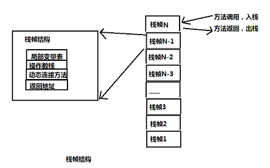
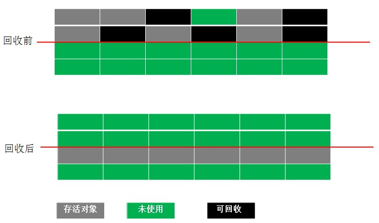
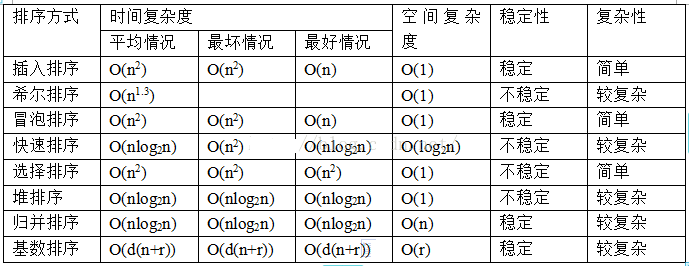

# 壹——JAVA知识
## 一、JAVA基础
### 1、继承情况下对象的初始化顺序
- **属性（静态、非静态）**、方法、**构造方法**和**自由块/构造块（静态、非静态）**都是类中的成员，在创建类的对象时，类中各成员的执行顺序：
  - 1.父类静态成员和静态初始化快，按在代码中出现的顺序依次执行。（父类静态成员；且只加载一次）
  - 2.子类静态成员和静态初始化块，按在代码中出现的顺序依次执行。（子类静态成员；且只加载一次）
  - 3.父类的实例成员和实例初始化块，按在代码中出现的顺序依次执行。（父类非静态成员）
  - 4.执行父类的构造方法。（父类构造方法）
  - 5.子类实例成员和实例初始化块，按在代码中出现的顺序依次执行。（子类非静态成员）
  - 6.执行子类的构造方法。（子类构造方法）

### 2、String、StringBuffer 和 StringBuilder 的区别
- String 为什么是final的？
  - String类用final修饰是为了保证线程安全，很多情况下存储密码、ip......所以得用final修饰设置为不可变的。（保证呗修饰的属性是安全的）
  - 为了字符串池更好的存储字符串
- StringBuffer 和 StringBuilder 默认大小是 16。
- 可变性　
  - 简单的来说：String 类中使用 final 关键字修饰保存字符串的字符数组,`private final char[] value`，所以 String 对象是**不可变**的。
  - 而StringBuilder 与 StringBuffer 都继承自 AbstractStringBuilder 类，在 AbstractStringBuilder 中也是使用字符数组保存字符串 `char[] value` 但是没有用 final 关键字修饰，所以这两种对象都是**可变**的。
  - StringBuilder 与 StringBuffer 的构造方法都是调用父类构造方法也就是 AbstractStringBuilder 实现的，大家可以自行查阅源码。
    ```java
    AbstractStringBuilder.java
    
    abstract class AbstractStringBuilder implements Appendable, CharSequence {
          char[] value;
          int count;
          AbstractStringBuilder() {
         
          }
          AbstractStringBuilder(int capacity) {
               value = new char[capacity];
          }
    }
    ```
- 线程安全性
  - String 中的对象是不可变的，也就可以理解为常量，**线程安全**。
  - AbstractStringBuilder 是 StringBuilder 与 StringBuffer 的公共父类，定义了一些字符串的基本操作，如 expandCapacity、append、insert、indexOf 等公共方法。
  - StringBuffer 对方法加了同步锁或者对调用的方法加了同步锁，所以是**线程安全**的。
  - StringBuilder 并没有对方法进行加同步锁，所以是**非线程安全**的。　　
- 性能
  - 每次对 String 类型进行改变的时候，都会生成一个新的 String 对象，然后将指针指向新的 String 对象。
  - StringBuffer 每次都会对 StringBuffer 对象本身进行操作，而不是生成新的对象并改变对象引用。
  - 相同情况下使用 StringBuilder 相比使用 StringBuffer 仅能获得 10%~15% 左右的性能提升，但却要冒多线程不安全的风险。
  ```java
  String s = "hello"+"world"+"i love you";
  StringBuffer Sb = new StringBuilder("hello").append("world").append("i love you");
  ```
  - 这个时候s有多个字符串进行拼接，按理来说会有多个对象产生，但是jvm会对此进行一个优化，也就是说只创建了一个对象，此时它的执行速度要比StringBuffer拼接快.再看下面这个:
    ```java
    String s2 = "hello";  
    String s3 = "world";  
    String s4 = "i love you";  
    String s1 = s2 + s3 + s4;
    ```
    - 上面这种情况，就会多创建出来三个对象，造成了内存空间的浪费.
- 对于三者使用的总结：
  - 操作少量的数据 = String
  - 单线程操作字符串缓冲区下操作大量数据 = StringBuilder
  - **多线程**操作字符串缓冲区下操作大量数据 = StringBuffer（**线程安全**）

### 3、hashcode()和equal()方法
面试官可能会问你：“你重写过 hashcode 和 equals 么，为什么重写equals时必须重写hashCode方法？”

- Hash是散列的意思，就是把任意长度的输入，通过散列算法变换成固定长度的输出，该输出就是散列值。关于散列值，有以下几个关键讨论：
  - 不同关键字经过散列算法变换后可能得到同一个散列地址，这种现象称为碰撞：**hash碰撞**；
  - 如果两个hash值不同（前提是同一个hash算法），那么这两个hash值对应的原始输入必定不同。
- hashCode（）介绍
  - hashCode() 的作用是获取哈希码，也称为散列码；它实际上是返回一个int整数；
  - 这个哈希码的作用是确定该对象在哈希表中的索引位置。hashCode() 定义在JDK的`Object.java`中，这就意味着Java中的任何类都包含有hashCode() 函数；
  - 散列表存储的是键值对(key-value)，它的特点是：能根据“键”快速的检索出对应的“值”。这其中就利用到了散列码！（可以快速找到所需要的对象）；
  - **hashCode的存在主要是为了提高散列结构存储中查找的效率，在线性表中没有作用**；
  - Integer类型的值的hashCode值就是它本身的值。
- 为什么要有 hashCode
  - 我们以“HashSet 如何检查重复”为例子来说明为什么要有 hashCode：

    > 当你把对象加入 HashSet 时，HashSet 会先计算对象的 hashcode 值来判断对象加入的位置，同时也会与其他已经加入的对象的 hashcode 值作比较，如果没有相符的hashcode，HashSet会假设对象没有重复出现。但是如果发现有相同 hashcode 值的对象，这时会**调用 equals（）方法来检查** hashcode 相等的对象是否真的相同。如果两者相同，HashSet 就不会让其加入操作成功。如果不同的话，就会重新散列到其他位置。（摘自我的Java启蒙书《Head first java》第二版）。这样我们就大大减少了 equals 的次数，相应就大大提高了执行速度。

- hashCode（）与equals（）的相关规
  - 如果两个对象相等，则hashcode一定也是相同的；
  - 两个对象相等,对两个对象分别调用equals方法都返回true；
  - （两个对象有相同的hashcode值，它们也不一定是相等的）如果两个对象的hashCode相同，不代表两个对象就相同，只能说明这两个对象在散列存储结构中，存放于同一个位置；
  - 因此，equals 方法被覆盖过，则 hashCode 方法也必须被覆盖；
  - hashCode() 的默认行为是对**堆**上的对象产生独特值。如果没有重写 hashCode()，则该 class 的两个对象无论如何都不会相等（即使这两个对象指向相同的数据）

```java
package com.edu.test.faceTest;

import java.util.Objects;

/**
 * @Author: 王仁洪
 * @Date: 2019/4/7 10:26
 */
public class TestHash {
    public static void main(String[] args) {
        String a = "100";
        String b = "EFG";
        String c = "100";
        String d = "EFG";
        String e = "EFGH";
        String g = "100F";
        String bb = new String("EFG");

        Integer f = 100;

        /**
         * public final class String{
         *     public int hashCode() {
         *         int h = hash;
         *         if (h == 0 && value.length > 0) {
         *             char val[] = value;
         *
         *             for (int i = 0; i < value.length; i++) {
         *                 h = 31 * h + val[i];
         *             }
         *             hash = h;
         *         }
         *         return h;
         *     }
         * }
         *
         * public final class Integer extends Number implements Comparable<Integer> {
         *     @Override
         *     public int hashCode() {
         *         return Integer.hashCode(value);
         *     }
         *
         *     public static int hashCode(int value) {
         *         return value;
         *     }
         * }
         */
        System.out.println(a.hashCode());//48625
        System.out.println(b.hashCode());//68550
        System.out.println(c.hashCode());//48625
        System.out.println(d.hashCode());//68550
        System.out.println(e.hashCode());//2125122
        System.out.println(g.hashCode());//1507445
        System.out.println(f.hashCode());//100

        /**
         * public final class String{
         * public boolean equals(Object anObject) {
         *         if (this == anObject) {
         *             return true;
         *         }
         *         if (anObject instanceof String) {
         *             String anotherString = (String)anObject;
         *             int n = value.length;
         *             if (n == anotherString.value.length) {
         *                 char v1[] = value;
         *                 char v2[] = anotherString.value;
         *                 int i = 0;
         *                 while (n-- != 0) {
         *                     if (v1[i] != v2[i])
         *                         return false;
         *                     i++;
         *                 }
         *                 return true;
         *             }
         *         }
         *         return false;
         *     }
         * }
         */
        System.out.println(b.equals(bb));//true
        System.out.println(bb.equals(b));//true

        System.out.println(b.hashCode());//68550
        System.out.println(bb.hashCode());//68550

        System.out.println(b==bb);//false
    }
}

class Person{
    private String name;
    private Integer age;

    public Person(String name, Integer age) {
        this.name = name;
        this.age = age;
    }

    @Override
    public boolean equals(Object o) {
        if (this == o) return true;
        if (o == null || getClass() != o.getClass()) return false;
        Person person = (Person) o;
        return Objects.equals(name, person.name) &&
                Objects.equals(age, person.age);
    }

    @Override
    public int hashCode() {
        return Objects.hash(name, age);
    }
    /**
     * public final class Objects {
     *      public static int hash(Object... values) {
     *         return Arrays.hashCode(values);
     *       }
     * }
     *
     * public class Arrays {
     *     public static int hashCode(Object a[]) {
     *         if (a == null)
     *             return 0;
     *
     *         int result = 1;
     *
     *         for (Object element : a)
     *             result = 31 * result + (element == null ? 0 : element.hashCode());
     *
     *         return result;
     *     }
     * }
     *
     * public class Object {
     *     public native int hashCode();
     * }
     */
}

/**
 * public class Object {
 *     public boolean equals(Object obj) {
 *         return (this == obj);
 *     }
 *
 *     public native int hashCode();
 * }
 */
```

### 4、java重载和重写

- **重载**： 发生在**同一个类**中，方法名必须相同，参数类型不同、个数不同、顺序不同，方法返回值和访问修饰符可以不同，发生在编译时（**编译时的多态**）。
  - 当参数列表相同但返回值不同时，将会出现编译错误，这并不是重载，因为jvm无法根据返回值类型来判断应该调用哪个方法。 　　
- **重写(覆盖)**： 发生在**父子类**中，方法名、参数列表必须相同，**返回值范围小于等于父类**，抛出的异常范围小于等于父类，**访问修饰符范围大于等于父类**；如果父类方法访问修饰符为 private 则子类就不能重写该方法。
  - 通过子类创建的实例对象调用这个方法时，将调用子类中的定义方法，这相当于把父类中定义的那个完全相同的方法给覆盖了，这也是面向对象编程的多态性的一种表现。

## 二、异常


## 三、集合
### 1、hashmap底层实现机制，为什么线程不安全
```java
package java.util;
/**
 * @since   1.2
 */
public class HashMap<K,V> extends AbstractMap<K,V>
    implements Map<K,V>, Cloneable, Serializable {
	/**
 	* The table, initialized on first use, and resized as
 	* necessary. When allocated, length is always a power of two.
 	* (We also tolerate length zero in some operations to allow
 	* bootstrapping mechanics that are currently not needed.)
 	* 表，在第一次使用时初始化，并根据需要调整大小。分配时，长度总是2的幂
 	* （在某些操作中，我们还允许长度为零，以允许当前不需要的引导机制）。
 	*/
	transient Node<K,V>[] table;

	/**
 	* The default initial capacity - MUST be a power of two.
 	*/
	static final int DEFAULT_INITIAL_CAPACITY = 1 << 4; // aka 16
}
```
- HashMap内部是通过一个**数组实现**的，只是这个数组比较特殊，数组里存储的元素是一个Entry实体(jdk 8为Node)，这个Entry实体主要包含key、value以及一个指向自身的next指针。
- HashMap是基于hashing实现的，当我们进行put操作时，根据传递的key值得到它的hashcode，然后再用这个hashcode与数组的长度进行模运算，得到一个int值，就是Entry要存储在数组的位置（下标）；
- 当通过get方法获取指定key的值时，会根据这个key算出它的hash值（数组下标），根据这个hash值获取数组下标对应的Entry，然后判断Entry里的key，hash值 或者通过equals()比较是否与要查找的相同，如果相同，返回value，否则的话，遍历该链表（有可能就只有一个Entry，此时直接返回null），直到找到为止，否则返回null。
- HashMap之所以在每个**数组元素存储的是一个链表**，是为了解决hash冲突问题，当两个对象的hash值相等时，那么一个位置肯定是放不下两个值的，于是hashmap采用链表来解决这种冲突，hash值相等的两个元素会形成一个链表。
- HashMap小知识：
  - **HashMap线程不安全（默认大小16，扩容为原容量的一倍）；**
  - **允许key/value为null；**
  - 加载因子为0.75：即当 元素个数超过 容量长度的0.75倍时， 进行扩容；
  - 长度始终保持2的n次方；
  - 如果不需要对数据进行排序选用HashMap；对数据进行排序时选用TreeMap。


## 四、多线程
### 1、不同子进程共享同一个父进程的什么资源？
- 子进程将获得父进程数据空间、堆、栈等资源的副本。

### 2、Java中的锁
- Java中的锁分类
	- 公平锁/非公平锁
	- 可重入锁
	- 独享锁/共享锁
	- 互斥锁/读写锁
	- 乐观锁/悲观锁
	- 分段锁
	- 偏向锁/轻量级锁/重量级锁
	- 自旋锁
- **公平锁/非公平锁**

  - 锁是指多个线程按照申请锁的顺序来获取锁。
  - 非公平锁是指多个线程获取锁的顺序并不是按照申请锁的顺序，有可能后申请的线程比先申请的线程优先获取锁。有可能，会造成优先级反转或者饥饿现象。
  - 对于Java **ReentrantLock**而言，通过构造函数指定该锁是否是公平锁，默认是非公平锁。非公平锁的优点在于吞吐量比公平锁大。
  - 对于**Synchronized**而言，也是一种非公平锁。由于其并不像ReentrantLock是通过AQS的来实现线程调度，所以并没有任何办法使其变成公平锁。
- **可重入锁**

  - 可重入锁又名递归锁，是指在同一个线程在外层方法获取锁的时候，在进入内层方法会自动获取锁。说的有点抽象，下面会有一个代码的示例。
  - 对于Java **ReentrantLock**而言, 他的名字就可以看出是一个可重入锁，其名字是Re entrant Lock重新进入锁。
  - 对于**Synchronized**而言,也是一个可重入锁。可重入锁的一个好处是可一定程度避免死锁。
  ```java
  synchronized void setA() throws Exception{
  	Thread.sleep(1000);
  	setB();
  }
  synchronized void setB() throws Exception{
  	Thread.sleep(1000);
  }
  ````

  - 上面的代码就是一个可重入锁的一个特点，如果不是可重入锁的话，setB可能不会被当前线程执行，可能造成死锁。
- **独享锁/共享锁**

  - 独享锁是指该锁一次只能被一个线程所持有。
  - 共享锁是指该锁可被多个线程所持有。
  - 对于Java ReentrantLock而言，其是独享锁。但是对于Lock的另一个实现类ReadWriteLock，其读锁是共享锁，其写锁是独享锁。
  	- 读锁的共享锁可保证并发读是非常高效的，读写，写读 ，写写的过程是互斥的。
  	- 独享锁与共享锁也是通过AQS来实现的，通过实现不同的方法，来实现独享或者共享。
  - 对于Synchronized而言，当然是独享锁。
- **互斥锁/读写锁**
	- 上面讲的独享锁/共享锁就是一种广义的说法，互斥锁/读写锁就是具体的实现。
	- 互斥锁在Java中的具体实现就是ReentrantLock
	- 读写锁在Java中的具体实现就是ReadWriteLock
- **乐观锁/悲观锁**

  - 乐观锁与悲观锁不是指具体的什么类型的锁，而是指看待并发同步的角度。
  - 悲观锁认为对于同一个数据的并发操作，一定是会发生修改的，哪怕没有修改，也会认为修改。因此对于同一个数据的并发操作，悲观锁采取加锁的形式。悲观的认为，不加锁的并发操作一定会出问题。
  - 乐观锁则认为对于同一个数据的并发操作，是不会发生修改的。在更新数据的时候，会采用尝试更新，不断重新的方式更新数据。乐观的认为，不加锁的并发操作是没有事情的。
  - 从上面的描述我们可以看出，悲观锁适合写操作非常多的场景，乐观锁适合读操作非常多的场景，不加锁会带来大量的性能提升。
  - 悲观锁在Java中的使用，就是利用各种锁。
  - 乐观锁在Java中的使用，是无锁编程，常常采用的是CAS算法，典型的例子就是原子类，通过CAS自旋实现原子操作的更新。
- **分段锁**

  - 分段锁其实是一种锁的设计，并不是具体的一种锁，对于ConcurrentHashMap而言，其并发的实现就是通过分段锁的形式来实现高效的并发操作。
  - 我们以ConcurrentHashMap来说一下分段锁的含义以及设计思想，ConcurrentHashMap中的分段锁称为Segment，它即类似于HashMap（JDK7与JDK8中HashMap的实现）的结构，即内部拥有一个Entry数组，数组中的每个元素又是一个链表；同时又是一个ReentrantLock（Segment继承了ReentrantLock)。
  - 当需要put元素的时候，并不是对整个hashmap进行加锁，而是先通过hashcode来知道他要放在那一个分段中，然后对这个分段进行加锁，所以当多线程put的时候，只要不是放在一个分段中，就实现了真正的并行的插入。
  - 但是，在统计size的时候，可就是获取hashmap全局信息的时候，就需要获取所有的分段锁才能统计。
  - 分段锁的设计目的是细化锁的粒度，当操作不需要更新整个数组的时候，就仅仅针对数组中的一项进行加锁操作。
- **偏向锁/轻量级锁/重量级锁**

  - 这三种锁是指锁的状态，并且是针对Synchronized。在Java 5通过引入锁升级的机制来实现高效Synchronized。这三种锁的状态是通过对象监视器在对象头中的字段来表明的。
  - 偏向锁是指一段同步代码一直被一个线程所访问，那么该线程会自动获取锁。降低获取锁的代价。
  - 轻量级锁是指当锁是偏向锁的时候，被另一个线程所访问，偏向锁就会升级为轻量级锁，其他线程会通过自旋的形式尝试获取锁，不会阻塞，提高性能。
  - 重量级锁是指当锁为轻量级锁的时候，另一个线程虽然是自旋，但自旋不会一直持续下去，当自旋一定次数的时候，还没有获取到锁，就会进入阻塞，该锁膨胀为重量级锁。重量级锁会让其他申请的线程进入阻塞，性能降低。
- **自旋锁**

  - 在Java中，自旋锁是指尝试获取锁的线程不会立即阻塞，而是采用循环的方式去尝试获取锁，这样的好处是减少线程上下文切换的消耗，缺点是循环会消耗CPU。
  - 典型的自旋锁实现的例子，自旋锁是采用让当前线程不停地的在循环体内执行实现的，当循环的条件被其他线程改变时 才能进入临界区。

### 3、创建线程的方法（四种）
- 创建线程的方法
  - 继承thread类
  - 实现Runnable接口
  - 实现Callable接口
  - 线程池（Java通过Executors提供四种线程池，分别为：）
    - newCachedThreadPool——创建一个可缓存线程池，如果线程池长度超过处理需要，可灵活回收空闲线程，若无可回收，则新建线程。
    - newFixedThreadPool——创建一个定长线程池，可控制线程最大并发数，超出的线程会在队列中等待。
    - newScheduledThreadPool——创建一个定长线程池，支持定时及周期性任务执行。
    - newSingleThreadExecutor——创建一个单线程化的线程池，它只会用唯一的工作线程来执行任务，保证所有任务按照指定顺序(FIFO, LIFO, 优先级)执行。
- 继承thread类
  ```java
  package com.edu.dongfangcaifu.thread;
  
  /**
   * @Author: sunnyandgood
   * @Date: 2019/4/21 17:32
   */
  public class ExtendsThread extends Thread {
      @Override
      public void run() {
          for (int i=0;i<10;i++){
              System.out.println(Thread.currentThread().getName() + "-" + i);
          }
      }
  
      public static void main(String[] args) {
          ExtendsThread extendsThread = new ExtendsThread();
          Thread thread = new Thread(extendsThread);
          thread.start();
      }
  }
  ```
- 实现Runnable接口
  ```java
  package com.edu.dongfangcaifu.thread;
  
  /**
   * @Author: sunnyandgood
   * @Date: 2019/4/21 17:37
   */
  public class ImplementsRunnable implements Runnable {
      @Override
      public void run() {
          for (int i=0;i<10;i++){
              System.out.println(Thread.currentThread().getName() + "-" + i);
          }
      }
  
      public static void main(String[] args) {
          ImplementsRunnable implementsRunnable = new ImplementsRunnable();
          Thread thread = new Thread(implementsRunnable);
          thread.start();
      }
  }
  ```
- 实现Callable接口
  ```java
  package com.edu.dongfangcaifu.thread;
  
  import java.util.concurrent.Callable;
  import java.util.concurrent.FutureTask;
  
  /**
   * @Author: sunnyandgood
   * @Date: 2019/4/21 17:40
   */
  public class ImplementsCallable implements Callable {
      @Override
      public Object call() throws Exception {
          for (int i=0;i<10;i++){
              System.out.println(Thread.currentThread().getName() + "-" + i);
          }
          return "Callable";
      }
  
      public static void main(String[] args) {
          ImplementsCallable implementsCallable = new ImplementsCallable();
          FutureTask futureTask = new FutureTask(implementsCallable);
          Thread thread = new Thread(futureTask);
          thread.start();
      }
  }
  ```
- 线程池
  ```java
  package com.edu.dongfangcaifu.thread;
  
  import java.util.concurrent.ExecutorService;
  import java.util.concurrent.Executors;
  
  /**
   * @Author: sunnyandgood
   * @Date: 2019/4/21 17:49
   */
  public class ThreadPoolTest {
      public static void main(String[] args) {
          //创建一个容量为5的线程池
          ExecutorService executorService = Executors.newFixedThreadPool(3);
          for (int i=0;i<6;i++){
              //向线程池提交一个任务（其实就是通过线程池来启动一个线程）
              executorService.execute(new Runnable() {
                  @Override
                  public void run() {
                      try {
                          Thread.sleep(1000);
                      } catch (InterruptedException e) {
                          e.printStackTrace();
                      }
                      System.out.println(Thread.currentThread().getName() + "启动了");
                  }
              });
          }
          executorService.shutdown();
      }
  }
  ```

### 4、有三个线程T1,T2,T3，如何保证顺序执行
- 方法一：（java多线程编程核心技术P234页）
  ```java
  import java.util.concurrent.locks.Condition;
  import java.util.concurrent.locks.ReentrantLock;
  
  /**
   * @Author: 王仁洪
   * @Date: 2019/4/18 9:26
   */
  public class ThreadPrintABC {
      volatile private static char nextPrintWho = 'A';
      private static ReentrantLock lock = new ReentrantLock();
      final private static Condition CONDITIONA = lock.newCondition();
      final private static Condition CONDITIONB = lock.newCondition();
      final private static Condition CONDITIONC = lock.newCondition();
      public static void main(String[] args) {
          Thread threadA = new Thread(){
              @Override
              public void run() {
                  try {
                      lock.lock();
                      while (nextPrintWho != 'A'){
                          CONDITIONA.await();
                      }
                      System.out.print("A");
                      nextPrintWho = 'B';
                      CONDITIONB.signalAll();
                  } catch (InterruptedException e) {
                      e.printStackTrace();
                  }finally {
                      lock.unlock();
                  }
              }
          };
  
          Thread threadB = new Thread(){
              @Override
              public void run() {
                  try {
                      lock.lock();
                      while (nextPrintWho != 'B'){
                          CONDITIONB.await();
                      }
                      System.out.print("B");
                      nextPrintWho = 'C';
                      CONDITIONC.signalAll();
                  } catch (InterruptedException e) {
                      e.printStackTrace();
                  }finally {
                      lock.unlock();
                  }
              }
          };
  
          Thread threadC = new Thread(){
              @Override
              public void run() {
                  try {
                      lock.lock();
                      while (nextPrintWho != 'C'){
                          CONDITIONC.await();
                      }
                      System.out.print("C");
                      nextPrintWho = 'A';
                      CONDITIONA.signalAll();
                  } catch (InterruptedException e) {
                      e.printStackTrace();
                  }finally {
                      lock.unlock();
                  }
              }
          };
  
          threadA.start();
          threadB.start();
          threadC.start();
          //ABC
  
  //        Thread[] a = new Thread[5];
  //        Thread[] b = new Thread[5];
  //        Thread[] c = new Thread[5];
  //        for (int i=0;i<5;i++){
  //            a[i] = new Thread(threadA);
  //            b[i] = new Thread(threadB);
  //            c[i] = new Thread(threadC);
  //            a[i].start();
  //            b[i].start();
  //            c[i].start();
  //        }
      }
  }
  ```
- 方法二：（java多线程编程核心技术P292页）
  ```java
  /**
   * @Author: sunnyandgood
   * @Date: 2019/4/21 19:14
   */
  public class Mythread extends Thread {
      private Object lock;
      private String showChar;
      private int showNumPosition;
      private int printCount = 0;//统计打印了几个字母
      volatile private static int addNumber = 1;
  
      public Mythread(Object lock,String showChar,int showNumPosition){
          super();
          this.lock = lock;
          this.showChar = showChar;
          this.showNumPosition = showNumPosition;
      }
  
      @Override
      public void run() {
          try {
              synchronized (lock){
                  while (true){
                      if (addNumber % 4 == showNumPosition){
                          //System.out.println("ThreadName=" + Thread.currentThread().getName() +
                           //       " runCount=" + addNumber + " " + showChar);
                          System.out.print(showChar);
                          lock.notifyAll();
                          addNumber++;
                          printCount++;
                          if (printCount == 1){
                              break;
                          }
                      }else {
                          lock.wait();
                      }
                  }
              }
          } catch (InterruptedException e) {
              e.printStackTrace();
          }
      }
  
      public static void main(String[] args) {
          Object lock = new Object();
          Mythread a = new Mythread(lock,"A",1);
          Mythread b = new Mythread(lock,"B",2);
          Mythread c = new Mythread(lock,"C",3);
          Mythread d = new Mythread(lock,"D",0);
          a.start();
          b.start();
          c.start();
          d.start();
          //ABCD
      }
  }
  ```

## 五、JAVA虚拟机
### 1、JVM内存分区
- Java虚拟机在执行Java程序的过程中，会把它管理的内存划分为几个不同的数据区域，这些区域都有各自的用途、创建时间、销毁时间。
- Java运行时数据区分为下面几个内存区域：

  <div align="center"></div>

  - 1)PC寄存器/程序计数器：
    - 严格来说是一个数据结构，用于保存当前正在执行的程序的内存地址，
    - 由于Java是支持多线程执行的，所以程序执行的轨迹不可能一直都是线性执行。
    - 当有多个线程交叉执行时，被中断的线程的程序当前执行到哪条内存地址必然要保存下来，以便用于被中断的线程恢复执行时再按照被中断时的指令地址继续执行下去。
    - 为了线程切换后能恢复到正确的执行位置，每个线程都需要有一个独立的程序计数器，
    - 各个线程之间计数器互不影响，独立存储，我们称这类内存区域为“**线程私有**”的内存,这在某种程度上有点类似于“ThreadLocal”，是**线程安全**的。
  - 2)Java栈 Java Stack：
    - Java栈总是**与线程关联在一起**的，每当创建一个线程，JVM就会为该线程创建对应的Java栈，
    - 在这个Java栈中又会包含多个**栈帧(Stack Frame)**，这些栈帧是与每个方法关联起来的，每运行一个方法就创建一个栈帧，每个栈帧会含有一些**局部变量、操作栈和方法返回值等信息**。
    - 每当一个方法执行完成时，该栈帧就会弹出栈帧的元素作为这个方法的返回值，并且清除这个栈帧，
    - Java栈的栈顶的栈帧就是当前正在执行的**活动栈**，也就是当前正在执行的方法，PC寄存器也会指向该地址。只有这个活动的栈帧的本地变量可以被操作栈使用，当在这个栈帧中调用另外一个方法时，与之对应的**一个新的栈帧被创建**，这个新创建的栈帧被放到Java栈的栈顶，变为当前的活动栈。同样现在只有这个栈的本地变量才能被使用，当这个栈帧中所有指令都完成时，这个栈帧被移除Java栈，刚才的那个栈帧变为活动栈帧，前面栈帧的返回值变为这个栈帧的操作栈的一个操作数。
    - **由于Java栈是与线程对应起来的，Java栈数据不是线程共有的，所以不需要关心其数据一致性，也不会存在同步锁的问题**。
    - 在Java虚拟机规范中，对这个区域规定了两种异常状况：
      - 如果线程请求的栈深度大于虚拟机所允许的深度，将抛出StackOverflowError异常；
      - 如果虚拟机可以动态扩展，如果扩展时无法申请到足够的内存，就会抛出OutOfMemoryError异常。在Hot Spot虚拟机中，可以使用-Xss参数来设置栈的大小。栈的大小直接决定了函数调用的可达深度。

    <div align="center"></div>

  - 3)堆 Heap:
    - 堆是JVM所管理的内存中最大的一块，是被所有Java线程锁共享的，**不是线程安全的**，**在JVM启动时创建**。
    - 堆是存储Java对象的地方，这一点Java虚拟机规范中描述是：所有的**对象实例**以及**数组**都要在堆上分配。
    - Java堆是GC管理的主要区域，从内存回收的角度来看，由于现在GC基本都采用分代收集算法，所以Java堆还可以细分为：**新生代**和**老年代**；
      - 新生代再细致一点有 **Eden空间、From Survivor空间、To Survivor空间**等。
  - 4)方法区Method Area:

    - 方法区存放了要加载的类的信息（名称、修饰符等）、类中的静态常量、类中定义为final类型的常量、类中的Field信息、类中的方法信息，当在程序中通过Class对象的`getName.isInterface`等方法来获取信息时，这些数据都来源于方法区。
    - **方法区是被Java线程锁共享的，不像Java堆中其他部分一样会频繁被GC回收**，它存储的信息相对比较稳定，**在一定条件下会被GC**，
    - 当方法区要使用的内存超过其允许的大小时，会抛出OutOfMemory的错误信息。
    - 方法区也是堆中的一部分，就是我们通常所说的Java堆中的**永久区** Permanet Generation，大小可以通过参数来设置,可以通过-XX:PermSize指定初始值，`-XX:MaxPermSize`指定最大值。
  - 5)常量池Constant Pool:
    - 常量池本身是方法区中的一个数据结构。
    - 常量池中存储了如**字符串、final变量值、类名和方法名常量**。
    - **常量池在编译期间就被确定，并保存在已编译的`.class`文件中**。一般分为两类：**字面量**和**引用量**。
      - 字面量就是字符串、final变量等。
      - 类名和方法名属于引用量。引用量最常见的是在调用方法的时候，根据方法名找到方法的引用，并以此定为到函数体进行函数代码的执行。引用量包含：类和接口的权限定名、字段的名称和描述符，方法的名称和描述符。

### 2、**JVM结构示意图**


### 3、JVM总体概述
- JVM总体上是由类装载子系统（ClassLoader）、运行时数据区、执行引擎、内存回收这四个部分组成。
- 其中我们最为关注的运行时数据区，也就是JVM的内存部分则是由方法区（Method   Area）、JAVA堆（Heap）、虚拟机栈（Stack）、程序计数器、本地方法栈这几部分组成；
- 除此以外，在概念中还有一个**直接内存**的概念，事实上这部分内存并不属于虚拟机规范中定义的内存区域，但是因为在JDK1.4+后新加的NIO类，以及JDK1.8+后的Metaspace的关系，所以在讨论JVM时也经常会被放到一起讨论。

### 4、JVM内存概述
- 各内存部分的功能及具体组成部分，总结如下：


- 需要说明的是，堆内存是GC重点回收区域，其中分代回收机制将堆内存划分为年轻代、老年代两个区域，默认情况下年轻代占整个堆内存空间的1/3,而老年代则占2/3,可以通过`-XX:NewRatio`设置年轻代与老年代的比值，默认为2，表示比值年轻代与老年代的比值为“1：2”，在JVM调优时可根据应用实际情况进行调整。
- 而年轻代又分为Eden、Survivor0、Survivor1，这三个区域占整个新生代空间的比值为8:1:1，即Eden区占8/10，其他两个区域分别占1/10,可通过`-XX:SurvivorRatio`参数进行设置，默认值为8。

### 5、正确理解并发问题
- 在了解了JVM结构，特别是内存结构后，我们再说说并发问题产生的原因。
- 在上面的内容中我们分析了Java堆、Java栈，知道Java堆存储的是对象，而Java栈内存是方法执行时所需要的局部变量，其中就包括堆中对象的引用，如果多个线程同时修改堆中同一引用对象的数据，就可能会产生并发问题，导致多个线程中某些线程得到的数据值与实际值不符，造成脏数据。
- **那么这种问题为什么会发生呢？**
	- 实际上，线程操作堆中共享对象数据时并不是直接操作对象所在的那块内存，这里称之为主内存；而是将对象拷贝到线程私有的工作内存中进行更新，完成后再将最新的数据值同步回主内存，而多个线程在同一时刻将一个对象的值改得七七八八，然后再同时同步给对象所在的内存区域，那么以谁更新的为准就成了问题了。
- 所以，为了防止这种情况出现，Java提供了同步机制，确保各个线程按照一定的机制同一时刻只能运行一个线程更新主内存的值。
- 具体逻辑示意图如下：


- 注意，这里所讲的主内存、工作内存与Java内存区域中的Java堆、栈内存、方法区等并不是同一个层次的内存划分。如果勉强类比，从变量、主内存、工作内存的定义来看，主内存主要对应于Java堆中对象实例数据部分，而工作内存则对应于虚拟机栈中使用的部分内存区域；从更低层次类比，主内存就直接对应于物理硬件的内存，而为了获取更好的运行速度，虚拟机（甚至是硬件系统本身的优化措施）可能会让内存优先存储于寄存器和高速缓存中，因为程序运行时主要访问读写的是工作内存。
- 而主内存与工作内存之间具体的交互协议，即一个变量如何从主内存拷贝到工作内存、如何从工作内存同步回主内存之间的实现细节，Java内存模型中定义了8种操作来完成。
- 而且还规定在执行上述8种基本操作时必须满足如下规则：
	- 不允许read和load、store和write操作之一单独出现，即不允许一个变量从主内存读取了但工作内存不接受，或者从工作内存发起了回写了但主内存不接受的情况出现。
	- 不允许一个线程丢弃它的最近的assign操作，即变量在工作内存中改变了之后必须把该变化同步回主内存。
	- 不允许一个线程无原因地（没有发生任何assign操作）把数据从线程的工作内存同步回主内存中。
	- 一个新的变量只能在主内存中“诞生”，不允许在工作内存中直接使用一个未被初始化（load或assign）的变量，换句话说，就是对一个变量实施use、store操作之前，必须先执行过了assign和load操作。
	- 一个变量在同一时刻只允许一条线程对其进行lock操作，但lock操作可以被同一条线程重复执行多次，多次执行lock后，只有执行相同次数的unlock操作，变量才会被解锁。
	- 如果对一个变量执行lock操作，那将会清空工作内存中此变量的值，在执行引擎使用这个变量前，需要重新执行load或assign操作初始化变量的值。
	- 如果一个变量事先没有被lock操作锁定,那就不允许对它执行unlock操作,也不允许去unlock一个被其他线程锁定住的变量。
	- 对一个变量执行unlock操作之前，必须先把此变量同步回主内存中（执行store、write操作）。
	- 以上8种内存访问操作以及上述规则限定，再加上volatile的一些特殊规定以及final不可变特性，就已经完成确定了JAVA程序中那些内存访问操作在并发下是安全的！

### 6、JVM参数总结


 

### 7、jvm垃圾回收算法
- 1) 标记-清除收集器 Mark-Sweep
- 2) 复制收集器        Copying　　
- 3) 标记-整理收集器 Mark-Compact
- 4) 分代收集器　　　Generational

- 基于tracing算法的垃圾收集也称为标记和清除(mark-and-sweep)垃圾收集器.
	- 这是最基础的垃圾回收算法，之所以说它是最基础的是因为它最容易实现，思想也是最简单的。标记-清除算法分为两个阶段：标记阶段和清除阶段。标记阶段的任务是标记出所有需要被回收的对象，清除阶段就是回收被标记的对象所占用的空间。具体过程如下图所示：

	

	- 从图中可以很容易看出标记-清除算法实现起来比较容易，但是有一个比较严重的问题就是容易产生内存碎片，碎片太多可能会导致后续过程中需要为大对象分配空间时无法找到足够的空间而提前触发新的一次垃圾收集动作。
- Copying算法
	- 为了解决Mark-Sweep算法的缺陷，Copying算法就被提了出来。它将可用内存按容量划分为大小相等的两块，每次只使用其中的一块。当这一块的内存用完了，就将还存活着的对象复制到另外一块上面，然后再把已使用的内存空间一次清理掉，这样一来就不容易出现内存碎片的问题。具体过程如下图所示：

	

	- 这种算法虽然实现简单，运行高效且不容易产生内存碎片，但是却对内存空间的使用做出了高昂的代价，因为能够使用的内存缩减到原来的一半。很显然，Copying算法的效率跟存活对象的数目多少有很大的关系，如果存活对象很多，那么Copying算法的效率将会大大降低。
- compacting算法
	- 为了解决Copying算法的缺陷，充分利用内存空间，提出了Mark-Compact算法。该算法标记阶段和Mark-Sweep一样，但是在完成标记之后，它不是直接清理可回收对象，而是将存活对象都向一端移动，然后清理掉端边界以外的内存。具体过程如下图所示：

  

- Generation算法　
	- 分代收集算法是目前大部分JVM的垃圾收集器采用的算法。它的核心思想是根据对象存活的生命周期将内存划分为若干个不同的区域。一般情况下将堆区划分为老年代（Tenured  Generation）和新生代（Young  Generation），老年代的特点是每次垃圾收集时只有少量对象需要被回收，而新生代的特点是每次垃圾回收时都有大量的对象需要被回收，那么就可以根据不同代的特点采取最适合的收集算法。
	- 目前大部分垃圾收集器对于新生代都采取Copying算法，因为新生代中每次垃圾回收都要回收大部分对象，也就是说需要复制的操作次数较少，但是实际中并不是按照1：1的比例来划分新生代的空间的，一般来说是将新生代划分为一块较大的Eden空间和两块较小的Survivor空间，每次使用Eden空间和其中的一块Survivor空间，当进行回收时，将Eden和Survivor中还存活的对象复制到另一块Survivor空间中，然后清理掉Eden和刚才使用过的Survivor空间。
	- 而由于老年代的特点是每次回收都只回收少量对象，一般使用的是Mark-Compact算法。

	

	- 新年代：新创建的对象都存放在这里。因为大多数对象很快变得不可达，所以大多数对象在年轻代中创建，然后消失。当对象从这块内存区域消失时，我们说发生了一次“**minor GC**”。
	- 老年代：没有变得不可达，存活下来的年轻代对象被复制到这里。这块内存区域一般大于年轻代。因为它更大的规模，GC发生的次数比在年轻代的少。对象从老年代消失时，我们说“**major GC**”（或“**full GC**”）发生了。
	- 上图中的**永久代(permanent generation)**也称为“**方法区(method area)**”，他存储class对象和字符串常量。所以这块内存区域绝对不是永久的存放从老年代存活下来的对象的。在这块内存中有可能发生垃圾回收。发生在这里垃圾回收也被称为major GC。

### 8、JVM(HotSpot) 7种垃圾收集器的特点及使用场景		
- 这里讨论的收集器基于JDK1.7Update 14之后的HotSpot虚拟机，这个虚拟机包含的所有收集器如下图3-5所示：

	

	- 上图展示了7种作用于不同分代的收集器，如果两个收集器之间存在连线，就说明它们可以搭配使用。
- **1.Serial收集器**
	- Serial收集器是最基本、发展历史最悠久的收集器。是单线程的收集器。它在进行垃圾收集时，必须暂停其他所有的工作线程，直到它收集完成。

	

	- Serial收集器依然是虚拟机运行在Client模式下默认新生代收集器，对于运行在Client模式下的虚拟机来说是一个很好的选择。
- **2.ParNew收集器**
	- ParNew收集器其实就是Serial收集器的多线程版本，除了使用多线程进行垃圾收集之外，其余行为包括Serial收集器可用的所有控制参数、收集算法、Stop The Worl、对象分配规则、回收策略等都与Serial 收集器完全一样。

	

	- ParNew收集器是许多运行在Server模式下的虚拟机中首选新生代收集器，其中有一个与性能无关但很重要的原因是，除Serial收集器之外，目前只有ParNew它能与CMS收集器配合工作。
- **3.Parallel Scavenge（并行回收）收集器**
	- Parallel Scavenge收集器是一个新生代收集器，它也是使用复制算法的收集器，又是并行的多线程收集器
	- 该收集器的目标是达到一个可控制的吞吐量（Throughput）。所谓吞吐量就是CPU用于运行用户代码的时间与CPU总消耗时间的比值，即 吞吐量=运行用户代码时间/（运行用户代码时间+垃圾收集时间）
	- 停顿时间越短就越适合需要与用户交互的程序，良好的响应速度能提升用户体验，而高吞吐量则可用高效率地利用CPU时间，尽快完成程序的运算任务，主要适合在后台运算而不需要太多交互的任务。
	- Parallel Scavenge收集器提供两个参数用于精确控制吞吐量，分别是控制最大垃圾收起停顿时间的
	- `-XX:MaxGCPauseMillis`参数以及直接设置吞吐量大小的-XX:GCTimeRatio参数
	- Parallel Scavenge收集器还有一个参数：-XX:+UseAdaptiveSizePolicy。这是一个开关参数，当这个参数打开后，就不需要手工指定新生代的大小（-Xmn）、Eden与Survivor区的比例（-XX:SurvivorRatio）、晋升老年代对象年龄（-XX:PretenureSizeThreshold）等细节参数，只需要把基本的内存数据设置好（如-Xmx设置最大堆），然后使用MaxGVPauseMillis参数或GCTimeRation参数给虚拟机设立一个优化目标。
	- 自适应调节策略也是Parallel Scavenge收集器与ParNew收集器的一个重要区别
- **4.Serial Old 收集器**
	- Serial Old是Serial收集器的老年代版本，它同样是一个单线程收集器，使用标记整理算法。这个收集器的主要意义也是在于给Client模式下的虚拟机使用。
	- 如果在Server模式下，主要两大用途：
		- （1）在JDK1.5以及之前的版本中与Parallel Scavenge收集器搭配使用
		- （2）作为CMS收集器的后备预案，在并发收集发生Concurrent Mode Failure时使用
	- Serial Old收集器的工作工程

	

- **5.Parallel Old 收集器**
  - Parallel Old 是Parallel Scavenge收集器的老年代版本，使用多线程和“标记-整理”算法。这个收集器在1.6中才开始提供。

	

- **6.CMS收集器**
	- CMS(Concurrent Mark Sweep)收集器是一种以获取最短回收停顿时间为目标的收集器。目前很大一部分的Java应用集中在互联网站或者B/S系统的服务端上，这类应用尤其重视服务器的响应速度，希望系统停顿时间最短，以给用户带来较好的体验。CMS收集器就非常符合这类应用的需求
	- CMS收集器是基于“标记-清除”算法实现的。它的运作过程相对前面几种收集器来说更复杂一些，整个过程分为4个步骤：
		- （1）初始标记
		- （2）并发标记
		- （3）重新标记
		- （4）并发清除
		- 其中，初始标记、重新标记这两个步骤仍然需要“Stop The World”.

	

	- CMS收集器主要优点：并发收集，低停顿。
	- CMS三个明显的缺点：
		- （1）CMS收集器对CPU资源非常敏感。CPU个数少于4个时，CMS对于用户程序的影响就可能变得很大，为了应付这种情况，虚拟机提供了一种称为“增量式并发收集器”的CMS收集器变种。所做的事情和单CPU年代PC机操作系统使用抢占式来模拟多任务机制的思想
		- （2）CMS收集器无法处理浮动垃圾，可能出现“Concurrent Mode Failure”失败而导致另一次Full GC的产生。在JDK1.5的默认设置下，CMS收集器当老年代使用了68%的空间后就会被激活，这是一个偏保守的设置，如果在应用中蓝年代增长不是太快，可以适当调高参数-XX:CMSInitiatingOccupancyFraction的值来提高触发百分比，以便降低内存回收次数从而获取更好的性能，在JDK1.6中，CMS收集器的启动阀值已经提升至92%。
		- （3）CMS是基于“标记-清除”算法实现的收集器，手机结束时会有大量空间碎片产生。空间碎片过多，可能会出现老年代还有很大空间剩余，但是无法找到足够大的连续空间来分配当前对象，不得不提前出发FullGC。为了解决这个问题，CMS收集器提供了一个-XX:+UseCMSCompactAtFullCollection开关参数（默认就是开启的），用于在CMS收集器顶不住要进行FullGC时开启内存碎片合并整理过程，内存整理的过程是无法并发的，空间碎片问题没有了，但停顿时间变长了。虚拟机设计者还提供了另外一个参数-XX:CMSFullGCsBeforeCompaction,这个参数是用于设置执行多少次不压缩的Full GC后，跟着来一次带压缩的（默认值为0，标识每次进入Full GC时都进行碎片整理）
- **7. G1收集器**
	- G1收集器的优势：
		- （1）并行与并发
		- （2）分代收集
		- （3）空间整理 （标记整理算法，复制算法）
		- （4）可预测的停顿（G1处处理追求低停顿外，还能建立可预测的停顿时间模型，能让使用者明确指定在一个长度为M毫秒的时间片段内，消耗在垃圾收集上的时间不得超过N毫秒，这几乎已经实现Java（RTSJ）的来及收集器的特征）
	- 使用G1收集器时，Java堆的内存布局是整个规划为多个大小相等的独立区域（Region）,虽然还保留有新生代和老年代的概念，但新生代和老年代不再是物理隔离的了，它们都是一部分Region的集合。
	- G1收集器之所以能建立可预测的停顿时间模型，是因为它可以有计划地避免在真个Java堆中进行全区域的垃圾收集。G1跟踪各个Region里面的垃圾堆积的价值大小（回收所获取的空间大小以及回收所需要的时间的经验值），在后台维护一个优先列表，每次根据允许的收集时间，优先回收价值最大的Region（这也就是Garbage-First名称的又来）。这种使用Region划分内存空间以及有优先级的区域回收方式，保证了G1收集器在有限的时间内可以获取尽量可能高的灰机效率
	- G1 内存“化整为零”的思路
	- 在GC根节点的枚举范围中加入Remembered Set即可保证不对全堆扫描也不会遗漏。
	- 如果不计算维护Remembered Set的操作，G1收集器的运作大致可划分为一下步骤：
		- （1）初始标记
		- （2）并发标记
		- （3）最终标记
		- （4）筛选回收

		

## 六、内部类
### 1、内部类的种类
- 静态内部类
  - 1)最简单的内部类，命名不能与外部类同名，定义在一个封闭的类中，有 static 修饰符
  - 2)编译是完全独立的。生成 class 文件的名由**外部类名加`$`再加内部类名**
  - 3)只能访问外部类的静态成员和静态方法，包括私有的静态成员
  - 4)生成静态内部类对象的方式为：

      ```java
      OuterClass.InnerClass inner = new OuterClass.InnerClass(); 
      
      public class TestStaticInnerClass {
          public static void main(String[] args) {
              OuterClass.StaticInnerClass staticInnerClass = new OuterClass.StaticInnerClass();
          }
      }
      
      class OuterClass{
          static class StaticInnerClass{
              public StaticInnerClass(){
                  System.out.println("StaticInnerClass");
              }
          }
      }
      ```

- 成员内部类
  - 1)定义在一个封闭的类中，而不使用 static 修饰符
  - 2)编译同静态内部类的编译方法（编译是完全独立的。生成 class 文件的名由外部类名加$再加内部类名）
  - 3)可以访问外部类的所有成员（静态的与非静态的方法与成员变量）
  - 4)生成成员内部类的实例：
    - 1>在外部类外（其他类中）
      ```java
      OuterClass.InnerClass inner = new OuterClass().new InnerClass(); 
      ```
    - 2>在外部类中：

      ```java
      Inner inner = this.new Inner();
      ```
  - 5)在内部类中访问外部类的成员：
    ```java
    OuterClass.this.member;
    ```

- 局部内部类
  - 1)定义在方法当中，**只能访问方法中声明的 final 类型的变量**。
  - 2)在方法的范围内定义，甚至在方法中更小的块。最不常用的内类形式。
  - 3)编译同静态内部类的编译方法（编译是完全独立的。生成 class 文件的名由**外部类名加`$`再加内部类名**）
  - 4)就像局部变量一样，不能被声明为 public, protected, private, static（公共的、受保护的、私有的和静态的）。只能访问最终的局部变量。

- 匿名内部类
  - 1)作为方法的参数。
  - 2)编译是独立完成的，生成 class 文件的名由**`外部类名加$再加数字`（1、2、3）**
  - 3)没有类名、没有关键字、没有关键字扩展和实现、没有构造方法。
  - 4)匿名内部类会隐式地继承一个父类或实现一个接口。

### 2、内部类的一些知识点
```java
//成员内部类
OuterClass.InnerClass innerClass = new OuterClass().new InnerClass();
//静态内部类
OuterClass.StaticInnerClass staticInnerClass = new OuterClass.StaticInnerClass();
```
- 非静态内部类中不能声明任何static成员。
- 外部类不能直接访问非静态内部类和静态内部类的内部成员。（但是可以通过类名访问静态内部类的静态成员）
- 非静态类可以直接访问外部类的所有成员，静态成员类只可直接访问外部类的静态成员。
- 匿名内部类也就是没有名字的内部类。
  - 正因为没有名字，所以匿名内部类只能使用一次，它通常用来简化代码编写
  - 但使用匿名内部类还有个前提条件：**必须继承一个父类或实现一个接口**


## 七、代码分析


# 贰——设计模式
### 1、单例模式
- 单例模式的各种实现
  - 饿汉式单例
  - 懒汉式单例（同步方法、同步代码块、双检查锁机制DCL（Double Check Lock））
  - 静态代码块实现单例模式（懒汉式单例）
  - 静态内部类实现单例模式（**强烈推荐**）
  - 序列化与反序列化的单例模式实现
  - 枚举数据类型实现单例
- 单例模式在jdk中的应用
  - Spring中的Bean，默认就是单例模式。
  - JDK中体现：
    - （1）Runtime
      ```java
      /**
       * @see     java.lang.Runtime#getRuntime()
       * @since   JDK1.0
       */
      public class Runtime {
      	private static Runtime currentRuntime = new Runtime();
      	public static Runtime getRuntime() {
      		return currentRuntime;
      	}
      	private Runtime() {}
      }
      ```
    - （2）NumberFormat
- 饿汉式单例：
  - 优点：这种写法比较简单，就是在类装载的时候就完成实例化。**避免了线程同步问题**。
  - 缺点：在类装载的时候就完成实例化，没有达到Lazy Loading(延迟加载)的效果。如果从始至终从未使用过这个实例，则会造成**内存的浪费**。
  ```java
  package com.edu.dongfangcaifu.singletonPattern;
  
  /**
   * @Author: sunnyandgood
   * @Date: 2019/4/21 20:22
   * 懒汉式单例
   */
  public class HungryManSingleton {
      private static HungryManSingleton singleton = new HungryManSingleton();
      private HungryManSingleton(){
  
      }
      public static HungryManSingleton getSingleton(){
          return singleton;
      }
  
      public static void main(String[] args) {
          Thread thread = new Thread(new Runnable(){
              @Override
              public void run() {
                  HungryManSingleton singleton = HungryManSingleton.getSingleton();
                  System.out.println(singleton.hashCode());
              }
          });
  
          Thread myThread[] = new Thread[3];
          for (int i=0;i<3;i++){
              myThread[i] = new Thread(thread);
              myThread[i].start();
          }
          /**
           * 676905244
           * 676905244
           * 676905244
           */
      }
  }
  ```
- 懒汉式单例
  - 懒汉式单例之普通方式：
      ```java
      package com.edu.dongfangcaifu.singletonPattern;

      /**
       * @Author: sunnyandgood
       * @Date: 2019/4/21 20:37
       */
      public class LazyManSingleton {
          private static LazyManSingleton singleton;
          private LazyManSingleton(){

          }
          public static LazyManSingleton getSingleton(){
              //延迟加载
              if (singleton==null){
                  singleton = new LazyManSingleton();
              }else {

              }
              return singleton;
          }
      }
      ```
  - 懒汉式单例之同步方法（线程安全）
      ```java
      package com.edu.dongfangcaifu.singletonPattern;

      /**
       * @Author: sunnyandgood
       * @Date: 2019/4/21 21:00
       */
      public class LazyManSingletonFun {
          private static LazyManSingletonFun singleton;
          private LazyManSingletonFun(){

          }
          public synchronized static LazyManSingletonFun getSingleton(){
              //延迟加载
              if (singleton==null){
                  singleton = new LazyManSingletonFun();
              }else {

              }
              return singleton;
          }
      }
      ```
  - 懒汉式单例之同步代码块（线程安全）
      ```java
      package com.edu.dongfangcaifu.singletonPattern;

      /**
       * @Author: sunnyandgood
       * @Date: 2019/4/21 21:00
       */
      public class LazyManSingletonFun {
          private static LazyManSingletonFun singleton;
          private LazyManSingletonFun(){

          }
          public static LazyManSingletonFun getSingleton(){
              synchronized (LazyManSingleton.class){
                  //延迟加载
                  if (singleton==null){
                      singleton = new LazyManSingletonFun();
                  }else {

                  }
              }
              return singleton;
          }
      }
      ```
  - 懒汉式单例之双检查锁机制DCL（Double Check Lock）（线程安全）
      ```java
      package com.edu.dongfangcaifu.singletonPattern;

      /**
       * @Author: sunnyandgood
       * @Date: 2019/4/21 21:00
       */
      public class LazyManSingletonFun {
          private volatile static LazyManSingletonFun singleton;
          private LazyManSingletonFun(){

          }
          public static LazyManSingletonFun getSingleton(){
              //延迟加载
              if (singleton==null){
                  synchronized (LazyManSingleton.class){
                      if (singleton==null){
                          singleton = new LazyManSingletonFun();
                      }
                  }
              }else {

              }
              return singleton;
          }
      }
      ```
- 静态代码块实现单例模式(懒汉式单例)
  ```java
  package com.edu.dongfangcaifu.singletonPattern;
  
  /**
   * @Author: sunnyandgood
   * @Date: 2019/4/21 20:48
   */
  public class StaticCodeBlockSingleton {
      private static StaticCodeBlockSingleton singleton;
      private StaticCodeBlockSingleton(){
  
      }
      static {
          singleton = new StaticCodeBlockSingleton();
      }
      public static StaticCodeBlockSingleton getSingleton(){
          return singleton;
      }
  }
  ```
- 静态内部类实现单例模式
  ```java
  package com.edu.dongfangcaifu.singletonPattern;
  
  /**
   * @Author: sunnyandgood
   * @Date: 2019/4/21 20:45
   */
  public class StaticInnerClassSingleton {
      private StaticInnerClassSingleton(){
          
      }
      static class InnerClass{
          private static StaticInnerClassSingleton singleton = new StaticInnerClassSingleton();
      }
      public static StaticInnerClassSingleton getSingleton(){
          return InnerClass.singleton;
      }
  }
  ```


# 叁——计算机网络
### 1、TCP协议和UDP协议的区别？
- TCP面向连接，UDP面向非连接；
- TCP是可靠传输,UDP是不可靠传输;
- TCP传输速度慢，UDP传输速度快；
- TCP传输数据有序,UDP不保证数据的有序性;
- TCP不保存数据边界,UDP保留数据边界;
- TCP有流量控制和拥塞控制,UDP没有;
- TCP保证数据正确性，UDP可能丢包；
- TCP是重量级协议,UDP是轻量级协议;
- TCP首部较长20字节,UDP首部较短８字节;

### 2、http和https的区别
- 基本概念：
  - HTTP：（hypertext transport protocol，超文本传输协议）是互联网上应用最为广泛的一种网络协议，是一个客户端和服务器端请求和应答的标准（TCP），用于从WWW服务器传输超文本到本地浏览器的传输协议，它可以使浏览器更加高效，使网络传输减少。
  - HTTPS：（Hypertext Transfer Protocol Secure，超文本传输安全协议）是以安全为目标的HTTP通道，简单讲是**HTTP的安全版**，即HTTP下加入SSL层，HTTPS的安全基础是SSL，因此加密的详细内容就需要SSL。
  	- **SSL**(Secure Sockets Layer 安全套接层),及其继任者传输层安全（Transport Layer Security，TLS）是为网络通信提供安全及数据完整性的一种安全协议。TLS与SSL在传输层对网络连接进行加密。 
- **HTTP与HTTPS有什么区别**
  - https协议需要到ca申请证书，一般免费证书较少，因而需要一定费用。
  - http是超文本传输协议，信息是明文传输，https则是具有安全性的ssl加密传输协议。
  - http和https使用的是完全不同的连接方式，用的端口也不一样，前者是80，后者是443。
  - http的连接很简单，是无状态的；HTTPS协议是由SSL+HTTP协议构建的可进行加密传输、身份认证的网络协议，比http协议安全。

- 客户端在使用HTTPS方式与Web服务器通信时有以下几个步骤，如图所示。
  - （1）客户使用https的URL访问Web服务器，要求与Web服务器建立SSL连接。
  - （2）Web服务器收到客户端请求后，会将网站的证书信息（证书中包含公钥）传送一份给客户端。
  - （3）客户端的浏览器与Web服务器开始协商SSL连接的安全等级，也就是信息加密的等级。
  - （4）客户端的浏览器根据双方同意的安全等级，建立会话密钥，然后利用网站的公钥将会话密钥加密，并传送给网站。
  - （5）Web服务器利用自己的私钥解密出会话密钥。
  - （6）Web服务器利用会话密钥加密与客户端之间的通信。
  - 公钥加密得私钥解；私钥加密得公钥解。

    

- HTTPS的优点
  - 尽管HTTPS并非绝对安全，掌握根证书的机构、掌握加密算法的组织同样可以进行中间人形式的攻击，但HTTPS仍是现行架构下最安全的解决方案，主要有以下几个好处：
  - （1）使用HTTPS协议可认证用户和服务器，确保数据发送到正确的客户机和服务器；
  - （2）HTTPS协议是由SSL+HTTP协议构建的可进行加密传输、身份认证的网络协议，要比http协议安全，可防止数据在传输过程中不被窃取、改变，确保数据的完整性。
  - （3）HTTPS是现行架构下最安全的解决方案，虽然不是绝对安全，但它大幅增加了中间人攻击的成本。
  - （4）谷歌曾在2014年8月份调整搜索引擎算法，并称“比起同等HTTP网站，采用HTTPS加密的网站在搜索结果中的排名将会更高”。
- HTTPS的缺点
  - 虽然说HTTPS有很大的优势，但其相对来说，还是存在不足之处的：
  - （1）HTTPS协议握手阶段比较费时，会使页面的加载时间延长近50%，增加10%到20%的耗电；
  - （2）HTTPS连接缓存不如HTTP高效，会增加数据开销和功耗，甚至已有的安全措施也会因此而受到影响；
  - （3）SSL证书需要钱，功能越强大的证书费用越高，个人网站、小网站没有必要一般不会用。
  - （4）SSL证书通常需要绑定IP，不能在同一IP上绑定多个域名，IPv4资源不可能支撑这个消耗。
  - （5）HTTPS协议的加密范围也比较有限，在黑客攻击、拒绝服务攻击、服务器劫持等方面几乎起不到什么作用。最关键的，SSL证书的信用链体系并不安全，特别是在某些国家可以控制CA根证书的情况下，中间人攻击一样可行。
- http切换到HTTPS
  - 如果需要将网站从http切换到https到底该如何实现呢？
  - 这里需要将页面中所有的链接，例如js，css，图片等等链接都由http改为https。例如：`http://www.baidu.com`改为`https://www.baidu.com`
  - BTW，这里虽然将http切换为了https，还是建议保留http。
  - 所以我们在切换的时候可以做http和https的兼容，具体实现方式是，去掉页面链接中的http头部，这样可以自动匹配http头和https头。
  - 例如：将`http://www.baidu.com`改为`//www.baidu.com`。
  - 然后当用户从http的入口进入访问页面时，页面就是http，如果用户是从https的入口进入访问页面，页面即使https的。

### 3、TCP的连接与释放过程
- TCP连接的建立

	

	- 设主机B运行一个服务器进程，它先发出一个被动打开命令，告诉它的TCP要准备接收客户进程的连续请求，然后服务进程就处于听的状态。不断检测是否有客户进程发起连续请求，如有，作出响应。设客户进程运行在主机A中，他先向自己的TCP发出主动打开的命令，表明要向某个IP地址的某个端口建立运输连接，过程如下：
	- 1）主机A的TCP向主机B的TCP发出连接请求报文段，其首部中的同步比特SYN应置1，同时选择一个序号x，表明在后面传送数据时的第一个数据字节的序号是x。
	- 2）主机B的TCP收到连接请求报文段后，如同意，则发挥确认。在确认报文段中应将SYN置为1，确认号应为x+1，同时也为自己选择一个序号y
	- 3）主机A的TCP收到此报文段后，还要向B给出确认，其确认号为y+1
	- 4）主机A的TCP通知上层应用进程，连接已经建立，当主机B的TCP收到主机A的确认后，也通知上层应用进程，连接建立。
- TCP连接的释放

	

	- 在数据传输完毕之后，通信双方都可以发出释放连接的请求。释放连接的过程为如上图所示：
	- 1）数据传输结束后，主机A的应用进程先向其TCP发出释放连接请求，不在发送数据。TCP通知对方要释放从A到B的连接，将发往主机B的TCP报文段首部的终止比特FIN置为1，序号u等于已传送数据的最后一个字节的序号加1。
	- 2）主机B的TCP收到释放连接通知后发出确认，其序号为u+1，同时通知应用进程，这样A到B的连接就释放了，连接处于半关闭状态。主机B不在接受主机A发来的数据；但主机B还向A发送数据，主机A若正确接收数据仍需要发送确认。
	- 3）在主机B向主机A的数据发送结束后，其应用进程就通知TCP释放连接。主机B发出的连接释放报文段必须将终止比特置为1，并使其序号w等于前面已经传送过的数据的最后一个字节的序号加 1，还必须重复上次已发送过的ACK=u+1。
	- 4）主机A对主机B的连接释放报文段发出确认，将ACK置为1，ACK=w+1, seq=u+1。这样才把从B到A的反方向连接释放掉，主机A的TCP再向其应用进程报告，整个连接已经全部释放。
- 注意的问题
	- 三次握手建立连接时，发送方再次发送确认的必要性
		- 主要是为了防止已失效的连接请求报文段突然又传到了B,因而产生错误。假定出现一种异常情况，即A发出的第一个连接请求报文段并没有丢失，而是在某些网络结点长时间滞留了，一直延迟到连接释放以后的某个时间才到达B，本来这是一个早已失效的报文段。但B收到此失效的连接请求报文段后，就误认为是A又发出一次新的连接请求，于是就向A发出确认报文段，同意建立连接。假定不采用三次握手，那么只要B发出确认，新的连接就建立了，这样一直等待A发来数据，B的许多资源就这样白白浪费了。
	- 四次挥手释放连接时，等待2MSL的意义
		- 第一，为了保证A发送的最有一个ACK报文段能够到达B。这个ACK报文段有可能丢失，因而使处在LAST-ACK状态的B收不到对已发送的FIN和ACK报文段的确认。B会超时重传这个FIN和ACK报文段，而A就能在2MSL时间内收到这个重传的ACK+FIN报文段。接着A重传一次确认。
		- 第二，就是防止上面提到的已失效的连接请求报文段出现在本连接中，A在发送完最有一个ACK报文段后，再经过2MSL，就可以使本连接持续的时间内所产生的所有报文段都从网络中消失。

### 4、浏览器发送请求到服务器接收到请求的过程


- 1.用户输入url，浏览器内部代码将url进行拆分解析;
- 2.浏览器首先去找本地的hosts文件，检查在该文件中是否有相应的域名、IP对应关系，如果有，则向其IP地址发送请求；
- 3.如果没有就会将domain（域）发送给 dns（域名服务器）进行解析，将域名解析成对应的服务器IP地址，发回给浏览器;
- 4.浏览器费了一顿周折终于拿到了服务器IP，接下来就是网络通信，分层由高到低分别为：应用层、传输层、网络层、数据链路层。发送端从应用层往下走，接收端从数据链路层往上走；

  - 首先：应用层客户端发送HTTP请求；HTTP请求包括请求报头和请求主体两个部分，其中请求报头包含了至关重要的信息，包括请求的方法（GET / POST）、目标url、遵循的协议（http / https / ftp…），返回的信息是否需要缓存，以及客户端是否发送cookie等。

  - **然后：传输层TCP传输报文**
    - 位于传输层的TCP协议为传输报文提供可靠的**字节流服务。它为了方便传输，将大块的数据分割成以报文段为单位的数据包进行管理，并为它们编号，方便服务器接收时能准确地还原报文信息。TCP协议通过“三次握手”等方法保证传输的安全可靠。**
    - 客户端发送一个带有SYN标志的数据包给服务端，在一定的延迟时间内等待接收的回复。服务端收到后，回传一个带有SYN/ACK标志的数据包以示传达确认信息，最后客户端再回传一个带ACK标志的数据包，代表握手结束，连接成功。
    	- **SYN （Synchronize Sequence Numbers）同步序列编号**
    	- **ACK  (Acknowledgement）确认字符**
    	- TCP三次握手也可以这么理解：
    	  ```java
    	  客户端：“你好，在家不，有你快递。”---SYN
    	  服务端：“在的，送来就行。”-----SYN/ACK
    	  客户端：“好嘞。”-----ACK
    	  ```
  - 接着：网络层IP协议查询MAC地址
  	- IP协议的作用是把TCP分割好的各种数据包传送给接收方。而要保证确实能传到接收方还需要接收方的MAC地址，也就是物理地址。IP地址和MAC地址是一一对应的关系，一个网络设备的IP地址可以更换，但是MAC地址一般是固定不变的。ARP协议可以将IP地址解析成对应的MAC地址。当通信的双方不在同一个局域网时，需要多次中转才能到达最终的目标，在中转的过程中需要通过下一个中转站的MAC地址来搜索下一个中转目标。
  	- 数据到达数据链路层:在找到对方的MAC地址后，就将数据发送到数据链路层传输。这时，客户端发送请求的阶段结束
  - 再次：服务器接收数据
  	- 接收端的服务器在链路层接收到数据包，再层层向上直到应用层。这过程中包括在运输层通过TCP协议将分段的数据包重新组成原来的HTTP请求报文。
  	- 服务器响应请求:服务接收到客户端发送的HTTP请求后，查找客户端请求的资源，并返回响应报文，响应报文中包括一个重要的信息——状态码。状态码由三位数字组成，
  	- 其中比较常见的是
  		- 200 OK表示请求成功。
  		- 301表示永久重定向，即请求的资源已经永久转移到新的位置。在返回301状态码的同时，响应报文也会附带重定向的url，客户端接收到后将http请求的url做相应的改变再重新发送。
  		- 404 not found 表示客户端请求的资源找不到。
  - 最后： 服务器返回相应文件
  	- 服务器端收到请求后的由web服务器（准确说应该是http服务器）处理请求，诸如Apache、Ngnix、IIS等。web服务器解析用户请求，知道了需要调度哪些资源文件，再通过相应的这些资源文件处理用户请求和参数，并调用数据库信息，最后将结果通过web服务器返回给浏览器客户端。
  	- 服务器有自己的MVC 结构
  - **关闭TCP连接**
    - 为了避免服务器与客户端双方的资源占用和损耗，当双方没有请求或响应传递时，任意一方都可以发起关闭请求。与创建TCP连接的3次握手类似，关闭TCP连接，需要4次握手。
    - TCP四次挥手可以这么理解：
      ```java
      客户端：“兄弟，我这边没数据要传了，咱关闭连接吧。”----FIN
      服务端：“收到，我看看我这边有木有数据了。”----ACK
      服务端：“兄弟，我这边也没数据要传你了，咱可以关闭连接了。”----FIN
      客户端：“好嘞。”----ACK
      ```


# 肆——Web
### 1、服务端获取客户端请求的真实IP
- 发生的场景：服务器端接收客户端请求的时候，一般需要进行签名验证，客户端IP限定等情况，在进行客户端IP限定的时候，需要首先获取该真实的IP。一般分为两种情况：
  - 方式一、客户端未经过代理，直接访问服务器端(nginx,squid,haproxy)；

  

  - 方式二、客户端通过多级代理，最终到达服务器端(nginx,squid,haproxy)；

  

- 客户端请求信息都包含在HttpServletRequest中，可以通过方法`getRemoteAddr()`获得该客户端IP。
	- 此时如果在使用方式一形式，可以直接获得该客户端真实IP。
	- 而如果是方式二中通过代理的形式，此时经过多级反向的代理，通过方法`getRemoteAddr()`得不到客户端真实IP，可以通过`x-forwarded-for`获得转发后请求信息。当客户端请求被转发，IP将会追加在其后并以逗号隔开，例如：`10.47.103.13,4.2.2.2,10.96.112.230`。
- 请求中的参数：
  ```javaScript
  request.getHeader("x-forwarded-for") : 10.47.103.13,4.2.2.2,10.96.112.230
  request.getHeader("X-Real-IP") : 10.47.103.13
  request.getRemoteAddr():10.96.112.230
  ```
- 客户端访问经过转发，IP将会追加在其后并以逗号隔开。最终准确的客户端信息为：
  ```java
  x-forwarded-for 不为空，则为逗号前第一个IP ；
  X-Real-IP不为空，则为该IP ；
  否则为getRemoteAddr() ；
  ```

### 2、cookie和session的区别
- cookie：位于用户的计算机上，用来维护用户计算机中的信息，直到用户删除。
  - 比如我们在网页上登录某个软件时输入用户名及密码时如果保存为cookie，则每次我们访问的时候就不需要登录网站了。我们可以在浏览器上保存任何文本，而且我们还可以随时随地的去阻止它或者删除。我们同样也可以禁用或者编辑cookie，但是有一点需要注意不要使用cookie来存储一些隐私数据，以防隐私泄露。
  - 在网站中，http请求是无状态的。也就是说即使第一次和服务器连接后并且登录成功后，第二次请求服务器依然不能知道当前请求是哪个用户。cookie的出现就是为了解决这个问题，第一次登录后服务器返回一些数据（cookie）给浏览器，然后浏览器保存在本地，当该用户发送第二次请求的时候，就会自动的把上次请求存储的cookie数据自动的携带给服务器，服务器通过浏览器携带的数据就能判断当前用户是哪个了。cookie存储的数据量有限，不同的浏览器有不同的存储大小，但一般不超过4KB。因此使用cookie只能存储一些小量的数据。
- session：session称为会话信息，位于web服务器上，主要负责访问者与网站之间的交互，当访问浏览器请求http地址时，将传递到web服务器上并与访问信息进行匹配， 当关闭网站时就表示会话已经结束，网站无法访问该信息了，所以它无法保存永久数据，我们无法访问以及禁用网站。
	- session和cookie的作用有点类似，都是为了存储用户相关的信息。不同的是，cookie是存储在本地浏览器，而session存储在服务器。存储在服务器的数据会更加的安全，不容易被窃取。但存储在服务器也有一定的弊端，就是会占用服务器的资源，但现在服务器已经发展至今，一些session信息还是绰绰有余的。
- cookie和session的区别:
  - cookie以文本格式存储在浏览器上，存储量有限；而session（会话）存储在服务端，可以无限量存储多个变量并且比cookie更安全
  - 1）Cookie以文本文件格式存储在浏览器中，而session存储在服务端；
  - 2）Cookie的存储限制了数据量，只允许4KB，而session是无限量的；
  - 3）我们可以轻松访问cookie值，但是我们无法轻松访问session（会话）值，因此它更安全；
  - 4）设置cookie时间可以使cookie过期。但是使用session-destory（），我们将会销毁session（会话）。
  - 总结：如果我们需要经常登录一个站点时，最好用cookie来保存信息，要不然每次登陆都特别麻烦，如果对于需要安全性高的站点以及控制数据的能力时需要用会话效果更佳，当然我们也可以结合两者，使网站按照我们的想法进行运行。

### 3、怎么获取cookie？
- 方法 ：`$.cookie(name)`
- 例：`$.cookie('rememberme')`，`$.cookie('user')`，`$.cookie('psw')`
- 如果cookie设置的期限还没过，我们就需要将cookie中的数据显示到页面上，先判断cookie中的rememberme是否为true，如果为true，将cookie中的值赋给对应的文本框，勾选记住密码单选框。
  ```js
  if($.cookie('rememberme')==='true'){
        $("#user").val($.cookie('user'));
        $("#psw").val($.cookie('psw'));
        $("#rememberme").prop('checked',true);
  }
  ```

### 4、GET与POST类型接口
- 工作当中经常用到这两种类型的接口，一直对它们两个的区别一知半解，并不能从原理上说出区别。
- GET和POST最直观的区别应该就是GET将url包含在参数当中，POST通过request body（请求主体）传递参数。
- 其余的区别有
	- 1.GET请求在浏览器回退时是无害的，POST会再次提交请求；
		- 这句话简单理解就是，get会将请求参数放在请求的url中，回退操作实际上浏览器会从之前的缓存中拿结果；post每次调用都会创建新的资源。还有人说从method的定义上说，get是幂等的，老衲查了一下，等幂性的意思就是一个请求和多次请求，资源的状态是一样的。get，head，put，delete都有等幂性。
	- 2.GET产生的URL地址可以被Bookmark，而POST不可以。
		- 我理解就是一个可以在浏览器的历史纪录里看到。。。可以要是ajax发起的GET请求，不是也不能看到吗？不明白
	- 3.GET请求会被浏览器主动cache，而POST不会。
		- 浏览器缓存又分为强缓存和协商缓存。
	- 4.GET只能进行url编码，POST支持多种方式编码。
		- url编码指的是urlEncode，POST提交数据的方式有application/x-www-form-urlencoded（浏览器form表单默认的编码方式，提交的数据按照  key1=val1&key2=val2 的方式进行编码，key 和 val 都进行了 URL  转码），multipart/form-data（表单上传文件时，必须让 form 的 enctype  等于这个值），application/json（告诉服务端消息主体是序列化后的 JSON 字符串），text/xml
	- 5.GET请求参数会被完整保留在浏览器历史记录里，而POST中的参数不会被保留。
		- 怎么感觉跟第2条有点重复，要么就是我对第2条有些误解
	- 6.GET请求在URL中传送的参数是有长度限制的，而POST没有。
		- 在开发API的时候就遇到过把接口创建成了get类型，因为参数太多太长请求不能成功，具体长度上限应该是2048字节。POST接口按理说是不会有限制的，但是webconfig文件中可以设置maxQueryStringLength,需要验证一下对POST请求起不起作用。
	- 7.对参数的数据类型，GET只接受ASCII字符，而POST没有限制。
		- URL 是 HTTP 的一个首部。既然作为一个首部，那么根据约定，一定是 ASCII 字符的。
	- 8.GET比POST更不安全，因为参数直接暴露在URL上，所以不能用来传递敏感信息
		- 这句话好像还比较好理解，嘿嘿嘿。
- GET和POST还有一些共同点
	- GET和POST是http协议的两种发送请求的方法。因为http的底层是TCP/IP，所以GET和POST的底层也是TCP/IP，有人说GET和POST请求都是TCP链接。又查了一下TCP是什么，感觉还比较复杂，今天理解应该无望，暂且不论。暂时简单粗暴地理解TCP就是传输数据用的，GET请求会产生一个TCP数据包，POST请求会产生两个TCP数据包。GET请求是把http   header和data一并发出去，服务器响应200，POST请求是浏览器先发送header，服务器响应100，浏览器发送data，浏览器再响应200。


# 伍——框架
### 1、Spring框架的好处，为什么使用它？
* 我们是在使用Spring框架的过程中，其实就是为了使用IOC（依赖注入）和AOP（面向切面编程），这两个是Spring的灵魂。
* 方便解耦，简化开发
  * Spring就是一个大工厂，可以将所有对象创建和依赖关系维护，交给Spring管理
* AOP编程的支持
  * Spring提供面向切面编程，可以方便的实现对程序进行权限拦截、运行监控等功能
* 声明式事务的支持
  * 只需要通过配置就可以完成对事务的管理，而无需手动编程
* 方便程序的测试
  * Spring对Junit4支持，可以通过注解方便的测试Spring程序
* 方便集成各种优秀框架
  * Spring不排斥各种优秀的开源框架，其内部提供了对各种优秀框架（如：Struts2、Hibernate、MyBatis、Quartz等）的直接支持
* 降低JavaEE API的使用难度
  * Spring 对JavaEE开发中非常难用的一些API（JDBC、JavaMail、远程调用等），都提供了封装，使这些API应用难度大大降低
* Spring的高度开放性，并不强制应用完全依赖于Spring，开发者可以自由选择spring的部分或全部 
* Spring的DI机制降低了业务对象替换的复杂性

### 2、解释一下IOC、DI和AOP

- spring的IOC容器是spring的核心，spring AOP是spring框架的重要组成部分。
- **控制反转（IOC）**：控制反转也叫依赖注入。利用了工厂模式
  - 在传统的程序设计中，当调用者需要被调用者的协助时，通常由调用者来创建被调用者的实例。但在spring里创建被调用者的工作不再由调用者来完成，因此**控制反转（IOC）**，创建被调用者实例的工作通常由spring容器来完成；然后注入调用者，因此也被称为**依赖注入（DI）**，依赖注入和控制反转是同一个概念。
  - Spring以动态灵活的方式来管理对象 ， 注入的两种方式，**设置注入**和**构造注入**。 
  	- 设置注入的优点：直观，自然 
  	- 构造注入的优点：可以在构造器中决定依赖关系的顺序。 
  - 将对象交给容器管理，你只需要在spring配置文件中配置相应的bean，以及设置相关的属性，让spring容器来生成类的实例对象以及管理对象。在spring容器启动的时候，spring会把你在配置文件中配置的bean都初始化好，然后在你需要调用的时候，就把它已经初始化好的那些bean分配给你需要调用这些bean的类（假设这个类名是A），分配的方法就是调用A的setter方法来**注入**，而不需要你在A里面new这些bean了。
  ```java
  <bean id="student" class="com.edu.bean.Student">
      <property name="name" value="小红"></property>
      <property name="gender" value="女"></property>
  </bean>
  
  //1、创建ioc容器对象：
  ApplicationContext applicationContext = new ClassPathXmlApplicationContext("spring.xml");
  
  //2、从容器中获得维护的Student实例
  
  //2.1通过id
  Student student1 = (Student)applicationContext.getBean("student");
  //2.2通过类名
  Student student2 = applicationContext.getBean(Student.class);
  ```
- **面向切面编程（AOP)**（Aspect-Oriented Programming）：AOP就是典型的代理模式的体现。

  - OOP将应用程序分解成**各个层次的对象**，而AOP将程序**分解成多个切面**。springAOP 只实现了方法级别的连接点，在J2EE应用中，AOP拦截到方法级别的操作就已经足够。
  - 面向切面编程（AOP)是以另一个角度来考虑程序结构，通过分析程序结构的关注点来完善面向对象编程（OOP）。**AOP可以说是对OOP的补充和完善**。
  - OOP引入封装、继承和多态性等概念来建立一种对象层次结构，用以模拟公共行为的一个集合。当我们需要为分散的对象引入公共行为的时候，OOP则显得无能为力。也就是说，OOP允许你定义从上到下的关系，但并不适合定义从左到右的关系。例如日志功能。日志代码往往水平地散布在所有对象层次中，而与它所散布到的对象的核心功能毫无关系。在OOP设计中，它导致了大量代码的重复，而不利于各个模块的重用。将程序中的交叉业务逻辑（比如安全，日志，事务等），**封装成一个切面，然后注入到目标对象**（具体业务逻辑）中去。
  - 实现AOP的技术，主要分为两大类：
    - 一是采用**动态代理技术**，利用截取消息的方式，对该消息进行装饰，以取代原有对象行为的执行；
    - 二是采用**静态织入**的方式，引入特定的语法创建“方面”，从而使得编译器可以在编译期间织入有关“方面”的代码.
  - 面向切面编程（AOP）完善spring的依赖注入（DI），面向切面编程在spring中主要表现为两个方面 
  	- 面向切面编程提供声明式事务管理 
  	- spring支持用户自定义的切面 
  - aop框架具有的两个特征： 
  	- 各个步骤之间的良好隔离性 
  	- 源代码无关性 


### 3、Spring中用到的设模式
- 主要用到的设计模式有**工厂模式**和**代理模式**。
  - IOC就是典型的工厂模式，通过sessionfactory去注入实例。
  - AOP就是典型的代理模式的体现。
  	- 代理模式是常用的java设计模式，他的特征是代理类与委托类有同样的接口，代理类主要负责为委托类预处理消息、过滤消息、把消息转发给委托类，以及事后处理消息等。代理类与委托类之间通常会存在关联关系，一个代理类的对象与一个委托类的对象关联，代理类的对象本身并不真正实现服务，而是通过调用委托类的对象的相关方法，来提供特定的服务。
- spring中用到的九种设计模式(http://itxxz.com/a/javashili/tuozhan/2014/0601/7.html)
  - 第一种：简单工厂
    - 又叫做静态工厂方法（StaticFactory Method）模式，但不属于23种GOF设计模式之一。 
    - 简单工厂模式的实质是由一个工厂类根据传入的参数，动态决定应该创建哪一个产品类。 
    - spring中的BeanFactory就是简单工厂模式的体现，根据传入一个唯一的标识来获得bean对象，但是否是在传入参数后创建还是传入参数前创建这个要根据具体情况来定。如下配置，就是在 HelloItxxz 类中创建一个 itxxzBean。
  - 第二种：工厂方法（Factory Method）
    -  通常由应用程序直接使用new创建新的对象，为了将对象的创建和使用相分离，采用工厂模式,即应用程序将对象的创建及初始化职责交给工厂对象。
    -  一般情况下,应用程序有自己的工厂对象来创建bean.如果将应用程序自己的工厂对象交给Spring管理,那么Spring管理的就不是普通的bean,而是工厂Bean。
  - 第三种：单例模式（Singleton）
    - 保证一个类仅有一个实例，并提供一个访问它的全局访问点。 
    - Spring中的单例模式完成了后半句话，即提供了全局的访问点BeanFactory。但没有从构造器级别去控制单例，这是因为spring管理的是任意的java对象。 
    - 核心提示点：Spring下默认的bean均为singleton，可以通过singleton=“true|false” 或者 scope=“？”来指定
  - 第四种：适配器（Adapter）
    - 在Spring的Aop中，使用的Advice（通知）来增强被代理类的功能。
    - Spring实现这一AOP功能的原理就使用代理模式（1、JDK动态代理。2、CGLib字节码生成技术代理。）对类进行方法级别的切面增强，即，**生成被代理类的代理类**， 并在代理类的方法前，设置拦截器，通过执行拦截器重的内容增强了代理方法的功能，实现的面向切面编程。
      ```java
      Adapter类接口：Target
      public interface AdvisorAdapter {
          boolean supportsAdvice(Advice advice);
          MethodInterceptor getInterceptor(Advisor advisor);
      }
      MethodBeforeAdviceAdapter类，Adapter
      class MethodBeforeAdviceAdapter implements AdvisorAdapter, Serializable {
          public boolean supportsAdvice(Advice advice) {
              return (advice instanceof MethodBeforeAdvice);
          }
          public MethodInterceptor getInterceptor(Advisor advisor) {
              MethodBeforeAdvice advice = (MethodBeforeAdvice) advisor.getAdvice();
              return new MethodBeforeAdviceInterceptor(advice);
          }
      }
      ```
  - 第五种：包装器（Decorator）
    - 在我们的项目中遇到这样一个问题：我们的项目需要连接多个数据库，而且不同的客户在每次访问中根据需要会去访问不同的数据库。我们以往在spring和hibernate框架中总是配置一个数据源，因而sessionFactory的dataSource属性总是指向这个数据源并且恒定不变，所有DAO在使用sessionFactory的时候都是通过这个数据源访问数据库。但是现在，由于项目的需要，我们的DAO在访问sessionFactory的时候都不得不在多个数据源中不断切换，问题就出现了：如何让sessionFactory在执行数据持久化的时候，根据客户的需求能够动态切换不同的数据源？我们能不能在spring的框架下通过少量修改得到解决？是否有什么设计模式可以利用呢？ 
    - 首先想到在spring的applicationContext中配置所有的dataSource。这些dataSource可能是各种不同类型的，比如不同的数据库：Oracle、SQL Server、MySQL等，也可能是不同的数据源：比如apache 提供的org.apache.commons.dbcp.BasicDataSource、spring提供的org.springframework.jndi.JndiObjectFactoryBean等。然后sessionFactory根据客户的每次请求，将dataSource属性设置成不同的数据源，以到达切换数据源的目的。
    - spring中用到的包装器模式在类名上有两种表现：一种是类名中含有Wrapper，另一种是类名中含有Decorator。基本上都是动态地给一个对象添加一些额外的职责。 
  - 第六种：代理（Proxy）
    - 为其他对象提供一种代理以控制对这个对象的访问。 
    - 从结构上来看和Decorator模式类似，但Proxy是控制，更像是一种对功能的限制，而Decorator是增加职责。 
    - spring的Proxy模式在aop中有体现，比如JdkDynamicAopProxy和Cglib2AopProxy。 
  - 第七种：观察者（Observer）
    - 定义对象间的一种一对多的依赖关系，当一个对象的状态发生改变时，所有依赖于它的对象都得到通知并被自动更新。
    - spring中Observer模式常用的地方是listener的实现。如ApplicationListener。
  - 第八种：策略（Strategy）
    - 定义一系列的算法，把它们一个个封装起来，并且使它们可相互替换。本模式使得算法可独立于使用它的客户而变化。 
    - spring中在实例化对象的时候用到Strategy模式
  - 第九种：模板方法（Template Method）
    - 定义一个操作中的算法的骨架，而将一些步骤延迟到子类中。Template Method使得子类可以不改变一个算法的结构即可重定义该算法的某些特定步骤。
    - Template Method模式一般是需要继承的。这里想要探讨另一种对Template Method的理解。
    - spring中的JdbcTemplate，在用这个类时并不想去继承这个类，因为这个类的方法太多，但是我们还是想用到JdbcTemplate已有的稳定的、公用的数据库连接，那么我们怎么办呢？我们可以把变化的东西抽出来作为一个参数传入JdbcTemplate的方法中。但是变化的东西是一段代码，而且这段代码会用到JdbcTemplate中的变量。怎么办？那我们就用**回调对象**吧。在这个回调对象中定义一个操纵JdbcTemplate中变量的方法，我们去实现这个方法，就把变化的东西集中到这里了。然后我们再传入这个回调对象到JdbcTemplate，从而完成了调用。这可能是Template Method不需要继承的另一种实现方式吧。 

### 4、spring原理 
- 内部最核心的就是IOC了，动态注入，让一个对象的创建不用new了，可以自动的生产，这其实就是利用java里的反射，反射其实就是在运行时动态的去创建、调用对象，Spring就是在运行时，跟xml Spring的配置文件来动态的创建对象，和调用对象里的方法的 。  
- Spring还有一个核心就是AOP这个就是面向切面编程，可以为某一类对象 进行监督和控制（也就是 在调用这类对象的具体方法的前后去调用你指定的 模块）从而达到对一个模块扩充的功能。这些都是通过  配置类达到的。  
- Spring目的：就是让对象与对象（模块与模块）之间的关系没有通过代码来关联，都是通过配置类说明管理的（Spring根据这些配置 内部通过反射去动态的组装对象）  
- 要记住：Spring是一个容器，凡是在容器里的对象才会有Spring所提供的这些服务和功能。  
- Spring里用的最经典的一个设计模式就是：模板方法模式。(这里我都不介绍了，是一个很常用的设计模式)， Spring里的配置是很多的，很难都记住，但是Spring里的精华也无非就是以上的两点，把以上两点跟理解了 也就基本上掌握了Spring.
- Spring AOP与IOC
	- IoC(Inversion of control): 控制反转    
		- 概念：控制权由对象本身转向容器；由容器根据配置文件去创建实例并创建各个实例之间的依赖关系  		- 核心：bean工厂；在Spring中，bean工厂创建的各个实例称作bean  
	- AOP(Aspect-Oriented Programming): 面向方面编程  
		- 代理的两种方式：  
			- 静态代理：  
				- 针对每个具体类分别编写代理类；  
				- 针对一个接口编写一个代理类；  
			- 动态代理：  
				- 针对一个方面编写一个InvocationHandler，然后借用JDK反射包中的Proxy类为各种接口动态生成相应的代理类

# 陆——数据库
### 1、根据以表格，以学号为主键，在数据库中创建表student
```sql
create table STUDENT{
  STU_NO char(20) NOT NULL PRIMARY KEY,
  STU_NAME char(20),
  STU_SEX char(1) default NULL,
  STU_AGE int,
  STU_SERI char(20)
}
```

### 2、MySQL左右连接，全连接
- 1）内连接：`select   a.*,b.*   from   a   inner   join   b     on   a.id=b.parent_id`      
- 2）左连接：`select   a.*,b.*   from   a   left   join   b     on   a.id=b.parent_id` 
- 3）右连接：`select   a.*,b.*   from   a   right   join   b     on   a.id=b.parent_id `      
- 4）完全连接：`select   a.*,b.*   from   a   full   join   b     on   a.id=b.parent_id`


### redis的应用场景
- 1、缓存
	- 缓存现在几乎是所有中大型网站都在用的必杀技，合理的利用缓存不仅能够提升网站访问速度，还能大大降低数据库的压力。Redis提供了键过期功能，也提供了灵活的键淘汰策略，所以，现在Redis用在缓存的场合非常多。
- 2、排行榜
	- 很多网站都有排行榜应用的，如京东的月度销量榜单、商品按时间的上新排行榜等。Redis提供的有序集合数据类构能实现各种复杂的排行榜应用。
- 3、计数器
	- 什么是计数器，如电商网站商品的浏览量、视频网站视频的播放数等。为了保证数据实时效，每次浏览都得给+1，并发量高时如果每次都请求数据库操作无疑是种挑战和压力。Redis提供的incr命令来实现计数器功能，内存操作，性能非常好，非常适用于这些计数场景。
- 4、分布式会话
	- 集群模式下，在应用不多的情况下一般使用容器自带的session复制功能就能满足，当应用增多相对复杂的系统中，一般都会搭建以Redis等内存数据库为中心的session服务，session不再由容器管理，而是由session服务及内存数据库管理。
- 5、分布式锁
	- 在很多互联网公司中都使用了分布式技术，分布式技术带来的技术挑战是对同一个资源的并发访问，如全局ID、减库存、秒杀等场景，并发量不大的场景可以使用数据库的悲观锁、乐观锁来实现，但在并发量高的场合中，利用数据库锁来控制资源的并发访问是不太理想的，大大影响了数据库的性能。可以利用Redis的setnx功能来编写分布式的锁，如果设置返回1说明获取锁成功，否则获取锁失败，实际应用中要考虑的细节要更多。
- 6、社交网络
	- 点赞、踩、关注/被关注、共同好友等是社交网站的基本功能，社交网站的访问量通常来说比较大，而且传统的关系数据库类型不适合存储这种类型的数据，Redis提供的哈希、集合等数据结构能很方便的的实现这些功能。
- 7、最新列表
	- Redis列表结构，LPUSH可以在列表头部插入一个内容ID作为关键字，LTRIM可用来限制列表的数量，这样列表永远为N个ID，无需查询最新的列表，直接根据ID去到对应的内容页即可。
- 8、消息系统
	- 消息队列是大型网站必用中间件，如ActiveMQ、RabbitMQ、Kafka等流行的消息队列中间件，主要用于业务解耦、流量削峰及异步处理实时性低的业务。Redis提供了发布/订阅及阻塞队列功能，能实现一个简单的消息队列系统。另外，这个不能和专业的消息中间件相比。

# 柒——数据结构
### 1、堆和栈的区别？
- 栈：栈顶的地址和栈的最大容量是系统预先规定好的能从栈获得的空间较小；由系统自动分配，速度较快，但程序员是无法控制的。
- 堆：用户申请，并指明大小；堆获得的空间比较灵活，也比较大；是由new分配的内存，一般速度比较慢，而且容易产生内存碎片。

### 2、一棵完全二叉树中有65个节点，则该二叉树的深度为6
<div align="center"></div>

### 3、一个像素为1024*768的图片在没有压缩的情况下，占用多少存储空间？
```java
1024X768 = 786432像素
786432X2 = 1572864字节
1572864除以1024 = 1536K
1536除以1024 = 1.5M
```

### 4、快速排序的思想是递归，但是它的平均速率确实是众多排序算法中最快的，为什么？
- 用递归能解决的问题通常能将问题不断缩小为性质相同但规模更小的问题，直到问题足够小能够直接解决，而且递归程序看起来非常简洁，是一种非常好的手段；
- 但一般情况下会产出很多无用的东西，衡量好再用递归。

### 5、快排原理
- 问题描述：

  - 假设我们现在对`{6,1,2,7,9,3,4,5,10,8}`这个10个数进行排序。
- 方法一：
  - 原理分析：
    - 首先在这个序列中随便找一个数作为基准数。为了方便，就让第一个数6作为基准数。

    - 接下来，需要将这个序列中所有比基准数大的数放在6的右边，比基准数小的数放在6的左边，类似`{3,1,2,5,4, 6 ,9,7,10,8}`这种排列；

    - 分别从初始序列`{6,1,2,7,9,3,4,5,10,8}`两端开始“探测”。先从**右**往**左**找一个**小于**6的数，再从**左**往**右**找一个**大于**6的数，然后**交换**他们。这里可以用两个变量`i`和`j`，分别指向序列`最左边`和`最右边`。我们为这两个变量起个好听的名字`“哨兵i”`和`“哨兵j”`。刚开始的时候让哨兵i指向序列的最左边（即i=1），指向数字6。让哨兵j指向序列的最右边（即j=10），指向数字。

    

    -  首先哨兵j开始出动。因为此处设置的基准数是最左边的数，所以需要让哨兵j先出动，这一点非常重要（请自己想一想为什么）。哨兵j一步一步地向左挪动（即j--），直到找到一个小于6的数停下来。接下来哨兵i再一步一步向右挪动（即i++），直到找到一个数大于6的数停下来。最后哨兵j停在了数字5处，哨兵i停在了数字7处。

    

    - 现在交换哨兵i和哨兵j所指向的元素的值。交换之后的序列如下：{6  1  2  **5**  9 3  4  **7**  10  8}；到此，第一次交换结束。

       

    - 接下来开始哨兵j继续向左挪动（再友情提醒，每次必须是哨兵j先出发）。他发现了4（比基准数6要小，满足要求）之后停了下来。哨兵i也继续向右挪动的，他发现了9（比基准数6要大，满足要求）之后停了下来。此时再次进行交换，交换之后的序列如下：{6  1  2  5  **4**  3  **9**  7 10  8}

    

    

    - 第二次交换结束，“探测”继续。哨兵j继续向左挪动，他发现了3（比基准数6要小，满足要求）之后又停了下来。哨兵i继续向右移动，糟啦！此时哨兵i和哨兵j相遇了，哨兵i和哨兵j都走到3处。说明此时“探测”结束。我们**将基准数6和3进行交换**。交换之后的序列如下：{**3**  1  2  5  4  **6**  9 7  10  8}

    

    

    

    - 到此第一轮“探测”真正结束。此时以基准数6为分界点，6左边的数都小于等于6，6右边的数都大于等于6。回顾一下刚才的过程，其实哨兵j的使命就是要找小于基准数的数，而哨兵i的使命就是要找大于基准数的数，直到i和j碰头为止。
    - OK，解释完毕。现在基**准数6已经归位**，它正好处在序列的第6位。此时我们已经将原来的序列，以6为分界点拆分成了两个序列，左边的序列是{3  1  2  5  4}，右边的序列是{9  7  10   8}。接下来还需要分别处理这两个序列。因为6左边和右边的序列目前都还是很混乱的。不过不要紧，我们已经掌握了方法，接下来只要模拟刚才的方法分别处理6左边和右边的序列即可。现在先来处理6左边的序列现吧。
    - 左边的序列是{3  1  2  5  4}。请将这个序列以3为基准数进行调整，使得3左边的数都小于等于3，3右边的数都大于等于3。调整完毕之后的序列的顺序应该是：{2  1  **3**  5  4}
    - OK，现在**3已经归位**。接下来需要处理3左边的序列{2 1}和右边的序列{5 4}。对序列{2 1}以2为基准数进行调整，处理完毕之后的序列为{1  2}，到此**2已经归位**。序列{1}只有一个数，也不需要进行任何处理。至此我们对序列{2 1}已全部处理完毕，得到序列是{1 2}。序列{5  4}的处理也仿照此方法，最后得到的序列如下：{1  2  3 4  5  6  9  7  10  8}
    - 对于序列{9  7  10  8}也模拟刚才的过程，直到不可拆分出新的子序列为止。最终将会得到这样的序列，如下{1  2  3 4  5  6  7  8  9  10}
    - 到此，排序完全结束。细心的同学可能已经发现，快速排序的每一轮处理其实就是将这一轮的基准数归位，直到所有的数都归位为止，排序就结束了。下面上个霸气的图来描述下整个算法的处理过程。
      
        
      
    - 快速排序之所比较快，因为相比冒泡排序，每次交换是跳跃式的。每次排序的时候设置一个基准点，将小于等于基准点的数全部放到基准点的左边，将大于等于基准点的数全部放到基准点的右边。这样在每次交换的时候就不会像冒泡排序一样每次只能在相邻的数之间进行交换，交换的距离就大的多了。因此总的比较和交换次数就少了，速度自然就提高了。当然在最坏的情况下，仍可能是相邻的两个数进行了交换。因此快速排序的最差时间复杂度和冒泡排序是一样的都是`O(N*N)`，它的平均时间复杂度为`O(NlogN)`。其实快速排序是基于一种叫做“二分”的思想。
  - 代码实现：
      ```java
      public void quickSort(int[] arr,int begin,int end){
          if (begin>=end){
              return;
          }
          int key = arr[begin];
          int left = begin;
          int right = end;
      
          while (left<right){
              while (left<right && arr[right]>=key){
                  right--;
              }
              while (left<right && arr[left]<=key){
                  left++;
              }
              if (left<right){
                  int temp = arr[left];
                  arr[left] = arr[right];
                  arr[right] = temp;
              }
              //System.out.println(Arrays.toString(arr));
          }
          if (left==right){
              arr[begin] = arr[left];
              arr[left] = key;
          }
      
          quickSort(arr,begin,left-1);
          quickSort(arr, left+1,end);
      }
      ```
- 方法二：
  - 原理分析：假设你有一堆横排的体重不一的萝卜，你想把它们按照重量从小到大进行排序。
    - 思路分析：
      - 0、如果最左边萝卜的下标>=最右右边萝卜下标，结束。（这就是我们的递归出口）
      - 1、把第一个萝卜挖出来备用。
      - 2、找两个工人一个叫A一个叫B，分别站在第一个萝卜（注意第一个萝卜的坑已经空了）和最后一个萝卜的位置。
      - 3、如果A和B相遇了，则执行6，否则继续执行4和5
      - 4、B往左走寻找比挖出来的第一个萝卜轻，且位置在A右边的萝卜，找到了就挖出来放到左所在的空坑里（这时B守着空坑）
      - 5、由于B把A的坑用掉了，所以A要往右寻找比一个萝卜重，且位置在B左边的萝卜，找到了就挖出来放到B守着的空坑里（这时A又守空坑了），执行3
      - 6、这时候两人已经相遇了，我们曾经把第一个萝卜挖出来，所以这时候必定有一个位置是空着的，这个位置也必然是他们相遇的这个位置，为什么呢？因为A和B相遇有两种情况，A往右走，与遇到B和B往左走遇到A，A和B的工作其实就是找到合适的萝卜去填对方的坑，当有一方在走，另一方所在位置必然是空的，所以A遇到B时候B是空的，B遇到A的时候A时是空的，所以最后的空坑肯定是他们相遇的位置。这时候只要把我们挖出的第一个萝卜放入这个空坑，就可以达到一个效果那就是相遇位置放上第一个萝卜之后，它左边的萝卜质量都小于它，它右边位置的萝卜质量都大于它。这时候就执行步骤7。
      - 7、把所有萝卜分成两堆，[第一个萝卜，相遇位置]为第一堆，[相遇位置+1，第最后一个萝卜]为第二堆。对这两堆萝卜从步骤0开始执同样的操作。
      - 注意：这里所谓的挖出萝卜产生空坑是逻辑上的不是物理上的，我们执行a=b之后，逻辑意义是将b存入了a，但是b中的值还是存在的。同理我们把A位置萝卜存入B位置之后A位置的值还是存在的，但是已经没有意义了，可以被别的值覆盖掉，也就是说我在第二步中的X的含义不是这里没有值了，而是这里的值已经拷贝到另一个位置，而这个位置可以被别的值直接覆盖。
    - 数据模拟：

      - 注意：加红的表示A和B当前所在位置；初始萝卜：{5 6 7 3 4}
      - 0、左边位置0，右边4，继续执行
      - 1、挖掉5，变成 {X 6 7 3 4}
      - 2、A站在0，B站在4
      - 3、A和B没有相遇，执行4、5
      - 4、B从所在位置开始往左找发现4比挖掉的5小，且位置在A右边，所以把4放到A的位置，变成{4 6 7 3 X}
      - 5、A从所在位置往右找，找比第一个萝卜大的萝卜，找到6，将6放到B所在坑位，变成{4 X 7 3 6}
      - 3、A和B没有相遇继续4、5
      - 4、B从所在位置开始往左找发现3比挖掉的5小，且位置在A右边，所以把3放到A的位置，变成{4 3 7 X 6}
      - 5、A从所在位置往右找，找到7，将6放到B所在坑位，变成{4 3 X 7 6}
      - 3、A和B没有相遇，执行4、5
      - 4、B从所在位置开始往左找，发现A的位置和它相等了，而且是个空坑，所以B虚空将该位置并不存在的萝卜放在该位置，这步属于累赘执行。变成{4 3 X 7 6}
      - 5、A从所在位置开始往右找，发现B的位置和它祥光了，而且是个空坑，所以A也虚空将该位置并不存在的萝卜放在该位置，这步属于累赘执行。变成{4 3 X 7 6}
      - 3、A已经遇到B执行6
      - 6、将第一次挖出的5放到相遇位置，变成了{4 3 5 7 6}
      - 7、分成两堆，一堆[0,2]，另一堆[3,4]
      - 8、对[0, 2]这堆的萝卜进行步骤0开始的一系列操作，对[3, 4]这堆的萝卜进行步骤0开始的一系列操作。
    
    
    
  - 代码实现：
      ```java
      public void quickSort1(int[] arr,int begin,int end) {
          if (begin >= end) {
              return;
          }
          int key = arr[begin];
          int left = begin;
          int right = end;
      
          while (left < right) {
              while (left<right && arr[right]>=key){
                  right--;
              }
              arr[left] = arr[right];
              //System.out.println(Arrays.toString(arr)+"*********");
              while (left<right && arr[left]<=key){
                  left++;
              }
              arr[right] = arr[left];
              //System.out.println(Arrays.toString(arr)+"&&&&&&&&&&&");
              //System.out.println("============");
          }
      
          arr[left] = key;
      
          quickSort1(arr, begin, left);
          quickSort1(arr, left + 1, end);
      }
      ```

### 6、一个数组中的十个数字【】，随机抽取，要求不重复的复杂度最低的情况。
- 时间复杂度：O(1)
	- 用ArrayList查重。

### 7、两个栈实现一个队列
- 有三种思路:
	- 思路一：将stack1作为存储空间，将stack2作为临时缓冲区，
		- 入队时，直接压入stac1，
		- 出队时，将stack1中的元素依次出栈压入stack2中，再将stack2的栈顶元素弹出，最后将stack2中的元素再倒回给stack1
	- 思路二：
		- 入队时，判断stack1是否为空，如果stack1为空，则将stack2中的所有元素都倒入stack1中，再将元素直接压入stack1；否则，直接压入stack1中  。
		- 出队时，判断stack2是否为空，如果stack2为空，则将stack1中的元素倒入stack2中，再将stack2的栈顶元素弹出；否则，直接弹出stack2的栈顶元素。
	- 思路三：
		- 入队时，直接压入stack1中
		- 出队时，判断stack2是否为空，如果stack2为空，则将stack1中的元素倒入stack2中；否则直接弹出stack2中的元素
- 思路一与思路二相比，如果是连续出栈操作或连续进栈操作，思路二比思路一好很多。思路三最好代码如下。
  ```java
  
  ```
  
### 8、两个队列实现一个栈
- 将queue1用作进栈出栈，queue2作为一个中转站
	- 入栈时，直接压入queue1中
	- 出栈时，先将queue1中的元素除最后一个元素外依次出队列，并压入队列queue2中，将留在queue1中的最后一个元素出队列即为出栈元素，最后还要把queue2中的元素再次压入queue1中
- 实现代码如下：
  ```java
  
  ```

### 9、介绍常用的几种排序，以及他们的算法复杂度，稳定性
- 选择排序、快速排序、希尔排序、堆排序不是稳定的排序算法，

- 冒泡排序、插入排序、归并排序和基数排序是稳定的排序算法。

  

  - 冒泡排序是稳定的，算法时间复杂度是O(n ^2)。  

- 选择排序（Selection Sort）   

  - 选择排序的基本思想是对待排序的记录序列进行n-1遍的处理，第i遍处理是将L[i..n]中最小者与L[i]交换位置。这样，经过i遍处理之后，前i个记录的位置已经是正确的了。   选择排序是不稳定的，算法复杂度是O(n ^2 )。   
- 插入排序 （Insertion Sort）   

  - 插入排序的基本思想是，经过i-1遍处理后,L[1..i-1]己排好序。第i遍处理仅将L[i]插入L[1..i-1]的适当位置，使得L[1..i] 又是排好序的序列。要达到这个目的，我们可以用顺序比较的方法。首先比较L[i]和L[i-1]，如果L[i-1]≤ L[i]，则L[1..i]已排好序，第i遍处理就结束了；否则交换L[i]与L[i-1]的位置，继续比较L[i-1]和L[i-2]，直到找到某一个位置j(1≤j≤i-1)，使得L[j] ≤L[j+1]时为止。图1演示了对4个元素进行插入排序的过程，共需要(a),(b),(c)三次插入。   直接插入排序是稳定的，算法时间复杂度是O(n ^2) 。  
- 堆排序   

  - 堆排序是一种树形选择排序，在排序过程中，将A[n]看成是完全二叉树的顺序存储结构，利用完全二叉树中双亲结点和孩子结点之间的内在关系来选择最小的元素。   堆排序是不稳定的，算法时间复杂度O(nlog n)。   
- 归并排序   

  - 设有两个有序（升序）序列存储在同一数组中相邻的位置上，不妨设为A[l..m]，A[m+1..h]，将它们归并为一个有序数列，并存储在A[l..h]。   其时间复杂度无论是在最好情况下还是在最坏情况下均是O(nlog2n)。   
- 快速排序   

  - 快速排序是对冒泡排序的一种本质改进。它的基本思想是通过一趟扫描后，使得排序序列的长度能大幅度地减少。在冒泡排序中，一次扫描只能确保最大数值的数移到正确位置，而待排序序列的长度可能只减少1。快速排序通过一趟扫描，就能确保某个数（以它为基准点吧）的左边各数都比它小，右边各数都比它大。然后又用同样的方法处理它左右两边的数，直到基准点的左右只有一个元素为止。   快速排序是不稳定的，最理想情况算法时间复杂度O(nlog2n)，最坏O(n ^2)。  
- 希尔排序  

  - 在直接插入排序算法中，每次插入一个数，使有序序列只增加1个节点，并且对插入下一个数没有提供任何帮助。如果比较相隔较远距离（称为 增量）的数，使得数移动时能跨过多个元素，则进行一次比较就可能消除多个元素交换。D.L.shell于1959年在以他名字命名的排序算法中实现了这一思想。算法先将要排序的一组数按某个增量d分成若干组，每组中记录的下标相差d.对每组中全部元素进行排序，然后再用一个较小的增量对它进行，在每组中再进行排序。当增量减到1时，整个要排序的数被分成一组，排序完成。  希尔排序是不稳定的，其时间复杂度为O(n ^2)。


# 捌——算法
### 1.顺时针打印矩阵
- 题目描述：
  - 有一个n * n 的二阶数组，从右上角开始，顺时针，从外到内，依次遍历所有元素。
    ```java
    例如：
      1   2   3   4
      5   6   7   8
      9   10  11  12
      13  14  15  16
    输出：4 8 12 16 15 14 13 9 5 1 2 3 7 11 10 6
    ```
  - 代码实现：
    ```java
    public class Matrix {
          public static void main(String[] args){
              int[][] arr={
                      {1,2,3,4},
                      {5,6,7,8},
                      {9,10,11,12},
                      {13,14,15,16}
              };
              print(arr,4);
          }
          static void print(int[][] arr,int n){
              //先输出最右一列
              for(int i=0;i<n;i++){
                  System.out.print(arr[i][n-1]+" ");
              }
              //输出最下面一行
              for(int i=n-2;i>=0;i--){
                  System.out.print(arr[n-1][i]+" ");   
              }
              //输出最左一列
              for (int i=n-2;i>=0;i--){
                  System.out.print(arr[i][0]+" ");
              }
              //输出第一行
              for (int i=1;i<n-1;i++){
                  System.out.print(arr[0][i]+" ");
              }
              //关键，向左上平移剩余的元素,以[0][0]为起点
              for(int i=0;i<n-2;i++){
                  for(int j=0;j<n-2;j++){
                      arr[i][j]=arr[i+1][j+1];
                  }
              }
              //递归调用
              if(n>1)
                  print(arr,n-2);
          }
      }
    ```

### 2、写一个函数实现对已从小到大排序的数组执行二分法查找
```java
public int binarySearch(int[] arr,int num){
    int index = -1;
    int start = 0;
    int end = arr.length-1;
    int mid;
    while (start<=end){
        mid = (start + end)/2;
        if (arr[mid]==num){
            index = mid;
            break;
        }
        if (arr[mid]<num)
            start = mid + 1;
        if (arr[mid]>num)
            end = mid - 1;
    }
    return index;
}
```

### 3、五猴子分桃问题
- 问题描述：

  - 海滩上有一堆桃子，五只猴子来分。第一只猴子把这堆桃子平均分为五份，多了一个，这只猴子把多的一个扔入海中，拿走了一份。第二只猴子把剩下的桃子又平均分成五份，又多了一个，它同样把多的一个扔入海中，拿走了一份，第三、第四、第五只猴子都是这样做的，问海滩上原来最少有多少个桃子？ 
- 解题：
  ```java
  如果多给4个桃子，则5只猴子每次都可以平均分且无剩余。
  设多给4个后共有A个桃。
  第一只取走后剩下：A×4/5；
  第二只取走后剩下：A×4/5×4/5；
  第三只取走后剩下：A×4/5×4/5×4/5；
  第四只取走后剩下：A×4/5×4/5×4/5×4/5：
  第五只取走后剩下：A×4/5×4/5×4/5×4/5×4/5 = A×1024/3125
  因为A×1024/3125一定是整数，所以A最少是3125。
  所以原来的桃子最少有：3125-4=3121(个)
  ```
- 程序分析：
	- 五只猴子分了五次桃子，
	- 假设第一只猴子那份桃子的个数为x，桃子的总数：`x*5+1`，第一只猴子拿走一份，丢掉一个后还剩下4份。
	- 假设第二只猴子那份桃子的个数为y，第二次分桃子的总数：`4*x=y*5+1` 在此基础上再分5份，拿走一份，丢掉一个还剩四份。
	- 第三只猴子那份桃子也是在第二只猴子剩下的四分里面再分，到第四只，第五只猴子也是。
	- 如果知道了第一只猴子拿走那份桃子的个数x便可以知道所有桃子的总数。
	- x可以由第二只猴子那份桃子`y*5+1/4=x`,y可以从第三只猴子那里求出,第四次猴子求出第三只猴子桃子的个数，第五只猴子求出第四只猴子拿走桃子的个数。
	- 可以假设第一只猴子那份桃子为1开始计算，不满足继续增加，一直到满足为止。
- 程序代码:
  - 方法一：暴力法 
      ```java
      public int monkeyPeach(int monkeyNum){
              //int q = 0;
          int allPeach = monkeyNum * 2;//桃子总数
          while (true) {
             int flag = 0;
              allPeach++;
              int surplus = allPeach;//剩余桃子总数
              for (int j=1;j<=monkeyNum;j++){//有monkeyNu个猴子需要分桃
                  //猴子能够将剩余桃子扔一个，然后平分为monkeyNum份，再拿走自己的那份
                  if ((surplus-1)%monkeyNum==0){
                      surplus = (surplus-1)/monkeyNum * (monkeyNum-1);
                      flag++;
                  }
                      //q++;
              }
              if (flag==monkeyNum){
                  break;
              }
          }
              //System.out.println(q);
          return allPeach;
      }
      ```
  - 方法二：
      ```java
      public int monkey1(int monkeyNum) {
          int allPeach = 1;    // 桃子总数
          int surplus = 1;   //剩下的桃子数
          int count = 0;  // 可以分的猴子数
          //int q = 0;
          while(true){
              //q++;
              if((surplus - 1) % monkeyNum == 0){    // 可以再分一个猴子
                  ++count;
                  surplus = (surplus - 1) / monkeyNum * (monkeyNum-1);
              }else if(count != monkeyNum){    // 不可以再分猴子了
                  surplus = ++allPeach;
                  count = 0;
              }
              if(count == monkeyNum) {    // 满足猴子总数， okay， 找到了
                  //System.out.println(q);
                  return allPeach;
              }
          }
      }
      ```
  - 方法三：返回一个区间内的所有可能
      ```java
      public List<Integer> monkey2(int monkeyNum, int max) {
          List<Integer> list = new ArrayList<>();
          int allPeach = 1;    // 桃子总数
          int surplus = 1;   //剩下的桃子数
          int count = 0;  // 可以分的猴子数
          count = 0;
          while(true){
              if((surplus - 1) % monkeyNum == 0){    // 可以再分一个猴子
                  ++count;
                  surplus = (surplus - 1) / monkeyNum * (monkeyNum-1);
              }else if(count != monkeyNum){    // 不可以再分猴子了
                  surplus = ++allPeach;
                  count = 0;
              }
              if(count == monkeyNum){    // 满足猴子总数， okay， 找到了
                  list.add(allPeach);
                  surplus = ++allPeach;
                  count = 0;
              }
              if(allPeach > max)
                  return list;
          }
      }
      ```
  - 方法四：
      ```java
      public int monkeyPeach(int monkeyNum) {
          //int q = 0;
          int lastPart = 1;   //最后那只猴子拿到的那份桃子数，
          int onePart = 0;    //通过最后那份桃子推理出第一份的桃子数，
          int count = 1;      //循环的次数，设置为条件。一共要循环monkeyNum-1次
          while (count < monkeyNum) {
              onePart = lastPart;
              for (int i = 0; i < monkeyNum-1; i++) {
                  int allPeach = onePart * monkeyNum + 1; //假设第i次桃子的总数 ,从第五次开始
                  //如果不能整除monkeyNum-1就不能推理出上次桃子的分数，叠加桃子数重新开始循环
                  if(allPeach%(monkeyNum-1)!=0){ 
                      lastPart++;
                      //q++;
                      count = 1; //循环计数器次数重置为1
                       break;
                  }
                  onePart = allPeach / 4; //可以求出上次桃子的个数
                  count++; //叠加计数器
              }
          }
          //System.out.println(q);
          return onePart * monkeyNum + 1;
      }
      ```

### 4、去除多个字符串中相同的字符串。
- 例如：
  ```java
  abcded sdfef abcded sdjfk cnjdn sdjfk
  输出的结果
  abcded sdfef sdjfk cnjdn
  ```
- 代码实现  
	- 方法一：暴力实现
      ```java
      public String[] delete(String[] strArr){
          String[] arr = new String[strArr.length];
          for (int i=0;i<strArr.length;i++){
              arr[i] = null;
          }
          int index = 0;
          boolean flag;
          for (int i=0;i<strArr.length;i++){
              flag = false;
              for (int j=0;j<strArr.length;j++){
                  if (null!=arr[j] && arr[j].equals(strArr[i])){
                      flag = true;
                      break;
                  }
              }
              if (!flag){
                  arr[index++] = strArr[i];
              }
          }
          String[] returnArr = new String[index];
          for (int i=0;i<index;i++){
              returnArr[i] = arr[i];
          }
          return returnArr;
      }
      ```
	- 方法二：用List实现
      ```java
      public List<String> deleteSame(String[] strArr){
          List<String> list = new ArrayList<>();
          list.add(strArr[0]);
          for (int i=1;i<strArr.length;i++){
              if (!list.contains(strArr[i])){
                  list.add(strArr[i]);
              }
          }
          return list;
      }
      ````
  
### 5、算法：给出start和end两个数据，随机产生100个不重复的数据。举例说明：1-100
```java
public int[] erandomDistinct(int start,int end,int vector){
    Random random = new Random();
    int[] arr = new int[end-start+1];
    int[] newArr = new int[vector];
    int flag = 0;
    for (int i=start;i<=end;i++){
        arr[flag++] = i;
    }
    flag = end-start+1;
    for (int i=0;i<vector;i++){
        flag--;
        int index  = random.nextInt(flag);
        newArr[i] = arr[index];
        arr[index] = arr[flag-1];
    }
    return newArr;
}
```

### 6.求连续子数组的和
- 问题描述：
	- 给定一个数组` array[1, 4, -5, 9, 8, 3, -6]`，在这个数字中有多个子数组，子数组和最大的应该是：`[9, 8, 3]`，输出20，再比如数组为`[1, -2, 3, 10, -4, 7, 2, -5]`，和最大的子数组为`[3, 10, -4, 7, 2]`，输出18。


### 7、数组乱序

- 方法一：（最优解）

  - 新建一个数组，每次从已知数组随机一个数 并把这个数复制到新数组中，
  - 然后将数组的最后一个值 赋值给前面随机到的数的位置上，然后将长度-1，
  - 再从原数组下标-1的数组中随机。
  - 运算次数就是数组长度，这种方法真的很聪明啊，以下是代码：

  ```java
  import java.util.Arrays;
  import java.util.Random;
  
  /**
   * @Author: 王仁洪
   * @Date: 2019/4/18 11:31
   */
  public class ArrayDisorder {
      public static void main(String[] args) {
          int[] arr = {1,2,3,4,5,6,7,8,9};
          ArrayDisorder array = new ArrayDisorder();
          int[] ints = array.arrayDisorder(arr);
          System.out.println(Arrays.toString(ints));
      }
      public int[] arrayDisorder(int[] arr){
          int arrLength = arr.length;
          int[] newArr = new int[arrLength];
          int length = arrLength + 1;//arr长度减一后的长度
          int newArrIndex = 0;//新数组下标
          Random random = new Random();
          do {
              length = length - 1;
              int index = random.nextInt(length);
              newArr[newArrIndex++] = arr[index];
              arr[index] = arr[length-1];
          }while (length > 1);//count < arrLength
          return newArr;
      }
  }
  ```


# 玖——逻辑
### 1.10个台阶，每次只能上1个或者2个，一共有多少种走法
- 第一种，递归思路。
    - 如果你上10个台阶，可以分解成下面两种情况：

      - 上9个台阶，最后上1个台阶。假设这种情况下，上前面9个台阶的方法数为m。
      - 上8个台阶，最后上2个台阶。假设这种情况下，上前面8个台阶的方法数为n。

    - 所以，上10个台阶的方法数，其实就是 m + n。

    - 可以递归为:

      ```java
      f(n) = f(n - 1) + f(n - 2),   n > 2
      f(n) = 2                  ,   n = 2
      f(n) = 1                  ,   n = 1

      private static int step(int n) {
         if (n == 1) return 1;
         if (n == 2) return 2;
         else return step(n - 1) + step(n - 2);
      }
      ```

- 第二种，排列思路。
    - 0个两步，10个一步。相对于全是一步。10C0 = 1种。
    - 1个两步，8个一步。相当于从9个坑里放1个两步。9C1 = 9种。
    - 2个两步，6个一步。相当于从8个坑里放2个两步。8C2 = 28种。
    - 3个两步，4个一步。相当于从7个坑里放3个两步。7C3 = 35种。
    - 4个两步，2个一步。相当于从6个坑里放4个两步。6C4 = 15种。
    - 5个两步，0个一步。相当于全是两步。5C5 = 1种。
- 所以一共有：1 + 9 + 28 + 35 + 15 + 1 = 89种。

### 2、给定两个排好序的数组，怎样高效得判断这两个数组中存在相同的数字？
- 方法一：时间复杂度（O(nlogn)）
  - 任意挑选一个数组，遍历这个数组的所有元素，遍历过程中，在另一个数组中对第一个数组中的每个元素进行binary search。
      ```java
      boolean findcommon(int a[],int b[]) {
          int i;
          for(i=0;i<a.length;i++) {
              int start = 0;
              int end = b.length-1;
              int mid;
              while(start<=end) {
                  mid = (start+end)/2;
                  if(a[i] == b[mid])
                      return true;
                  else if (a[i]<b[mid])
                      end = mid-1;
                  else
                      start = mid+1;
              }
          }
          return false;
      }
      ```
- 方法二：时间复杂度（O(n)）
    - 首先设两个下标，分别初始化为两个数组的起始地址，依次向前推进。
    - **推进的规则**：是比较两个数组中的数字，**小的那个数组的下标向前推进一步**，直到任何一个数组的下标到达数组末尾时，如果这时还没碰到相同的数字，说明数组中没有相同的数字。

      ```java
      public boolean findcommo(int a[], int b[]) {
          int i = 0;
          int j = 0;
          while (i < a.length && j < b.length) {
              if (a[i] == b[j])
                  return true;
              if (a[i] > b[j])
                  j++;
              if (a[i] < b[j])
                  i++;
          }
          return false;
      }
      ```


# 拾——操作系统
### 1、轮询任务调度和可抢占任务调度有什么区别？
- 轮询调度的原理是每一次把来自用户的请求轮流分配给内部中的服务器，从1开始，直到N(内部服务器个数)，然后重新开始循环。只有在当前任务主动放弃CPU控制权的情况下（比如任务挂起），才允许其他任务（包括高优先级的任务）控制CPU。开始循环。
- 抢占式调度允许高优先级的任务打断当前执行的任务，抢占CPU的控制权。这有利于后面的高优先级的任务也能及时得到响应。但实现相对较复杂且可能出现低优先级的任务长期得不到调度。

### 2、解释一下高内聚，低耦合
- 高内聚：
  - 高内聚是一种评判软件设计质量的标准。内聚更为专业的说法叫做**功能内聚**，是对系统中元素职责的相关性和集中度的量度。如果元素有高度的相关职责，除了这些职责在没有其他的工作，那么该元素就有高内聚。
  - 例如：这就好像，如果我是一个项目经理，我的职责是监控和协调我的项目各个阶段的工作。当我的项目进入需求分析阶段，我会请求需求分析员来完成；当我的项目进入开发阶段，我会请求软件开发人员来完成；当我的项目需要测试的时候，我会请求测试人员。。。。。。如果我参与了开发，我就不是一个高内聚的元素，因为开发不是我的职责。
  - 为什么要高内聚：
  	- 可读性
  	- 复用性
  	- 可维护性和易变更性
- 低耦合：
  - 耦合就是元素与元素之间的连接，感知和依赖量度。这里说的元素即是功能，对象，系统，子系统。模块。
  - 例如：现在有方法A和方法B
  	- 我们在A元素去调用B元素，当B元素有问题或者不存在的时候，A元素就不能正常的工作，那么就说元素A和元素B耦合。
  - 耦合带来的问题：
  	- 当元素B变更或者不存在时，都将影响元素A的正常运作，影响系统的可维护性和易变更性。同时元素A只能运行在元素B中，这也大大的降低了A元素的可复用性。正因为耦合的种种弊端，我们才需要在软件设计上追求低耦合
  - 低耦合如何做：
  	- 元素A不能过度依赖元素B
  	- 合理的职责划分：让系统中的对象各司其职，不仅是提高内聚的要求，同时也可以有效地降低耦合
  	- 使用接口而不是继承：我们不难发现。继承就是一种耦合，假如子类A继承了父类B，不论是直接继承或者间接继承，一但父类B不存在或者发生任何变更，都将导致子类A不得不修改或者重写。假如父类B的子类数十上百的，这就是灾难性的变更。
- 简单的理解高内聚低耦合：
  - 耦合和内聚的的评判标准是强度，耦合越弱越好，内聚越强越好；
  - **耦合指模块与模块之间的关系**，最弱的耦合就是通过一个主控模快来协调n个模块进行运作。
  	- 例如：客户要求在界面上增加一个字段，你的项目要修改几个地方呢？如果你只要修改项目文档，那么你的开发构架就是最低强度的耦合，而这种设计 成熟的开发团队都已经做到了，他们使用开发工具通过项目模型驱动数据库和各层次的代码，而不是直接修改那些代码；
  - **内聚指的是模块内部的功能**，最强的就是功能不能拆分，也就是原子化。
- 耦合性分类(低――高): 无直接耦合;数据耦合;标记耦合;控制耦合;公共耦合;内容耦合;
	- 1)无直接耦合:
	- 2)数据耦合: 指两个模块之间有调用关系，传递的是简单的数据值，相当于高级语言的值传递;
	- 3)标记耦合: 指两个模块之间传递的是数据结构，如高级语言中的数组名、记录名、文件名等这些名字即标记，其实传递的是这个数据结构的地址;
	- 4)控制耦合: 指一个模块调用另一个模块时，传递的是控制变量（如开关、标志等），被调模块通过该控制变量的值有选择地执行块内某一功能;
	- 5)公共耦合: 指通过一个公共数据环境相互作用的那些模块间的耦合。公共耦合的复杂程序随耦合模块的个数增加而增加。
	- 6)内容耦合: 这是最高程度的耦合，也是最差的耦合。当一个模块直接使用另一个模块的内部数据，或通过非正常入口而转入另一个模块内部。
- 内聚性匪类(低――高): 偶然内聚;逻辑内聚;时间内聚;通信内聚;顺序内聚;功能内聚;\
	- 1)偶然内聚: 指一个模块内的各处理元素之间没有任何联系。
	- 2)逻辑内聚: 指模块内执行几个逻辑上相似的功能，通过参数确定该模块完成哪一个功能。
	- 3)时间内聚: 把需要同时执行的动作组合在一起形成的模块为时间内聚模块。
	- 4)通信内聚: 指模块内所有处理元素都在同一个数据结构上操作（有时称之为信息内聚），或者指各处理使用相同的输入数据或者产生相同的输出数据。
	- 5)顺序内聚: 指一个模块中各个处理元素都密切相关于同一功能且必须顺序执行，前一功能元素输出就是下一功能元素的输入。
	- 6)功能内聚: 这是最强的内聚，指模块内所有元素共同完成一个功能，缺一不可。与其他模块的耦合是最弱的。

### 3、死锁产生的条件，如何解决死锁
- 死锁产生的四个必要条件(只要其中任意一个不成立，则死锁就不会发生。)
	- （1）互斥条件；即在一段时间内，一个资源只能被一个进程占用。
	- （2）请求和保持条件；进程已经获得了某种资源，但又提出了新的资源的要求，而该资源已经被其他进程占有，此时请求进程被阻塞，但对自己保持的资源不放。
	- （3）不可抢占资源；进程已获得的资源在未使用完成之前不能被其他进程抢占。
	- （4）循环等待条件；在发生死锁时，必然存在一个循环链。
- 处理死锁的方法
	- （1）预防死锁
		- 去破坏产生死锁的四个必要条件中的一个或几个来预防死锁的产生。
	- （2）避免死锁
		- 在资源的动态分配过程中，用某种方法防止系统进入不安全状态，避免死锁的发生。
	- （3）检测死锁
		- 通过检测机构检测出死锁的发生，然后采取适当的措施。
	- （4) 解除死锁
		- 当检测到死锁已经发生时，撤销一些进程，回收他们的资源，将他们分配给其他需要的进程，使其继续运行。
- 预防死锁
	- 由于互斥条件是保护临界资源的一种措施，所以不仅不能改变，还要加以保证。所以只能破坏其他三个条件。
	- （1）破坏“请求和保持条件”
		- 第一种协议：进程必须一次性的申请所需的所有资源，并且系统有足够的资源分配给他，否则就不分配。
			- 这种协议的优点是简单，易行且安全，但存在很大的问题，比如资源严重浪费和是进程发生饥饿现象。
		- 第二种协议：允许一个进程只获得运行初期的所需资源，在进程运行过程中，将运行完成的资源释放，然后再请求其他所需资源。
	- （2）破坏“不可抢占条件”
		- 将不可抢占变成可抢占的资源，实现起来较为复杂，且需要付出很大的代价。
	- （3）破坏“循环条件”
		- 将循环条件改为层次分配策略
- 避免死锁
	- 在资源的动态分配过程中，防止系统进入不安全状态，以避免发生死锁。
	- 安全状态：只要存在一种可以顺利完成任务的顺序就属于安全状态。
	- 不安全状态：没有任意一种顺序使任务顺利完成。
	- 利用银行家算法避免死锁
		- 银行家算法是Dijkstra提出的，该算法最初是为银行系统设计的，以确保银行在发放现金贷款时，不会发生不能满足所有客户需求的情况。
		- 为实现银行家算法，每一个新进程在进入系统时，必须申明在运行过程中，可能需要的资源的最大单元数目，其数目不应该超过系统资源总量。
		- （1) 银行家算法中的数据结构:系统中设置了四个数据结构，分别是系统中可利用的资源，所有进程对资源的最大需求，系统中的资源分配，所有进程还需资源的数目。
			- 1）可利用资源向量Available。这是一个含有m个元素的数组，他表示了系统中可利用的每种资源的数目；如果Available[j]=K,则表示系统中现有Rj个资源K个。
			- 2）最大需求矩阵Max。这是一个n*m的矩阵，表示了系统中的进程对某类资源的最大需求；如果Max[i,j]=K,则表示进程i需要的Rj类资源的最大数目为K个。
			- 3）分配矩阵Allocation。这是一个n* m的矩阵，表示了系统中每一类资源分配给每一进程的资源数；如果Allocation[i,j]=K,则表示该进程i已经获得Rj资源的数目为K个。
			- 4）需求矩阵Need。这也是一个n*m的矩阵，表示每一个进程需要的各类资源数；如果Need[i,j]=K，则表示该进程i 还需要Rj资源的数目为K个。
			- 上述三个矩阵存在如下关系：
			  ```java
			  Need[ i, j ] = Max[ i, j ]- Allocation[ i, j ]
			  ```
		- （2）银行家算法
			- 设Request i 是进程Pi的请求向量，如果Requesti[ j ]=K，表示进程 Pi 需要 K 个 Rj 类型的资源，当Pi发出请求时，系统按照如下步骤进行检查：
			- (1)如果Requesti [ j ]<= Need[ i ][ j ]，则转（2)；否则，认为它所需要的资源超过它所申请的最大值；
			- (2)如果Requesti [ j ]<= Avaliable[ j ]，则转（3)；否则，表示系统中的资源不满足需求。
			- (3)系统试探分配资源，修改相关数据：
			  ```java
			  Avaliable [ j ] -= Request[ i ][ j ] ;
			  Allocation[ i ][ j ] += Requeat[ i ][ j ];
			  Need[ i ][ j ] -= Request[ i ][ j ];
			  ```
			- (4)系统执行安全性检查，如安全，则分配成立；否则试探险性分配作废，系统恢复原状，进程等待。
- 死锁的解除
	- 解除死锁的方法：
		- （1）抢占资源。从一个或多个进程中抢占足够数量的资源，分配给死锁进程。
		- （2）终止进程。终止系统中的一个或多个死锁进程，直至打破循环环路，使系统从死锁状态解脱出来。
		- 在系统中造成死锁的原因很多，并且死锁是一个麻烦的问题，我们要通过这些方法解决死锁问题。

