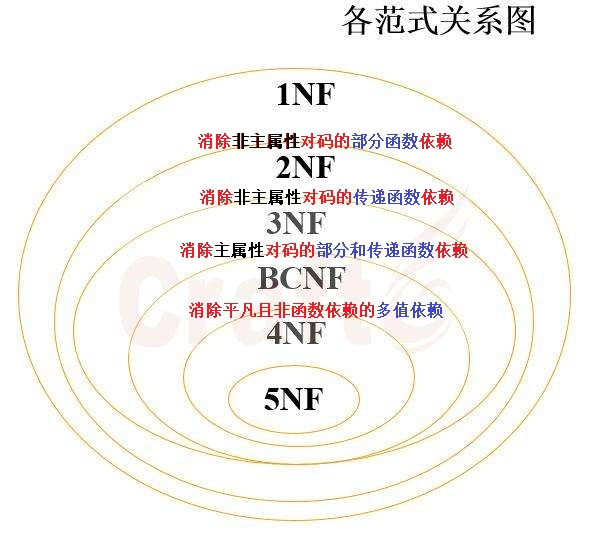

# 文思海辉面试总结

### 一、Tomcat的原理

* tomat是一个servlet容器，来处理http请求。在平时的使用中我们都会再浏览器中输入http地址来访问服务资源，比如格式`http://host[":"port][abs_path]`(`http://localhost:8080/123.jpg`)。从浏览器到服务端的每一次请求都遵循http协议，在网络上其实走仍然是tcp协议，即我们常使用的socket来处理客户端和服务器的交互。根据输入的http地址可以知道服务器的IP地址和端口，根据这两个参数就可以定位到服务器的唯一地址。tomcat根据http地址端口后面的资源路径就可以知道反馈什么样的资源给浏览器。
   

### 二、数据库的范式

* 总结

   * 1NF： 字段是最小的的单元不可再分
   * 2NF：满足1NF,表中的字段必须完全依赖于全部主键而非部分主键 (一般我们都会做到)
   * 3NF：满足2NF,非主键外的所有字段必须互不依赖
   * BCNF：在 3NF 的基础上，没有任何属性完全函数依赖于非候选码的任何一组属性
   * 4NF：在 BCNF 的基础上，消除表中的多值依赖

* 第一范式（1NF）无重复的列：

    * 所谓第一范式（1NF）是指数据库表的每一列都是不可分割的基本数据项，同一列中不能有多个值，即实体中的某个属性不能有多个值或者不能有重复的属性。如果出现重复的属性，就可能需要定义一个新的实体，新的实体由重复的属性构成，新实体与原实体之间为一对多关系。在第一范式（1NF）中表的每一行只包含一个实例的信息。简而言之，第一范式就是无重复的列。

    * 1NF的定义为：符合1NF的关系中的每个属性都不可再分。

* 第二范式（2NF）属性完全依赖于主键：

    * 第二范式（2NF）是在第一范式（1NF）的基础上建立起来的，即满足第二范式（2NF）必须先满足第一范式（1NF）。第二范式（2NF）要求数据库表中的每个实例或行必须可以被惟一地区分。为实现区分通常需要为表加上一个列，以存储各个实例的惟一标识。例如员工信息表中加上了员工编号（emp_id）列，因为每个员工的员工编号是惟一的，因此每个员工可以被惟一区分。这个惟一属性列被称为主关键字或主键、主码。 
    * 第二范式（2NF）要求实体的属性完全依赖于主关键字。所谓完全依赖是指不能存在仅依赖主关键字一部分的属性，如果存在，那么这个属性和主关键字的这一部分应该分离出来形成一个新的实体，新实体与原实体之间是一对多的关系。为实现区分通常需要为表加上一个列，以存储各个实例的惟一标识。简而言之，**第二范式就是属性完全依赖于主键**。

* 第三范式（3NF）属性不依赖于其它非主属性：

    * 满足第三范式（3NF）必须先满足第二范式（2NF）。简而言之，**第三范式（3NF）要求一个数据库表中不包含已在其它表中已包含的非主关键字信息**。例如，存在一个部门信息表，其中每个部门有部门编号（dept_id）、部门名称、部门简介等信息。那么在的员工信息表中列出部门编号后就不能再将部门名称、部门简介等与部门有关的信息再加入员工信息表中。如果不存在部门信息表，则根据第三范式（3NF）也应该构建它，否则就会有大量的数据冗余。简而言之，**第三范式就是属性不依赖于其它非主属性。 也就是说， 如果存在非主属性对于码的传递函数依赖，则不符合3NF的要求**。

### 三、索引的作用

* 优点：创建索引可以大大提高系统的性能。 
    
    * 第一，通过创建唯一性索引，可以保证数据库表中每一行数据的唯一性。 
    
    * 第二，可以大大加快 数据的检索速度，这也是创建索引的最主要的原因。 
    
    * 第三，可以加速表和表之间的连接，特别是在实现数据的参考完整性方面特别有意义。 
    
    * 第四，在使用分组和排序 子句进行数据检索时，同样可以显著减少查询中分组和排序的时间。 
    
    * 第五，通过使用索引，可以在查询的过程中，使用优化隐藏器，提高系统的性能。

* 缺点：

    * 第一，创建索引和维护索引要耗费时间，这种时间随着数据量的增加而增加。 

    * 第二，索引需要占物理空间，除了数据表占数据空间之外，每一个索引还要占一定的物理空间，如果要建立聚簇索引，那么需要的空间就会更大。 

    * 第三，当对表中的数据进行增加、删除和修改的时候，索引也要动态的维护，这样就降低了数据的维护速度。

### 四、冒泡排序的思想

* 冒泡排序的中心思想是：从无序序列头部开始，进行两两比较，根据大小交换位置，直到最后将最大（小）的数据元素交换到了无序队列的队尾，从而成为有序序列的一部分；下一次继续这个过程，直到所有数据元素都排好序。算法的核心在于每次通过两两比较交换位置，选出剩余无序序列里最大（小）的数据元素放到队尾。

* 冒泡排序算法的运作如下：

    * 1.比较相邻的元素。如果第一个比第二个大（小），就交换他们两个。

    * 2.对每一对相邻元素作同样的工作，从开始第一对到结尾的最后一对。这步做完后，最后的元素会是最大（小）的数。

    * 3.针对所有的元素重复以上的步骤，除了最后已经选出的元素（有序）。

    * 4.持续每次对越来越少的元素（无序元素）重复上面的步骤，直到没有任何一对数字需要比较，则序列最终有序。

