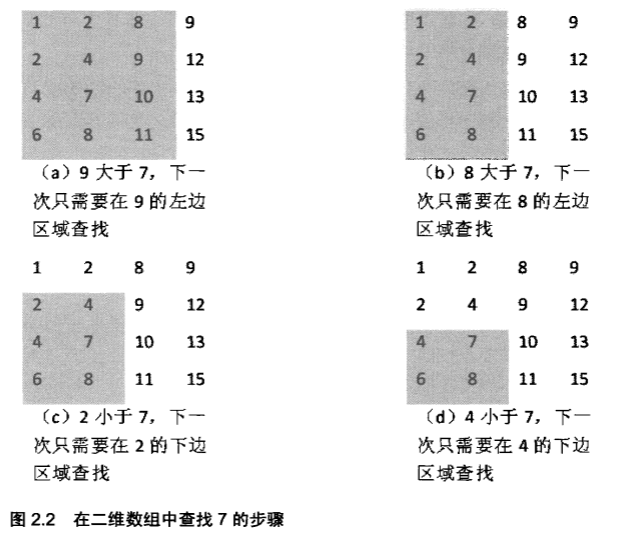

* [2.3.1数组](#2.3.1数组)

# 2.3.1数组

### 二维数组中的查找

* 题目描述：

  在一个二维数组中（每个一维数组的长度相同），每一行都按照从左到右递增的顺序排序，每一列都按照从上到下递增的顺序排序。请完成一个函数，输入这样的一个二维数组和一个整数，判断数组中是否含有该整数。

      Consider the following matrix:
      [
        [  1,  2,  8,  9],
        [  2,  4,  9, 12],
        [  4,  7, 10, 13],
        [  6,  8, 11, 15]
      ]

      Given target = 7, return true.
      Given target = 5, return false.

* 解题思路：

     * （1）首先选取数组右上角的数字9。由于9大于7，并且9还是第4列的第一个（也是最小的）数字，因此7不可能出现在数字9所在的列。于是我们把这一列从需要考虑的区域剔除，之后只需要分析剩下的3列（如图2.2（a）所示）。在剩下的矩阵中，位于右上角的数字是8。同样，8大于7，因此8所在的列我们也可以剔除。接下来只分析剩下的两列即可（如图2.2（b）所示）。
     
     * （2）在由剩余的两列组成的数组中，数字2位于数组的右上角。2小于7，那么要查找的7可能在2的右边，也有可能在2的下边。在前边的步骤中，我们已经发现2右边的列都已经被剔除了，也就是说7不可能在2的右边，因此7只有可能在2的下边。于是把数字2所在的行也剔除，只分析剩下的三行两列数字（如图2.2(c)所示）。在剩下的数字中，数字4位于右上角，和前面一样，把数字4所在的行也剔除，最后剩下两行两列数字（如图2.2（d）所示）。
     
     * （3）在剩下的两行两列4个数字中，位于右上角的刚好就是我们要查找的数字7，于是查找过程就可以结束了。
  
  

* 总结（右上角或左下角）

    总结上述查找过程：首先选取数组中**右上角**的数字。如果该数字等于要查找的数字，查找过程结束；如果该数字大于要查找的数字，剔除这个数字所在的列；如果该数字小于要查找的数字，则剔除这个数字所在的行。也就是说如果要查找的数字不在数组的右上角，则每一次都在数组的查找范围中剔除一行或一列，这样每一步都可以缩小查找范围，直到找到要查找的数字，或者查找范围为空。  

* 实现代码

      public class FindInTwoDimenArray {
        /** 
         * 在一个二维数组中，每一行都按照从左到右递增 
         * 的顺序排序，每一列都按照从上到下递增的顺序排序。 
         * 请完成一个函数，输入这样的一个二维数组 
         * 和一个整数，判断数组中是否函数该整数。 
         */ 
         public static void main(String[] args) {
          int[][] arr = {{1,2,8,9},
                   {2,4,9,12},
                   {4,7,10,13},
                   {6,8,11,15}};
          System.out.println(search(arr, 7));
        }
         private static boolean search(int[][] arr,int value) {
           for(int i=0,j=arr.length-1;i<=arr.length-1&&j>=0;) {
             if(arr[i][j]==value) {
               return true;
             }
             if(arr[i][j]>value) {
               j--;
             }else {
              i++;
            }
           }
          return false;
         }
      }

  

